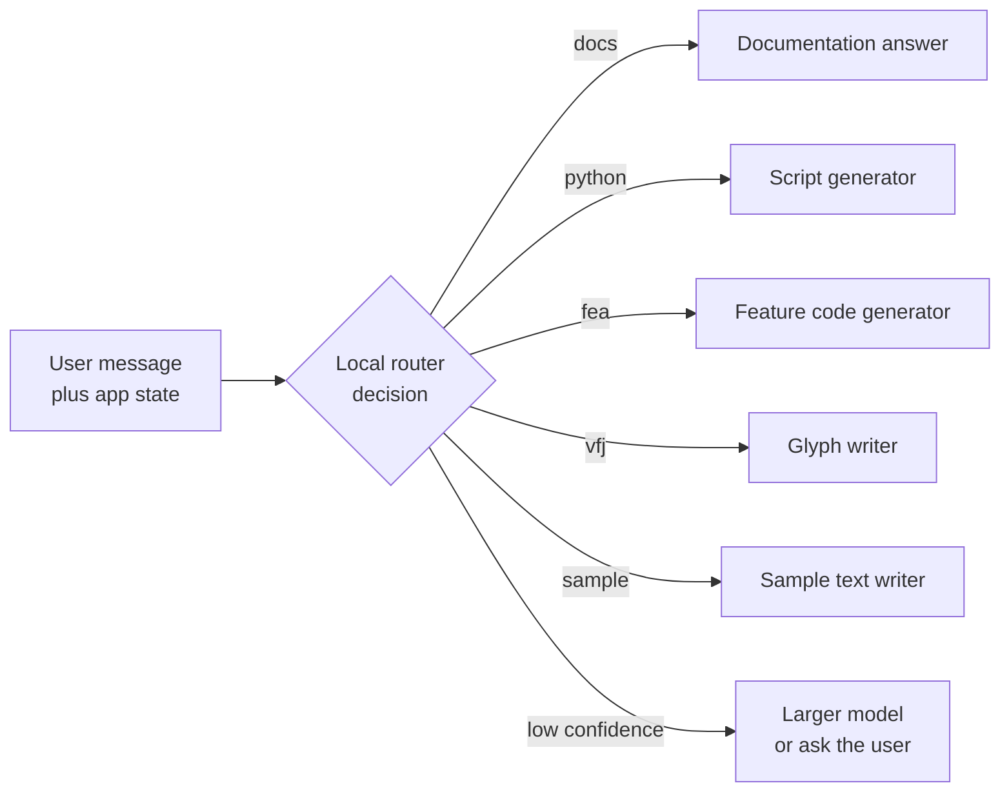

# 1. Deciding, not generating

A System One decision asks a language model to pick, not to write. You hand it a *state* (a message, a ticket, a slice of application data) and a set of named *questions*, each with a closed set of answers. The model returns one probability for every allowed answer. It never produces free text, so there is nothing to parse, repair or retry: the answer is always one of the values you listed.


*A decision model points at one of the answers it was given. It does not write a new one.*

This book is about running those decisions on your own machine. It compares the ways of reading a decision out of a model, 291 benchmark methods, and the Python package, `ornotto`, that puts the local engines behind one API.

## What a decision looks like

A decision request has two parts. The state is whatever the model should judge. The questions say what to judge about it:

```json
{
  "state": "Rename every selected glyph that ends in .sc to .smcp, in all open fonts",
  "questions": {
    "task":       {"type": "choice", "instructions": "What does the user want?",
                   "criteria": {"docs": "an explanation", "python": "a script", "fea": "feature code"}},
    "wants_code": {"type": "noul",   "instructions": "Does the user want code they can run?"},
    "risk":       {"type": "score",  "instructions": "How much existing data could this change?",
                   "criteria": ["none", "some glyphs", "whole fonts"]}
  }
}
```

There are three kinds of question:

- A **choice** picks one option from a list. Each option can carry a description of when it applies.
- A **yes/no** question (System One calls it `noul`) returns the probability of yes.
- A **score** places the state on an ordered rubric and returns the expected level, which can fall between two levels.

The reply has one answer per question name. A choice comes back with the winning option and a probability for every option; a yes/no comes back as a single number between 0 and 1; a score comes back as an expected level plus the distribution over the levels. [Chapter 2](02-decisions.md) goes through every field.

Because the answer set is closed, the output is valid by construction. A model that generates JSON can forget a brace, invent a field, or answer "probably billing" when the schema wanted `billing`. A model that only assigns probabilities to `billing`, `shipping` and `other` cannot. None of the readouts in this book lets the model write its answer: each reads probabilities at one position. (slot asks llama-server for a single token only to see the log-probabilities of the candidates.)

## Where decisions fit

Decisions are small, frequent and cheap to check. That makes them useful wherever software has to branch on the meaning of text:

- **Routing.** Send a request to the right handler, team, model or prompt.
- **Triage.** Flag a ticket as urgent, a transfer as suspicious, a message as spam.
- **Tagging.** Attach a language, a topic, a product area, a sentiment.
- **Gating an agent.** Before a large model runs a tool, ask a small one whether the tool call is safe, whether the user asked for it, or whether a human should look first.

In each case the question is fixed at development time and only the state changes at run time. That lets you test the question like code: collect labelled examples, measure how often the answer is right, and move the threshold on the probability until the mistakes you care about are rare enough.

If the decision needs free-form output, such as a summary, a translation or code, a decision engine is the wrong tool. It can still sit in front of the generator and decide whether to call it.

## The running example: the FontLab assistant router

Every benchmark in this book asks the same question. FontLab, the font editor, has a built-in assistant. A message typed into it must go to one of five handlers, and the router has to pick the right one before anything else happens. The five tasks, as our benchmark harness defines them:

- **docs**: answer a question from the FontLab documentation. The user wants to know how a feature, tool, panel, dialog, setting or workflow works, what something means, where to find something, or why FontLab behaves a certain way. They want an explanation, not code.
- **python**: write, fix or explain a Python script that automates FontLab, through the FontLab Python API or FontTools and DrawBot style scripting: batch operations, renaming glyphs, generating files, processing fonts programmatically.
- **fea**: write or fix OpenType feature code in the Adobe FDK (`.fea`) syntax: feature blocks such as `liga`, `kern`, `calt`, `smcp` or `ss01`, lookups, substitutions, positioning, classes and `languagesystem` statements.
- **vfj**: write a glyph definition in VFJ, FontLab's JSON glyph format: one JSON object with the glyph's name, Unicode value, advance width, contours, nodes, components, anchors and guides.
- **sample**: write a sample text (a pangram, a test string, a word list, a paragraph or a set of glyph sequences) to show in the FontLab Glyph window so the user can examine the font with it.

The categories overlap on purpose. "How do I write a liga feature?" is a documentation question about feature code. "Show me how a glyph is stored in a VFJ file" asks for an explanation, not a glyph. The router set has 67 queries in 30 languages, and ten of them were written to sit on these boundaries. [Chapter 5](05-method.md) describes the set and how it was scored.

A router is a good test because it is a real decision with a known right answer, it runs on every message, and a wrong answer is expensive: the user gets a script when they asked how a menu works.

## jev, the hosted reference

TypeSafe's **jev** is a hosted System One model. You send a state and questions to an API and get calibrated probabilities back; our benchmark harness reaches it through OpenRouter's System One API as `jev-latest`. It is the reference point in this book because it is the model the local engines have to match. On the router set jev scores 65 of 67, both on translated queries and on the original text.

jev also defined the vocabulary. The request and answer shapes shown above are its API, and pydantic-ai's `TypeSafeModel` speaks it. dohnuts, one of the two local engines, answers the same requests at the same `/v1/systemone` path, which is why an agent written for jev can run locally with a changed base URL ([chapter 11](11-typed.md)).

### How jev arrived

TypeSafe announced jev on 15 September 2026, in a post by its founder Diogo Almeida titled "Introducing System One Models & Jev".[^launch] The name System One comes from Daniel Kahneman's *Thinking, Fast and Slow*: the fast, automatic kind of judgement, as opposed to deliberate reasoning. The post described a new architecture, a "parallel sampler", and a training method it called "Reinforcement Learning for Calibrated Decisions (RLCD)". The claim that set the tone was that jev "achieves similar levels of intelligence on System One tasks compared to existing LLMs, while being two orders of magnitude faster and more efficient."

The price follows from the design. A language model is billed for the tokens it reads and, at a higher rate, for the tokens it writes. jev writes nothing, so TypeSafe charges only for input: $0.042 per million input tokens, with output listed as "FREE (too cheap to meter)".[^launch] The model page adds the working limits:[^models]

| | jev 1.13.0, as documented on 30 September 2026 |
|---|---|
| Price | $0.042 per million input tokens; output not charged |
| Rate limits | 100K tokens per second, 40 requests per second |
| Context | 64k tokens per request, of which 32k cover the state plus the longest question |
| Input | text only |
| Languages | English first; "Other languages, including CJK scripts, are handled but not equally well" |
| Options per choice | up to 255, per the launch post; above that TypeSafe scores the options separately and then chooses |

The launch also came with a $40M seed round led by DCVC, as reported by BusinessWire on the same day.[^funding] The Hacker News thread on the launch post collected 1,989 points and 520 comments.[^hn-launch] Three days later TechCrunch reported that "the company briefly lost the ability to serve users from its API because demand was so high."[^techcrunch]

The training data matters for the rest of this book. TypeSafe says jev was trained "exclusively on synthetic data", in TechCrunch's words, and Almeida put the bet in his own: "We made an early bet that we will be making all of our data, and that has been one of the best bets I've ever made in my life".[^techcrunch] The open models in [chapter 4](04-models.md) are trained differently, and several of their authors say explicitly that no jev outputs went into them.

### Which jev we measured

A hosted alias is a pointer, not a model. Our harness called `jev-latest`, and the benchmark rows record the alias, not the build behind it. On 30 September 2026, TypeSafe's model page listed one model, `jev-1.13.0`, with both `jev-latest` and `jev-preview` pointing to it and the note "There is no preview build available right now".[^models] Every public board that ranked jev between 18 and 29 September also names 1.13.0. We therefore read our jev rows as jev 1.13.0. That is an inference for the days between those checks: our own results cache does not record the build.

Almeida addressed this on the Latent Space podcast on 21 September: "We will not change our models when we deploy them. That is insane." In the same conversation he left the door open to keeping the current build around: "there is a world that we might temporarily LTS what is right now Jev 1.13.0."[^latent] A new build would arrive under a new version name, and the alias would move to it. [Why run decisions locally](#why-run-decisions-locally) explains why that still matters for a threshold you have tuned.

!!! quote "How it looked from the outside"
    Simon Willison wrote about jev on 21 September: "I'm with Maggie Appleton, I think "decision models" is a better name for these." He also noted that its input price was "cheaper even than OpenAI's GPT-5 Nano".[^willison] On Latent Space, swyx summed up the pitch as a framing that "makes the case that you should always make one or 10 or 100 Jev calls for every one reasoning call that you make."[^latent] Not everyone was convinced. A Hacker News commenter, hbrn, wrote on 22 September: "$40m in funding, 2 years in stealth. Performs on-par with SemIf which was built in a couple days".

### Other hosted decision services

jev did not stay alone for long. By the end of September three other hosted services answered the same kind of request:

- **OpenAI's Decision API**, announced at DevDay on 29 September 2026, runs on GPT-6 Luna. OpenAI's own figure, as The New Stack reported it: "OpenAI says its model returns results in 150 milliseconds, compared to GPT-6 Luna, which would take 1.6 seconds." It is in limited preview, with no public price.[^openai]
- **Liquid AI's d1**, announced the same day, uses the same three question kinds at its own `/v1/systemone` path, as the model `d1:free`. Liquid's documentation does not state whether the weights will be published or under what licence.[^liquid]
- **meraGPT Decider 1** and Featherless's **Simple Jev** appear as hosted rows on the public typed-decisions board, which [chapter 6](06-results.md) quotes beside our own results.

None of these was part of our benchmark. They are here because they change the question a reader asks. When jev was the only service, "hosted or local" meant "jev or not". By the end of the month it meant choosing among several hosted providers with different prices, limits and latencies, or running a model that does not depend on any of them.

## Why run decisions locally

jev answers the router question in 466 ms on average, measured from our client, network included. The fastest local methods within three answers of it take about 52 ms (decider-0.8b on dohnuts), and the most accurate one, Qwen3.5-4B-Hmm (`Q8_0`) on pcdServer, takes 88 ms on the same machine ([chapter 6](06-results.md)).

Latency is the first reason to run locally. A router that sits in front of every message adds its delay to every message, and a gate in front of every tool call adds it to every step of an agent. At 50 ms the decision disappears into the time the interface needs to redraw; at 500 ms the user waits for it.

Cost per call is the second reason. A decision is small, but a router or a gate runs on every request, so the number of calls grows with the product rather than with the difficulty of the question. A local model costs the same whether you ask once or a million times.

Privacy is the third. The state is often exactly the data you would rather not send anywhere: a customer's message, the contents of a document, the file a user has open. A local engine reads it on the machine where it already is.

The fourth is that a local engine keeps working offline and does not change under you. A hosted alias such as `jev-latest` moves when a new release ships, and a threshold tuned against one release may not hold for the next. A GGUF file on disk answers the same way until you replace it.

The price is accuracy on the hardest queries and the work of choosing, downloading and running a model. This book is about paying that price well.

### A desktop application is a special case

Most of the writing about jev in September assumed a server: a web backend, an agent loop, a queue of tickets. FontLab is a desktop application, and its assistant router runs where the user types. That changes the weight of each reason above.

- **The state is the user's work.** A message to the assistant often comes with the open font, the selected glyphs and the active window ([chapter 2](02-decisions.md#the-state) shows such a state). Sending that to a hosted API means sending unpublished type design to a third party with every message the router sees.
- **The network is not guaranteed.** Designers work on trains and in studios with strict outbound rules. A router that fails without a connection turns the assistant off, including the parts, such as the documentation handler, that could have answered locally.
- **The call count follows the user, not the product.** A desktop router runs on each message of each user. Paying per call scales with how much people use the assistant, which is the one thing a product team wants to grow.
- **The machine is already there.** A current Mac has a GPU that sits idle while the user reads the assistant's reply. The decider-0.8b file that `ornotto` registers is 0.81 GB ([chapter 8](08-speed.md#memory-one-model-at-a-time)).

The same reasoning holds for other desktop tools that route between a few handlers: a code editor deciding whether a request needs the language server, a mail client sorting incoming messages, a photo tool choosing between a filter and a generative fill. The local engine does not need to be as accurate as jev on every query. It needs to be accurate enough on the queries the product sees, with a known fallback for the rest. [Chapter 9](09-confidence.md#a-fallback-gate) shows how to build that fallback from the model's own probabilities.



The router is a decision; the handlers behind it are generators. Only the router needs to run on every message, which is why it is the part worth running locally first.

## What changed in September 2026

Most of the field this book describes is younger than a month. The dates, checked at the primary sources:

- jev launched on 15 September 2026, and every dedicated open decision model in our benchmark first appeared on Hugging Face between 16 and 29 September. The two engines `ornotto` bundles were created on 18 September (pcdServer) and 21 September (dohnuts.cpp).
- TypeSafe kept one model, `jev-1.13.0`, throughout the month. No alias moved.[^models]
- OpenAI and Liquid AI announced hosted decision services on 29 September.[^openai] [^liquid]
- An arXiv paper counted 2,170 public jev projects on GitHub by 22 September, a week after launch.[^wild]

The field is young enough that "latest" is a date. The chapters that follow give the date with every outside number.

## How this book is organised

The **concepts** part (chapters 1 to 4) defines a decision, explains how each engine reads one out of a model, and sorts the models into dedicated, fine-tuned and vanilla families.

The **benchmarks** part (chapters 5 to 9) describes how the router set was measured and reports accuracy, quantization, speed, caching and confidence for every model and engine we ran.

The **package** part (chapters 10 to 12) documents `ornotto`, shows how to use it from plain Python and from pydantic-ai, and ends with a guide to choosing an engine and model, and to building and contributing.

[^launch]: Diogo Almeida, TypeSafe, "Introducing System One Models & Jev", 2026-09-15. <https://typesafe.ai/blog/introducing-system-one-models-and-jev>
[^models]: TypeSafe, "Models", documentation, read 2026-09-30. <https://docs.typesafe.ai/models>
[^funding]: BusinessWire, "TypeSafe AI Emerges From Stealth With $40M in Funding", 2026-09-15. <https://www.businesswire.com/news/home/20260915525333/en/>
[^hn-launch]: Hacker News, discussion of the jev launch post, 2026-09-15. <https://news.ycombinator.com/item?id=49717558>
[^techcrunch]: TechCrunch, "A new kind of AI model from a ChatGPT inventor is thrilling developers", 2026-09-18. <https://techcrunch.com/2026/09/18/a-new-kind-of-ai-model-from-a-chatgpt-inventor-is-thrilling-developers/>
[^latent]: Latent Space, "Jev: System One models for Prod, not God", podcast with Diogo Almeida, 2026-09-21. <https://www.latent.space/p/jev>
[^willison]: Simon Willison, "Jev introduces a new shape of LLM", 2026-09-21. <https://simonwillison.net/2026/Sep/21/jev/>
[^openai]: Frederic Lardinois, The New Stack, report on OpenAI's Decision API, 2026-09-29. <https://thenewstack.io/openai-decision-api-luna/>
[^liquid]: Liquid AI, "Decision models", documentation, read 2026-09-30. <https://docs.liquid.ai/lfm/models/decision-models>
[^wild]: arXiv 2609.30216, "Jev in the Wild", 2026-09-24. <https://arxiv.org/abs/2609.30216>
