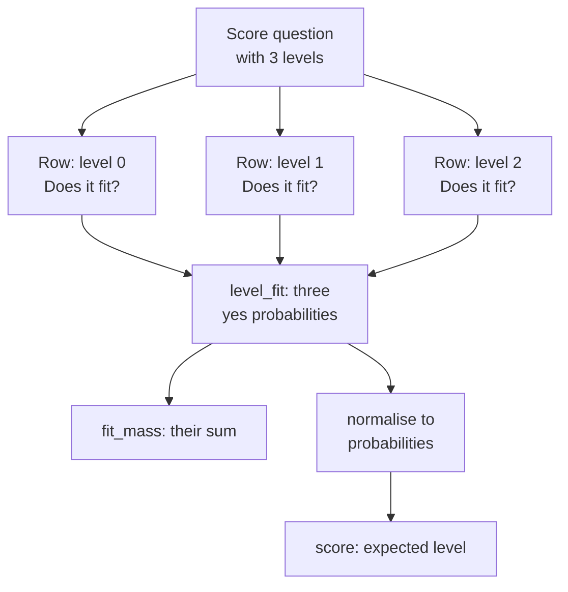

# 2. The shape of a decision

A decision request carries a state and a set of named questions. Both engines in the `ornotto` package accept the same three question kinds, but they build different prompts from them and return different fields. This chapter describes the request and the answer in System One terms, then shows what changes on pcdServer. The `ornotto` package hides most of the difference ([chapter 10](10-package.md)); the parts it cannot hide, such as calibration and limits, are here.

## Three types, three control-flow statements

The three question kinds map onto code a programmer already writes. Diogo Almeida, who designed jev's API, put it this way in the Hacker News thread on the launch: "choice maps to "match" statement, "score" maps to sorting, "noul" short for bernoulli maps to if-statements".[^hn-launch]

| Kind | In code | What the software does with the answer |
|---|---|---|
| choice | `match` / `switch` | takes one branch out of several |
| score | sorting, ranking | orders items, or compares a level with a threshold |
| yes/no (`noul`) | `if` | takes a branch or not |

The analogy explains the design. A branch in a program needs a value from a known set, and so does a decision. A branch never needs prose, so neither does the answer. The same thread has Almeida on the rule that follows: "strings (and all sequential data structures) are not allowed at all". That is also why the reply can be computed in one pass, and why TypeSafe does not charge for output ([chapter 1](01-deciding.md#how-jev-arrived)).

The name `noul` is short for Bernoulli, the distribution of a single yes/no trial. Not every reader liked it. One Hacker News commenter, alienbaby, wrote: "A Noul performs a Bernoulli trial … I hate it :)". dohnuts also accepts `bool` as an alias.

## The state

The state is what the model judges. It can be a string or any JSON value, and every question in the request refers to the same state.

On dohnuts the state shapes the prompt directly:

- A string is used as it is.
- Any other JSON value is printed Python-style, `{"k": v, ...}`, with `", "` and `": "` separators, the way the decider model saw data in training.
- Every array of 8 or more items is rewritten as `[{"_index": 0, ...}, {"_index": 1, ...}, ...]`, so the model can refer to an item by its position.

That makes application state a first-class input. If your assistant knows the open font, the selection and the active window, you can pass them as an object rather than describing them in prose:

```json
{"message": "Why does this pair look too tight?", "window": "Metrics window",
 "selection": ["A", "V"], "font": "Garamond Pro Italic"}
```

pcdServer takes a `context` string of at most 64 KiB. Structured state has to be serialised first; `ornotto` does it with `json.dumps`, so pcdServer sees JSON text where dohnuts sees a Python-style dict.

### What to leave out of the state

More state is not better state. TypeSafe's own page on jev's weak spots says so directly: "Jev suffers from context rot, so unrelated material in the `state` costs you accuracy." The same page warns that jev "may struggle with tasks that require additional levels of indirection. It can be quite literal".[^jagged] Our benchmark did not measure the effect on the local models, and there is no reason to assume a 0.8B model ignores unrelated text better than jev does.

Two papers from September measured what an unhelpful state can do:

- **One sentence of opinion.** JevAdvBench appended a single unverified opinion to the state and found that it flipped 12.1% of jev-1.13.0 decisions.[^advbench]
- **Natural context.** "JevOut" reports that natural context redirected 312 of 508 correct jev decisions, 61.4%.[^jevout]

Neither paper tested the local models in this book, so the figures describe jev, not dohnuts or pcdServer. The practical rule is the same for both. Pass the state the question needs: the message, the window, the selection. Leave out the history, the log and the user's guess at the answer. If a field in your application state can carry someone's opinion about the right branch, treat it as input to be judged, not as context.

## The three question kinds

### Choice

A choice picks one option. In System One, `criteria` is either a list of names or an object mapping each name to a description of when it applies:

```json
{"type": "choice", "instructions": "Which team should handle this?",
 "criteria": {"billing": "Charges and invoices", "shipping": "Delivery status", "other": null}}
```

A name without a description is read by its name alone. dohnuts accepts 2 to 255 options per question. Up to 10 options are labelled with the letters A to J; longer lists use single-token labels A to Z, then AA, AB and so on. jev documents the same ceiling of 255 options, and above that scores the options independently before making an explicit choice ([chapter 1](01-deciding.md#how-jev-arrived)).

pcdServer has no per-option descriptions. A field is a name, one `description` of up to 1,024 bytes, and `choices`, a list of 2 to 256 distinct strings of up to 256 bytes each:

```json
{"name": "team", "description": "Which team should handle this? billing: Charges and invoices; shipping: Delivery status",
 "choices": ["billing", "shipping", "other"]}
```

When `ornotto` translates a choice for pcdServer, it folds the option descriptions into the field description, one `name: description` line per option, and clips the result at 1,024 bytes.

### Names and order are part of the question

A choice is typed, but the type does not guarantee that the model reads the options the way you meant them. The option name is text the model reads, and so is its position in the list.

The clearest evidence came out in September. The paper "Type-Safe Is Not Error-Free" renamed the options from `0`/`1` to `no`/`yes` and kept the rubric behind them the same.[^typesafe-not] On the open jev-like models it tested, the renaming changed 70.4 answers in every hundred and moved AUC from .94 to .23. On hosted jev, AUC moved from .8146 to .5806. The type-error rate stayed at 0% throughout: every answer was a valid option; what changed was which one.

Order has a similar effect. The OpenJev model card reports that shuffling the options flipped its answers in 18.5% of cases before the authors tuned for it, and in 2.3% after.[^openjev]

For the questions you write, this suggests three habits:

- **Name options by what they mean.** `billing` is safer than `A`, and `urgent` safer than `1`. The router in this book uses `docs`, `python`, `fea`, `vfj` and `sample` for that reason.
- **Give each option a description when names could overlap.** On dohnuts the description sits next to the option in the prompt. On pcdServer `ornotto` folds it into the field description.
- **Test a reordering.** If the answers change when you reverse the list, the question is ambiguous or the model is guessing. [Chapter 9](09-confidence.md) shows how the probabilities of such answers look.

### Yes/no

A yes/no question (`noul`, with `bool` accepted as an alias) returns the probability that the answer is yes. The optional `criteria` object says what counts as each answer:

```json
{"type": "noul", "instructions": "Is this message spam?",
 "criteria": {"true": "Unsolicited advertising", "false": "A legitimate conversation"}}
```

Without criteria, dohnuts shows the options as `no` and `yes`. On pcdServer a yes/no is a field whose choices are exactly `[false, true]`.

### Score

A score places the state on an ordered rubric. `criteria` is a list whose position is the level, starting at zero, or an object keyed by numbers, which dohnuts sorts numerically:

```json
{"type": "score", "instructions": "How frustrated is the customer?",
 "criteria": ["calm", "frustrated", "very frustrated"]}
```

The answer is the expected level, the probability-weighted average of the levels, so a score of 1.44 sits between "frustrated" and "very frustrated". pcdServer has no graded type. `ornotto` sends the levels as the choices `"0"`, `"1"`, `"2"`, lists the level texts in the field description, and computes the expected level from the probabilities pcdServer returns.

The order of `criteria` is the order of the levels. TypeSafe's Python SDK made this explicit in version 0.6.0, released on launch day, which turned `Score.criteria` into an ordered sequence; 0.7.0, three days later, replaced msgspec with pydantic for its request types.[^sdk] Code that still builds a rubric as a dict keyed by level numbers works with dohnuts, which sorts the keys, but is out of date against the current SDK.

## The answer

Each answer carries a `type` matching its question. Beyond that, the fields depend on the kind and the engine.

| Kind | System One fields | What the value means |
|---|---|---|
| choice | `choice`, `probabilities`, `confidence` | the option with the highest probability |
| yes/no | `noul` | the probability of yes, from 0 to 1 |
| score | `score`, `probabilities`, `confidence`, `legend` | the expected level; `legend` maps each level to its text |

`probabilities` covers every option or level and sums to 1. dohnuts adds a `native` block with profile-specific statistics, and `usage.input_tokens`, the tokens it read across every row of the request. pcdServer returns its own shape: `values` with the assembled object, one entry per field in `fields` with `value`, `probability`, `probabilities` and `levels`, and a `metrics` block with timings and cache status.

### The confidence trap

dohnuts reports two numbers with confusing names:

| JSON path | What it is |
|---|---|
| `answers.<name>.confidence` | 1 − H/ln K: one minus the entropy of the distribution over its maximum. 0 means uniform, 1 means certain. `native.certainty` repeats it. |
| `answers.<name>.native.confidence` | the top probability, after temperature scaling |

The two disagree most on yes/no questions. A yes probability of 0.72 has a top probability of 0.72 but an entropy-based `confidence` of 0.14, because 0.72 is not far from the uniform 0.5. If you want to know how likely the answer is to be right, read the top probability. On our router set it also separated right from wrong answers slightly better at low fallback rates ([chapter 9](09-confidence.md)).

`ornotto` sidesteps the names: `Answer.probability` is the top probability for a choice or score and the probability of yes for a yes/no, and `Answer.confidence` is the probability of the answer given, `max(p(yes), p(no))` for a yes/no.

### Isolated score levels

The decider model's recipe scores a rubric one level at a time by default (`isolated_levels: true` in its metadata). Each level becomes its own yes/no row: the question, then `Proposed answer: <level>`, then `Does the proposed answer fit?`. dohnuts reports the yes probabilities as `native.level_fit` and their sum as `native.fit_mass`; normalised, they give `probabilities`, and `score` is their expected value.

A low `fit_mass` is a warning in its own right: no level describes the state well. In one of our FontLab examples, "Loop through masters and print their names" scored 0.63 on a rubric of general type design, the FontLab UI and the FontLab Python API. Every level fitted poorly (fit_mass 0.50) and "general type design" fitted least badly, so the score was wrong and the fit mass said so. Send `"isolated": false` on the question to score all levels in one lettered row instead.



Isolated levels cost one row per level, so a five-level rubric reads the state five times on dohnuts. [Chapter 8](08-speed.md#prefix-caching-in-dohnuts) shows how the prefix cache keeps that from costing five full prefills.

## Calibration

A probability is *calibrated* when answers given with probability 0.8 are right about 80 percent of the time. The dedicated decision models are trained and then tuned for this: decider, kev and laya divide their logits by a fitted temperature before the softmax. decider-0.8b uses T = 1.03 and decider-2b T = 1.3, both read from the model's metadata. jev's probabilities are calibrated by its provider.

pcdServer's probabilities are not calibrated. It computes a softmax over the first tokens of the allowed values only, with no temperature, and reports the model's raw preference among them. A chat model can put 0.998 on an answer that a calibrated model would give 0.9, which is exactly what happened on the router's kern example: decider on dohnuts said `fea` with 0.90, a 4B model on pcdServer said `fea` with 0.998.

!!! warning "Compare confidences only within one kind"
    A 0.9 from dohnuts and a 0.9 from pcdServer are different measurements. Thresholds tuned on one engine do not transfer to the other. Accuracy comparisons are safe, because they use only the winning option. `ornotto` marks every answer with `calibrated`: true for dohnuts, false for pcdServer.

!!! quote "How it looked from the outside"
    Asked on Hacker News whether a model that cannot write text can still hallucinate, Almeida answered with a question: "Would you say a linear classifier hallucinates?"[^hn-launch] The typed answer rules out invented options. It does not rule out a confident wrong one. The papers above, and the calibration numbers in [chapter 9](09-confidence.md), are about that second kind of error.

Calibration is a property of the recipe, not a guarantee. On the 67 router queries, translated and direct runs pooled, decider-0.8b's top probabilities between 0.6 and 0.8 were right 19 times out of 20, while those of 0.95 and above were right 61 times out of 63 ([chapter 9](09-confidence.md)).

## Limits

| | dohnuts (decider profile) | pcdServer |
|---|---|---|
| Endpoint | `POST /v1/systemone` (one request), `POST /predict` (one or an array) | `POST /v1/pcd/decode` |
| State | a string or any JSON value | `context`: a string, up to 64 KiB |
| Questions per request | up to `--max-questions`, 8 by default (`ornotto` starts it with 64) | 1 to 63 fields |
| Options per question | 2 to 255 | 2 to 256 strings, each up to 256 bytes, or exactly `[false, true]` |
| Option descriptions | yes, in `criteria` | no; one field description of up to 1,024 bytes |
| Field names | any question key | up to 128 bytes, unique |
| Graded answers | `score`, with `level_fit` and `fit_mass` | none; use an ordered enum |
| Token budget | 4,096 tokens per question row | the whole rendered request must fit the model context (8,192 for pcdServer's default model); at most 4,096 candidate tokens in all |
| Request body | | 1 MiB |
| Images | no (only the Dohnuts profile reads `state.image`) | no |

jev's documented limits are wider in one direction and narrower in another: a 64k-token context, of which 32k cover the state plus the longest question, text input only, and up to 255 options per choice ([chapter 1](01-deciding.md#how-jev-arrived)).

## What changed in September 2026

- **The SDK types moved.** `typesafe-sdk` 0.6.0 (15 September) made `Score.criteria` ordered, and 0.7.0 (18 September) switched its models to pydantic.[^sdk] pydantic-ai adapted within the month ([chapter 11](11-typed.md)).
- **dohnuts aligned its answers with TypeSafe's.** On 23 September the upstream project committed "Align the systemone API with TypeSafe responses", which brings its `/v1/systemone` replies closer to the shape jev returns.
- **The weak spots got numbers.** Option names, option order, appended opinions and unrelated context were each measured within two weeks of the launch. None of those papers changes the request format. Each changes how carefully you should write the questions.

[^hn-launch]: Hacker News, discussion of the jev launch post, replies by Diogo Almeida, 2026-09-15. <https://news.ycombinator.com/item?id=49717558>
[^jagged]: TypeSafe, "Jev 1.13 jaggedness", documentation, read 2026-09-30. <https://docs.typesafe.ai/model-jaggedness/jev-1.13>
[^advbench]: arXiv 2609.31142, "JevAdvBench: A Benchmark and Black-Box Attacks for Reinforcement Learning for Calibrated Decisions Models", 2026-09-25. <https://arxiv.org/abs/2609.31142>
[^jevout]: arXiv 2609.30243, "JevOut: Natural Context Can Flip Decision Models", 2026-09-24. <https://arxiv.org/abs/2609.30243>
[^typesafe-not]: Yu Sun et al., arXiv 2609.26758, "Type-Safe Is Not Error-Free", 2026-09-22. <https://arxiv.org/abs/2609.26758>
[^openjev]: openjev, "openjev" model card, read 2026-09-30. <https://huggingface.co/openjev/openjev>
[^sdk]: TypeSafe, "Python SDK changelog", documentation, read 2026-09-30. <https://docs.typesafe.ai/sdk/python/changelog.md>
