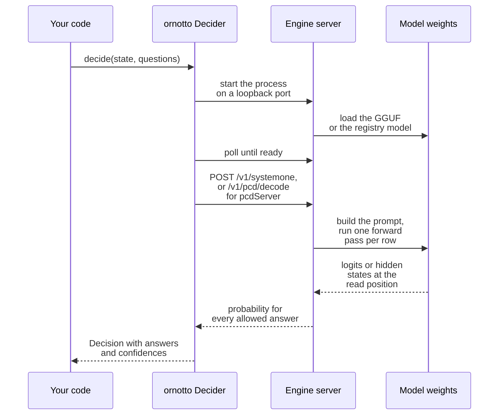
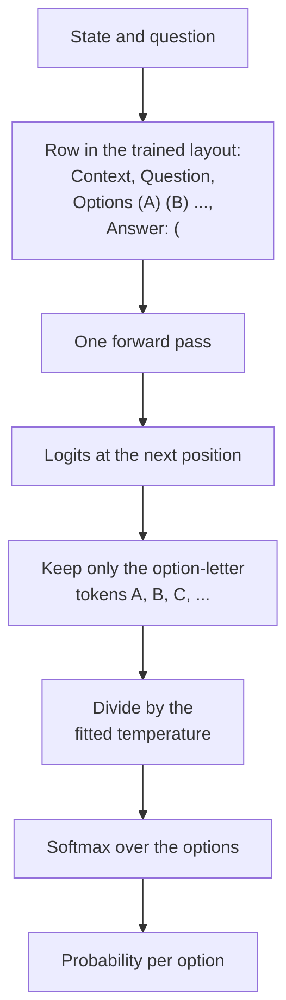
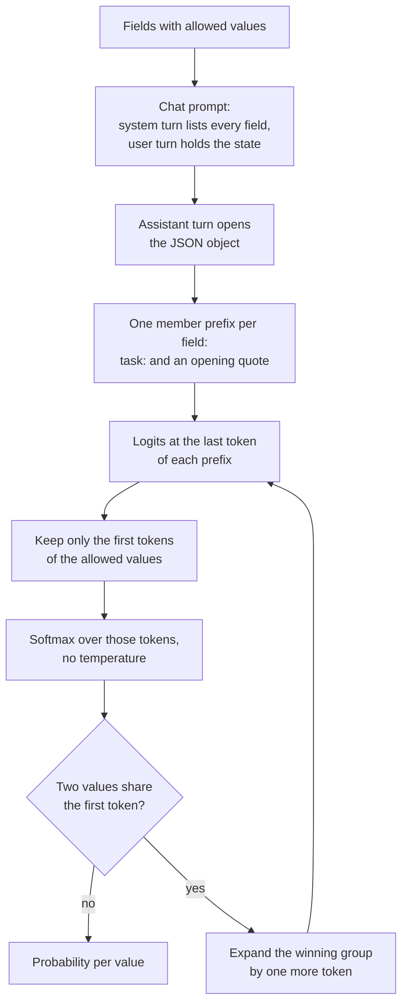
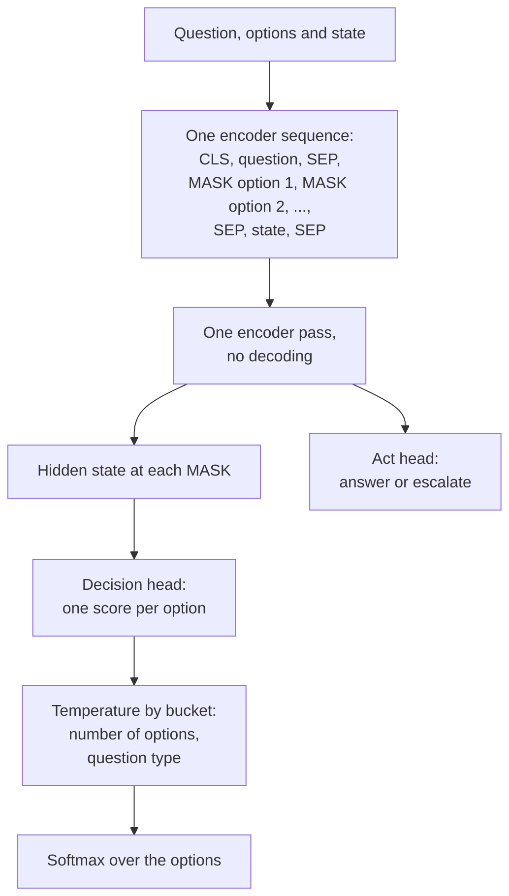
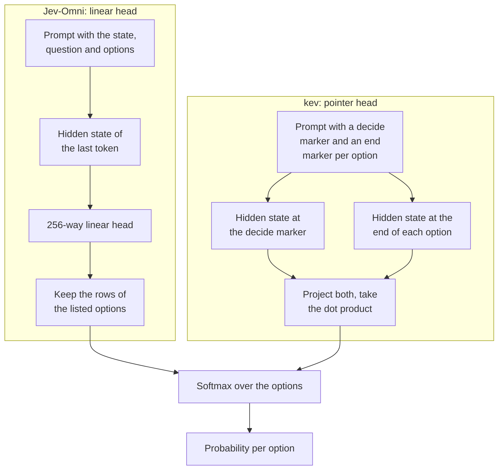
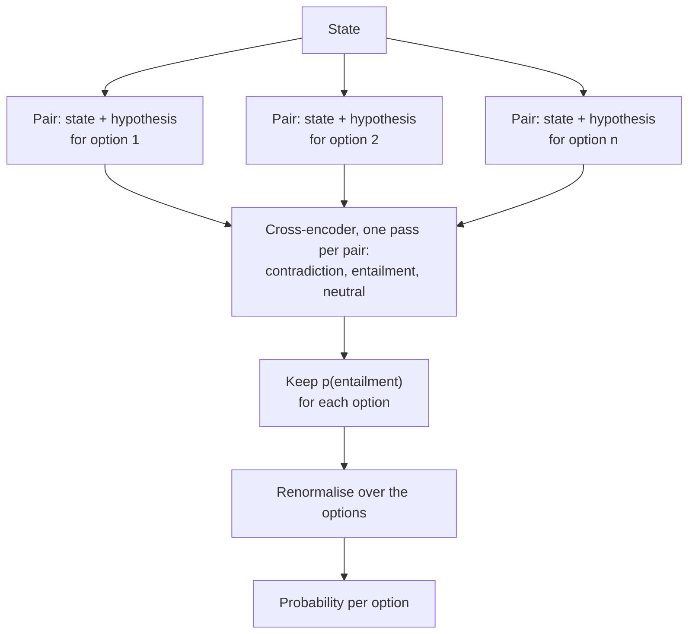
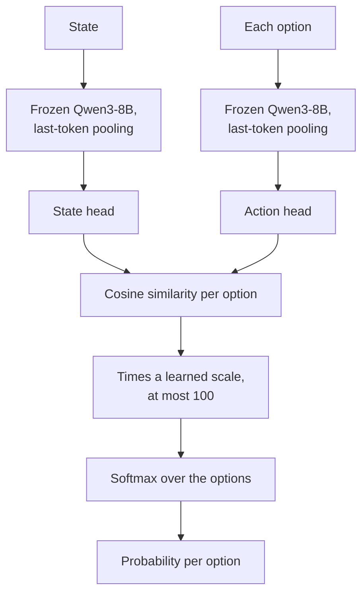

# 3. Ways to read an answer

A decision engine turns a state and a question into a prompt, runs the model once, and reads a probability for each allowed answer out of the result. The readouts in this book differ in all three steps: what the prompt looks like, where in the model they read, and what they return. Those differences decide which models a readout can use, how fast it answers, and whether its probabilities mean what they say.


*Each readout in this chapter takes its answer from a different place in the model.*

Four words recur in the rest of this book, each with one meaning:

- A **readout** is how the answer is read out of the model: jev's (not public), dohnuts' answer slot, pcdServer's first-token scoring, slot's top-100 log-probabilities, and laya's decision head. The second half of the chapter adds the readouts of the models benchmarked later: a linear head on a hidden state, entailment per option, contrastive similarity, and the readouts that model authors ship in their own servers.
- A **runtime** is what executes the network: llama.cpp on Metal or on the CPU, MLX, Core ML, Core AI, ONNX Runtime, PyTorch or ExecuTorch.
- An **engine** is a server you run: dohnuts, pcdServer, llama-server, laya.cpp, ollaya, or a server that a model's authors publish with the model. jev is a hosted service, not something you run.
- A **method** is one row of the benchmark: one model file, read by one readout, on one engine or runtime, such as `pcdserver@qwen3.5-4b-hmm-q8`.

Two of the readouts belong to the engines the `ornotto` package bundles, dohnuts and pcdServer, and `ornotto` can also start ollaya if you install it. jev is the hosted reference. slot is a readout our benchmark harness builds on top of a stock llama-server, and laya is a different kind of model with a readout of its own.

Almost every readout in this chapter belongs to one of six families. The answer is read either at a letter the model would write next, at a hidden state through a trained head, at the first token of each allowed value, at a marker in front of each option in an encoder, from an entailment score per option, or from the similarity of two embeddings. Each family gets a diagram in its section below. The diagrams show where the probability comes from, not every step of the engine.

## How a request reaches a model

Whatever the readout, a local decision in `ornotto` takes the same path. The package starts one engine process per model, on a free port on the loopback interface, and waits until the engine says it is ready. It then sends the request, receives the engine's reply and turns it into a `Decision` object. The model itself never sees the System One request: it sees the prompt, or the encoder sequence, that the engine builds from it.



dohnuts and ollaya speak System One themselves, so `ornotto` forwards the request as it is. pcdServer speaks its own field format, so `ornotto` translates each question into a field on the way in and the fields back into answers on the way out. If an engine accepts fewer questions per request than you ask, `ornotto` splits the questions into several requests and joins the answers. [Chapter 10](10-package.md#engine-lifecycle) describes the lifecycle from the package's side, and [chapter 11](11-typed.md) shows the same path under pydantic-ai.

The path has one consequence worth keeping in mind when you read the benchmark. The time `ornotto` reports includes the HTTP round trip to the loopback engine, and the engines differ in how much work they do before the model runs: dohnuts builds its prompt in C++, pcdServer applies a chat template, and slot needs a second round trip to tokenize. [Chapter 8](08-speed.md#where-the-time-goes) separates those costs.

## jev

jev is TypeSafe's hosted System One model. You send the request shape from [chapter 2](02-decisions.md) to `/v1/systemone` and get answers with `choice`, `confidence` and `probabilities`, plus `usage.billing_units`. Our harness reaches it through OpenRouter's System One API as `jev-latest`.

What jev does inside is not public: we know its inputs and outputs, not its prompt or its readout. Its answers are calibrated by its provider. On the router set it scores 65 of 67, translated or direct, at 466 ms per query measured from our client, network included.

jev matters to the local engines in two ways. It sets the accuracy to beat, and it defined the API that dohnuts and pydantic-ai's `TypeSafeModel` speak.

TypeSafe has said a little about the design, in the launch post and in replies on the launch thread. The post names a training method, "Reinforcement Learning for Calibrated Decisions (RLCD)", and a "parallel sampler", and it states that "Jev supports a cardinality up to 255": a question with more options than that is answered in two stages, a score first and a choice after it.[^jev-launch] Diogo Almeida, TypeSafe's founder, explained on the thread why the API has no string answers: "strings (and all sequential data structures) are not allowed at all - this is how we make sure all outputs can be computed in parallel (thus no output token cost)".[^hn-launch] He did not describe the architecture: "architecture is close to the chest for now".

That is still less than the book needs to call jev a readout in the sense of this chapter. The benchmark therefore treats it as a black box with a known interface. Every row of jev in this book measured `jev-latest`, which pointed to version 1.13.0 whenever it was checked during September 2026 ([chapter 1](01-deciding.md)).

!!! quote "How it looked from the outside"
    When the launch thread turned to whether a model that generates no text can hallucinate, Almeida answered with a question: "Would you say a linear classifier hallucinates?"[^hn-launch] The point applies to every readout in this chapter. None of them can produce an answer outside the list you gave, and every one of them can put a high probability on the wrong item in that list. [Chapter 9](09-confidence.md) is about the second problem.

## dohnuts

dohnuts ([dohnuts.cpp](https://github.com/DreamBlooms/dohnuts.cpp)) is a C++ server on llama.cpp that runs models trained for System One decisions, each through its own *profile*. The metadata JSON that ships with a model names the profile:

- **decider** ([Mapika/decider](https://huggingface.co/Mapika/decider-0.8b)): a full fine-tune of Qwen3.5 read at an answer slot.
- **kev** ([jaredpalmer/kev](https://huggingface.co/jaredpalmer/kev-0.8b)): a LoRA plus a bilinear pointer head over the hidden states at a decide marker and at the end of each option.
- **Dohnuts** ([PsiACE/Dohnuts](https://huggingface.co/PsiACE/Dohnuts-0.1.0-0.8B)): one scalar head over the hidden state at each candidate marker, with image input.

The decider profile is the one most of this book measures. For each question it builds one row in the layout the model was trained on:

```text
Context:
<state>

Question: <instructions>
Options:
(A) docs: answer a question about how FontLab works, from the documentation
(B) python: …
Answer: (
```

The model reads the row once. dohnuts takes the logits of the option-letter tokens at the position after `Answer: (`, divides them by the model's temperature (1.03 for decider-0.8b), and applies a softmax. Nothing is generated: the letter the model would write next is scored, never written.



This is the *answer-slot letter readout*, the most common family in the benchmark. decider, Qwen3.5-4B-Hmm read through slot, rune, JevK5, APUS-OpenJev and winnow all read a letter or an option label at one position; they differ in the prompt that leads up to it and in whether a temperature follows. The logits of every other token in the vocabulary are ignored, so the probabilities always sum to one over the options, whatever else the model would have liked to write. The temperature is what separates a calibrated readout from a raw one: the decider recipe fits it per checkpoint and ships it in the metadata, and [chapter 4](04-models.md#decider) lists the values.

Because the letters are tied to positions in the list, this family is the one most exposed to option order. A model that has learnt a preference for `(A)` will show it on every question. [Option order and the readouts](#option-order-and-the-readouts), below, collects what is known about it.

Every question is its own row, and an isolated score is one row per level. Upstream dohnuts cleared the model's memory before each row and decoded it from scratch, so a request with four questions paid for its state four times. Our fork reuses the decoded state across the rows of a request; [chapter 8](08-speed.md) has the measurements and the pull request.

dohnuts batches concurrent requests at its queue and says which batch served a call in the `X-Dohnuts-Batch-Id` and `X-Dohnuts-Batch-Offset` headers. Its replies carry no timings.

The kev and Dohnuts profiles do not read a letter. They read hidden states through a head that ships with the model, the family described under [a linear head on a hidden state](#a-linear-head-on-a-hidden-state-jev-omni). One binary can serve both families because the profile, not the server, decides where the model is read.

Upstream dohnuts changed its reply on 2026-09-23 with a commit titled "Align the systemone API with TypeSafe responses".[^dohnuts-align] Our fork was last updated late on the same day, and upstream has moved on since then. [Chapter 12](12-choosing.md#contributing-upstream) describes where the fork stands against upstream.

The same binary runs on the CPU or, built with `-DDOHNUTS_METAL=ON` and started with `--gpu-layers -1`, on Apple's GPU. With decider-0.8b at Q8_0, the Metal build answers a router query in 52 ms and the CPU build (8 threads) in 275 ms, with the same 62 of 67. Qwen3.5 is a hybrid of 18 gated delta-net layers and 6 attention layers, and the delta-net layers dominate CPU time.

## pcdServer

pcdServer ([stephanj/pcdServer](https://github.com/stephanj/pcdServer)) implements Parallel Constrained Decoding. It runs any chat GGUF that llama.cpp supports and needs no special training, because it asks the model to write a JSON object and then scores only the tokens that could legally come next.

The prompt uses the model's own chat template. The system turn is fixed text followed by the fields:

```text
You are a precise structured-data extraction engine. Read the user's text and decide the value of
every field below. Each field must be set to exactly one of its allowed values. Respond only with a
JSON object containing every field.

Fields:
- "task": <description>. Allowed values: "docs", "python", "fea", "vfj", "sample"

Output format:
{
  "task": <value>
}
```

The user turn is the context. The assistant turn opens the JSON object, after Qwen3.5's empty `<think></think>` block.

A decode then runs in phases:

1. **Schema prefix.** The system prompt depends only on the fields, so pcdServer decodes it once and saves a full checkpoint of the model's state. A later request with the same fields restores the checkpoint instead of decoding again.
2. **Dynamic context.** The context, the end of the user turn and the start of the assistant turn are decoded after the prefix.
3. **Broadcast.** The finished sequence is copied into one sequence per field.
4. **Field suffixes.** Each field's sequence gets its own member prefix, `  "task": "`, and all of them are decoded in one batch, with logits only on the last token of each.
5. **Scoring.** pcdServer applies a softmax over the first tokens of the allowed values only. A boolean field ends at the colon, so the scored tokens are ` true` and ` false`.

The expensive part, the context, is decoded once however many fields a request has. Each extra field adds only a short suffix to one batch.



This is the *constrained first-token* family, and pcdServer is its only member in the benchmark. It needs no training because the model is doing what it was trained for, writing the next token of a JSON answer, and the server only restricts which tokens count. [Chapter 8](08-speed.md#the-schema-cache-in-pcdserver) draws the same decode from the timing side, with the schema checkpoint in it.

Not everyone agrees that restricting tokens is a good way to ask a model. On jev's launch thread, Almeida wrote that "constrained decoding (OpenAI-style structured outputs) make models dumber unfortunately", and that "if ever a model was assigning probability to an invalid token, the model is by definition confused."[^hn-launch] pcdServer throws that probability away and renormalises over the valid tokens, so a confused model can still return a confident answer. The benchmark offers some evidence on both sides. The same decider-0.8b weights scored 62 through their trained slot and 55 through pcdServer. A chat model tuned for decisions, Qwen3.5-4B-Hmm, scored 64 and 65 through pcdServer, the best result near 90 ms, and fewer through its own letter readout ([chapter 6](06-results.md)).

### The collision tree

Two allowed values can start with the same token, such as `kern pair` and `kern class`. pcdServer then resolves them level by level: the winning group of the first token stays live and is expanded with its next token, until every live candidate differs. `levels` in the reply reports how many levels were needed, and each level costs another forward pass. In one of our FontLab examples, the choices `kern pair`, `kern class`, `kerning panel settings` and `class definition` needed 3 levels and 5 forward passes.

Only the winning group is expanded. A losing group's probability is split **equally** among its members, so two losing options that share a first token always report the same probability, whatever the model thought of them. In a 14-option panel example, "Font Info" and "Font Audit" both came back at 0.0105. If the probability of an alternative matters to you, give it a distinct first word.

### What pcdServer returns

`values` holds the assembled object and `fields[]` holds `value`, `probability`, `probabilities` and `levels` for each field. `metrics` reports `elapsedMs`, `forwardPasses`, `schemaCacheStatus` (`miss`, `hit` or `fallback`), `checkpointBytes` and the milliseconds of each phase. The probabilities are a raw softmax, not temperature-scaled ([chapter 2](02-decisions.md#calibration)).

With the same decider-0.8b Q8_0 file that dohnuts reads at its answer slot, pcdServer answers a router query in 28 ms, the fastest way to run this GGUF. It scores 55 of 67 translated, against 62 for the answer-slot readout: the decider model was trained to answer at `Answer: (`, not inside a JSON object. With a model trained for chat, pcdServer does much better: [chapter 6](06-results.md) has the numbers.

## slot

slot is how our benchmark harness reads a decision model through a stock `llama-server`, with no decision-specific server at all. It asks for one token and the log-probabilities of the top candidates:

```json
{"prompt": "...", "n_predict": 1, "n_probs": 100, "temperature": 0, "cache_prompt": false}
```

and then does the readout on the client, in one of two ways:

- **decider readout.** The prompt is the tokens of `Context:\n<state>` followed by the tokens of the question and options, tokenized separately as the decider package does. The harness looks up the log-probabilities of the option-letter token ids, divides them by the model's temperature and applies a softmax.
- **Hmm readout.** For [n4ze3m/hmm](https://github.com/n4ze3m/hmm) models, the prompt is a Qwen chat turn with thinking turned off: the state, the question, one `A: name — description` line per option, and `Return only the option letter.` The harness sums the probabilities of every top token whose trimmed text is a single option letter, then renormalises over the options.

- **Letter readouts of other decision models.** Three later models are read the same way, each with the prompt and temperature its authors publish. Rune ([surogate/rune-26b-a4b-GGUF](https://huggingface.co/surogate/rune-26b-a4b-GGUF), version 1) is a Gemma 4 26B-A4B mixture-of-experts fine-tune; its option-letter logits are divided by a temperature of 2. JevK5 ([alibiserikbay/JevK5-GGUF](https://huggingface.co/alibiserikbay/JevK5-GGUF)) is a Qwen3.5-4B fine-tune read at the next-token log-probabilities of the option letters, with a temperature of 1.22; a letter missing from the list gets the lowest listed log-probability minus 2. APUS-OpenJev ([apus-ailab/APUS-OpenJev-v1-35B-A3B-GGUF](https://huggingface.co/apus-ailab/APUS-OpenJev-v1-35B-A3B-GGUF)) is a Qwen3.5-35B-A3B fine-tune read the same way from the top 1,024 candidates, without calibration.

A letter that falls outside the top 100 tokens gets probability 0, and the harness counts it as a miss.

slot depends on one feature of llama-server, the `n_probs` list of top candidates, and on nothing that is specific to decision models. That makes it the easiest readout to keep running as llama.cpp changes. None of the llama.cpp releases between 2026-09-09 and 2026-09-30 touched the log-probability output or `n_probs`, so the slot rows stay valid for newer servers as far as the readout is concerned.[^llamacpp-releases]

Rune's Q3_K_M file is the only local method that matched jev on translated text, 65/67, at 367 ms. On the original text it scored 57/67. The earlier pcdServer build answered the surogate Gemma 4 files with HTTP 422. The October fork adds a Jinja fallback and serves the separately pinned mradermacher Rune conversions ([October results](06-results.md#issue-102-october-additions)).

slot is the control for dohnuts: both read decider at the same slot, and they agree to within 0.0004 on every text ([chapter 6](06-results.md#one-set-of-weights-three-scores)), so dohnuts reproduces decider's own readout. slot pays for its generality with a round trip to tokenize and one to complete, and answers the router question in 65 ms with the DreamBlooms decider-0.8b Q8_0 file, against 52 ms for dohnuts.

## laya

laya ([convaiinnovations/laya](https://huggingface.co/convaiinnovations/laya-multilingual)) is not a language model. It is a multilingual encoder, mmBERT-base, with a decision head trained for System One questions. Its input is one sequence:

```text
[CLS] choice question: <instructions> [SEP] [MASK] <option 1> [MASK] <option 2> … [SEP] <state> [SEP]
```

The head reads the encoder's hidden states at the `[MASK]` in front of each option and scores them. Probabilities are calibrated with a temperature chosen by bucket, first by the number of options and then by question type. A second head, the *act head*, returns `action.act_probability`: the probability that the question should be answered directly rather than escalated. It is the only built-in abstain signal among the readouts here, and our benchmark does not use it yet ([chapter 9](09-confidence.md#the-abstain-signal-nobody-used)).



This is the *encoder marker* family. GLiNER2.5-Decide, von and Julia-1, described under [more encoders](#more-encoders), read the same way: a marker in front of each option, one hidden state per marker, one score per option. The whole input is read in both directions at once, so, unless the model restricts attention as von does, every option can see the state and the other options. The cost is the input budget: an encoder has a fixed maximum length, and the question, every option and the state have to share it.

laya's README states two details that matter when you compare it with jev. Its `confidence` is one minus the normalised entropy of the distribution, which the README notes is "not Jev's (n·p_max − 1)/(n − 1)", so the two services can report different confidences for the same distribution.[^laya-readme] And its option budget is counted in tokens, `head_max_len` of 192 or 256 tokens, "not Jev's cap of 255 options". The same README also reports what happens outside the languages a checkpoint was trained on: the English checkpoint, given Khmer, scored "0.000 accuracy at 0.952 confidence". That is the encoder family's version of the lesson in [chapter 9](09-confidence.md): a confident answer can be read from any input, whether the model understood it or not.

An encoder reads its whole input in one pass and never decodes, so laya is fast: on MLX it answers a router query in 6.9 ms, and a compact Core ML export on the Neural Engine in 4.2 ms. The price is accuracy and length. laya-multilingual scores 52 of 67 translated and 49 direct, and its encoders share a budget of 1,024 tokens between the question, the options and the state. The Neural Engine exports hold 96 tokens in all, so they get a compact prompt, and their load time runs to about 20 seconds.

The same checkpoint ran on eight engines and runtimes in our benchmark: MLX, Core ML on the Neural Engine, Core AI, ONNX Runtime, llama.cpp as an embedding server with the head on the client (with the head in Python, or converted to GGUF), laya.cpp, which also serves the kev GGUFs, and ollaya. [Chapter 6](06-results.md) lists them all.

## A linear head on a hidden state: Jev-Omni

[Jev-Omni](https://huggingface.co/akhilaaa3/Jev-Omni) is a Gemma 4 12B-class model with a trained 256-way linear decision head over the hidden state of the prompt's last token. The GGUF conversions at [ngquocvinh/Jev-Omni-GGUF](https://huggingface.co/ngquocvinh/Jev-Omni-GGUF) hold the backbone only. The head ships beside them as a float32 NumPy file.

llama.cpp does not know the head, so the benchmark starts a stock llama-server as an embedding server with `--embedding --pooling none`, takes the hidden state of the last token, and applies the head and a softmax on the client. This is the `llama.cpp embeddings + head` engine in the tables, which also runs laya's Q4_0 encoders with a head GGUF. The MLX build, [Ruiruiz30/Jev-Omni-MLX-4bit](https://huggingface.co/Ruiruiz30/Jev-Omni-MLX-4bit), runs the same head in process with a temperature of 1.115.

The Q3_K_M file scored 64/67 in both modes, and the Q5_K_M and Q8_0 files 63/67. At 1.1 to 1.2 seconds per query, it is slower than every other method that scored 63 or more, except lev. The MLX 4-bit build scored 61/67 at 780 ms.

Jev-Omni and kev belong to the same family: a trained head reads one or more hidden states of a decoder, and nothing is read from the vocabulary. They differ in where the head looks.



A pointer head scores each option by comparing it with the decision point, so the number of options is limited by the prompt length rather than by the head. A fixed linear head has one output per code, so its width is a hard limit. imajev's 255 option codes plus one `unknown` code match the 255-option limit that TypeSafe states for jev, and Jev-Omni's head has 256 outputs. NeoHorse-Jev-4B and leo-1.7b, under [servers that model authors publish](#servers-that-model-authors-publish), are pointer heads of the kev kind, and Dohnuts' scalar head at each candidate marker is a close relative.

## Entailment per option: semif

[semif](https://huggingface.co/jacksodj/semif-4b-nli-v5-mlx) is a Qwen3.5-4B cross-encoder for natural-language inference, converted to MLX. Its head classifies a text pair as contradiction, entailment or neutral, so it answers one option at a time. The benchmark pairs the state with one hypothesis per option, reads the probability of entailment for each, and renormalises over the options. That renormalisation is our choice; the model does not define a multi-option answer.

semif scored 51/67 translated and 49/67 direct, at 121 ms. ollaya's `nli:modernbert-large` reads a zero-shot NLI encoder the same way, one pair per option, and scored 20/67.



The *entailment per option* family was not built for a closed list. Each pair is judged on its own, so the model never compares two options with each other, and two options that both follow from the state can both score high. The renormalisation turns those independent judgements into a distribution, but the model did not produce one. The cost also grows with the list: one pass per option, where the readouts above need one pass for the whole question. Pulse Decide 150M, a pair cross-encoder with a value head, has the same shape and the same limits.

## Contrastive similarity: CLM

[CLM-v0.1-8B](https://huggingface.co/Contrastive-LM/CLM-v0.1-8B) embeds the state and each option and compares them. A frozen Qwen3-8B encodes each text with last-token pooling, a state head and an action head project the two embeddings, and the score of an option is their cosine similarity times a learned scale capped at 100, followed by a softmax over the options.



In the *contrastive* family the option texts carry most of the meaning of the decision, and the state is matched to whichever option it most resembles in the learned space. Because each option is embedded on its own, an option's embedding can in principle be computed once and reused for every request that offers the same option.

The GGUF builds ([czl/CLM-v0.1-8B-GGUF](https://huggingface.co/czl/CLM-v0.1-8B-GGUF)) run in llama-server with `--pooling last`, and the heads run in the authors' `clm-serve`, which answers System One requests. The MLX builds run behind the authors' own MLX embedding server. Every CLM method scored between 33 and 39 translated and between 27 and 31 direct, on llama.cpp, MLX and ollaya alike. ollaya describes the model as built for agent, game and tool-calling states, and a five-way question about a user's message is none of those.

## Servers that model authors publish

Several decision models ship with a server of their own that answers the System One request from [chapter 2](02-decisions.md). The benchmark sends each one the request it sends jev, and the tables list them under the engine *System One server*. The readouts behind that one API differ:

- **NeoHorse-Jev-4B** ([TokenRhythm/NeoHorse-Jev-4B-GGUF](https://huggingface.co/TokenRhythm/NeoHorse-Jev-4B-GGUF)) packs the state and the options into one prefill, as kev does, and reads a pointer head. Each GGUF holds the backbone, the head and the tokenizer, and runs in the authors' patched llama.cpp. That build targets CUDA; the benchmark ran it on a Metal build. Q8_0 scored 64/67 in both modes at 273 ms, and Q3_K_M 63/67 at 296 ms.
- **lev** ([interfaze-ai/lev](https://huggingface.co/interfaze-ai/lev)) is a LoRA on Qwen3.5-4B. It gives each option a one-token code, reads the codes in two option orders and averages them, and calibrates with a temperature per bucket. It scored 63/67 and 64/67, at 2.2 seconds per query. Its model card calls it English only; the direct score is a measurement, not evidence that it is multilingual.
- **imajev-4b** ([mohit67890/imajev-4b](https://huggingface.co/mohit67890/imajev-4b)) is a LoRA on the same Qwen3.5-4B with a 256-code readout: 255 option codes and one `unknown` code. The benchmark removes the `unknown` probability and renormalises. 62/67 and 64/67, at 363 ms.
- **leo-1.7b** ([Suparva/leo-1.7b](https://huggingface.co/Suparva/leo-1.7b)) is a LoRA on Qwen3-1.7B-Base with learned marker embeddings and a listwise pointer head, calibrated per question type and number of options. It runs with `--precise`, without which its server rounds probabilities to two decimals. 57/67 and 62/67, at 136 ms.
- **jeb-35b-a3b** ([szybkie-ai/jeb-35b-a3b](https://huggingface.co/szybkie-ai/jeb-35b-a3b), GGUF by [mradermacher](https://huggingface.co/mradermacher/jeb-35b-a3b-GGUF)) is a Qwen3.6-35B-A3B mixture-of-experts model trained with a softmax restricted to the answer tokens. Its `jeb serve` runs over llama-server. Q3_K_M scored 63/67 in both modes at 333 ms. The Q5_K_M file was not benchmarked: loading it took the machine's free memory below the benchmark's safety limit, and the run stopped.
- **CLM**'s `clm-serve`, above.

These servers were started before the timed run, so their load column is empty.

## ollaya

[ollaya](https://github.com/ollaya-dev/ollaya) (Apache-2.0) calls itself Ollama for decision models. It is one Rust binary: `ollaya serve` runs a daemon, and `ollaya pull` fetches a model from its registry. A registry entry is a small ONNX graph with a `decision.json` and a `calibration.json`; the weights come from the model authors' own Hugging Face repositories, pinned to a commit and checked by hash. Each model keeps its authors' readout and calibration.

ollaya answers on two APIs. `/v1/systemone` takes the same request and returns the same answer as jev. `/api/decide` is in the style of Ollama's API, and it also loads and unloads a model. The two treat a long state differently: `/api/decide` cuts a state that does not fit the model's context, and `/v1/systemone` refuses it with HTTP 422 and the code `STATE_TRUNCATED`. The benchmark sent the laya tags to `/api/decide` and every other tag to `/v1/systemone`.

On a Mac, ollaya runs a model on one of three runtimes: llama.cpp on Metal for models whose authors publish a GGUF (winnow), MLX on the GPU for encoders that carry an architecture layer (laya, nli), and ONNX Runtime on the CPU, in float32, for the rest. Ten tags were benchmarked:

- `winnow:12b`, a Gemma 4 fine-tune from EldanRing run from the authors' Q8_0 GGUF and read at the option-label logits, scored 64/67 translated and 65/67 direct, at 891 ms.
- `decider:0.8b` scored 61/67 and 60/67 at 285 ms: the weights dohnuts reads in 52 ms, here as a float32 graph on the CPU. `kev:0.8b` scored 60/67 and 62/67 at 268 ms.
- `laya:multilingual` scored 52/67 and 49/67 at 12 ms, like every other full-precision build of that checkpoint.
- `von:1.1` and `decision:eos` scored 57/67, `laya:en` 42/67, `clm:8b` 39/67, `gliclass:large` 26/67 and `nli:modernbert-large` 20/67.

The load column for ollaya includes the preload through `/api/decide`: from 1.2 seconds for `laya:multilingual` and `nli:modernbert-large` to 36 seconds for winnow and 49 seconds for clm.

## More encoders

laya is not the only encoder with a decision head. The later encoders read the hidden state at a marker per option, like laya, or score one text pair per option:

- **GLiNER2.5-Decide** ([fastino](https://huggingface.co/fastino/GLiNER2.5-Decide)) is DeBERTa-v3-large with a label head, scored at a marker in front of each option. It is English only, so it has no direct score. It ran on three runtimes: Core AI, Apple's runtime for `.aimodel` bundles on macOS 27, in 26.9 ms ([coreai-community](https://huggingface.co/coreai-community/GLiNER2.5-Decide-CoreAI)); ONNX Runtime in 67.3 ms ([onnx-community](https://huggingface.co/onnx-community/GLiNER2.5-Decide-ONNX)); and a fixed-shape Core ML package in 349 ms, after an 82-second load ([FluidInference](https://huggingface.co/FluidInference/gliner2-5-decide-coreml)). All three scored 61/67, nine answers above laya-multilingual's usual 52 and the best encoder result in the benchmark.
- **von** ([wfzyx/von](https://huggingface.co/wfzyx/von)) is ModernBERT-large with an option-marker head. Since version 1.2 it is order-invariant: each option attends only to the shared prefix and to itself. English only. Version 1.2 as ONNX ([DanKau/von-1.2-onnx](https://huggingface.co/DanKau/von-1.2-onnx)) and version 1.1 in ollaya both scored 57/67.
- **decima-small** ([amyrmahdy/decima-small](https://huggingface.co/amyrmahdy/decima-small)) is a multilingual late-interaction model: it encodes the state once and each option separately, then scores each option against the state with a small cross-attention scorer. Its int8 ONNX build scored 37/67 at 12 ms.
- **Pulse Decide 150M** ([RouterML/pulse-decide-150m](https://huggingface.co/RouterML/pulse-decide-150m)) is a pair cross-encoder on ModernBERT-base: one pass per option, mean pooling and a value head. English only. 34/67 at 18 ms in PyTorch.
- **Julia-1** ([SupersonicLabs/Julia-1](https://huggingface.co/SupersonicLabs/Julia-1)) is mmBERT-small with a laya-style head. It scored 31/67 on both MLX (6.8 ms) and ONNX Runtime.
- **Lumma-fev-0.6b** ([FrontiersMind/Lumma-fev-0.6b](https://huggingface.co/FrontiersMind/Lumma-fev-0.6b)) is not an encoder but a small decoder trained from scratch, read by a pointer head over the end of each option in a single prefill. 33/67 in PyTorch.

laya itself came back in four new builds. The Q4_0 encoders with head GGUFs from [wigcheng5566/laya-neutron-gguf](https://huggingface.co/wigcheng5566/laya-neutron-gguf), on llama.cpp embeddings, gave the best laya score so far, 54/67 at 43 ms; the English encoder in the same format scored 46/67. The MXFP8 and MXFP4 conversions on MLX scored 53/67 and 44/67, and a third ONNX export 52/67.

## Option order and the readouts

Every readout above sees the options in some order and under some name, and several of them are sensitive to both. The families handle it differently:

- **Letter readouts** tie each option to a letter by its position, so a shuffled list is a different prompt. Order effects are not limited to them: the authors of OpenJev report on their model card that answers flipped in 18.5% of cases when the options were shuffled before their tuning, and in 2.3% after it.[^openjev-card]
- **lev** reads its one-token codes in two option orders and averages the two readings, at the price of a second pass.
- **von** 1.2 is order-invariant by construction: each option attends only to the shared prefix and to itself, so moving an option cannot change its score.
- **Entailment and contrastive readouts** score each option on its own and have no position to be biased by. Their weakness is the opposite one: the options never see each other.

Names matter as much as order. A paper posted on 2026-09-22 changed only how option names were assigned to the same rubric, and reports that renaming the options `0` and `1` to `no` and `yes` moved the AUC of open jev-like models from .94 to .23, and of hosted jev from .8146 to .5806, while the rate of type errors stayed at 0%.[^option-names] The answer stayed well formed and became wrong. [Chapter 2](02-decisions.md) shows how to write options that survive this, and the router set's fixed option names are one reason our results should not be read as a ranking on other questions.

## What others found about readouts

The benchmark in this book compares readouts on one question. Others have compared them on many, and their findings point the same way: the readout matters less than the model behind it.

!!! quote "How it looked from the outside"
    Eleven days after jev's launch, Lijuan Tang and Yuemeng Zheng reviewed 28 papers posted between 19 and 24 September. Their conclusion: "the typed readout itself has not shown an independent accuracy advantage over comparable label-probability readouts. Jev's clearest gains are in latency and cost".[^evidence-audit]

The Decision 1.0 model card from the vLLM Semantic Router project offers a comparison of readouts on its own benchmark of 54 tasks and 3,766 questions. It includes a stock Qwen3.5-2B read through a letter readout, next to trained heads. These are the card's figures, measured by its authors, and they are not comparable with the router set:[^decision-card]

| Model, readout | Overall, Decision 1.0 benchmark (card, read 2026-09-30) |
|---|---:|
| Decision 1.0 Eos-0.8B, trained endpoint head | 61.89 |
| Kev 0.8B, pointer head | 58.28 |
| Qwen3.5-2B, letter readout, no decision training | 57.24 |
| Laya English, encoder marker head | 51.03 |

On the router set the same three dedicated models came in a different order (kev 0.8B in ollaya ahead of Decision Eos, laya English well behind), which is a reminder that a ranking belongs to its benchmark. What carries over is the place of the untrained letter readout, close to the trained heads: that is the vanilla-model result of [chapter 4](04-models.md#vanilla-models) seen from outside.

## Side by side

| | jev | dohnuts | pcdServer | slot | laya |
|---|---|---|---|---|---|
| Runtime | hosted | llama.cpp, Metal or CPU | llama.cpp, Metal or CPU | llama.cpp, in a stock llama-server | MLX, Core ML, Core AI, ONNX Runtime, llama.cpp |
| Models | jev | decider, kev, Dohnuts, Jet, JPT, Tev1, ThisThat | any chat GGUF | decider, Hmm, rune, JevK5, APUS-OpenJev | laya checkpoints |
| Prompt | not public | the model's trained layout | chat template and JSON schema | the model's trained layout | encoder sequence with `[MASK]` markers |
| Scored | not public | option letters at `Answer: (` | first tokens of allowed values | option letters in the top 100 | hidden state at each `[MASK]` |
| Calibrated | yes | native temperature from metadata; validate on your task | no | decider readout: yes, temperature applied by the client; Hmm readout: no | yes, by bucket |
| Extra questions cost | not public | a full row each | a short suffix each | a full request each | a full pass each |
| Reuse across requests | not public | the state prefix of multi-row requests (our fork) | schema prefix checkpoints (LRU) | none (`cache_prompt: false`) | none |
| Router accuracy, best row | 65/67 | 64/67 (decider-35b-a3b) | 64/67 (Qwen3.5-4B-Hmm) | 65/67 (rune-26b-a4b) | 54/67 (laya-neutron) |
| ms per query, decider-0.8b (DreamBlooms Q8_0) | | 52 (Metal), 275 (CPU) | 28 | 65 | |

laya does not run decider; its own encoder answers in 6.9 ms on MLX. The best dohnuts method, decider-35b-a3b at Q4, answers in 266 ms; pcdServer's best, Qwen3.5-4B-Hmm at Q8_0, in 88 ms; slot's best, rune at Q3_K_M, in 367 ms.

The later readouts, by their best row:

| Readout | Engine or runtime | Best row | Translated / direct | ms/query |
|---|---|---|---|---:|
| Linear head on the last hidden state | llama.cpp embeddings + head | Jev-Omni Q3_K_M | 64 / 64 | 1,222 |
| Authors' servers | System One server | NeoHorse-Jev-4B Q8_0 | 64 / 64 | 273 |
| Authors' readouts in a registry | ollaya | winnow:12b | 64 / 65 | 891 |
| Marker head on an encoder | Core AI | GLiNER2.5-Decide | 61 / not applicable | 27 |
| Entailment per option | MLX | semif-4b-nli | 51 / 49 | 121 |
| Contrastive similarity | System One server | CLM-v0.1-8B Q8_0 | 39 / 28 | 108 |

## What changed in September 2026

Both engines that `ornotto` bundles were written in September 2026, and both still build against the llama.cpp of mid-September. The readouts in this chapter did not change during the month. The ground under them did:

- **The September builds pinned llama.cpp v0.4.1**, released on 2026-09-14. The October dohnuts fork instead pins `7fe450e` (0.5.0-dev), inherited from current upstream; pcdServer retains `b29c606`, tag v0.4.1. dohnuts carries its dependency as a submodule and pcdServer fetches its tag when it builds.[^dohnuts-repo][^pcdserver-repo]
- **llama.cpp moved on.** v0.5.0 followed on 2026-09-23, and build b11236 on 2026-09-28 migrated the server, speculative decoding and multimodal code to `llama_batch_ext`.[^llamacpp-batch] Code that builds a `llama_batch` by hand will probably need porting past that point. Whether dohnuts and pcdServer do has not been tried.
- **Nothing touched the log-probabilities.** No release in the month changed the log-probability output or `n_probs`, so the slot readout is unaffected.[^llamacpp-releases]
- **New server options.** Build b11223 on 2026-09-27 added RANK pooling for causal rerankers, and b11240 on 2026-09-28 accepted images at `/v1/embeddings`. Neither is used here, but both are new ways to run a head on a hidden state from a stock llama-server, as the Jev-Omni and laya rows do.
- **pcdServer has been quiet.** Its only release, v0.1.0, came out on 2026-09-18, and the repository has had no commit, issue or pull request since that day.[^pcdserver-repo] The October ornotto build carries a [fork](https://github.com/fontlaborg/pcdServer/tree/issue102-jinja-fallback) with a Jinja chat-template fallback, automatic-BOS deduplication and a CPU-weight option; the new Rune runs verify that path. The upstream activity statement describes the September snapshot.
- **dohnuts kept moving.** Upstream aligned its System One replies with TypeSafe's on 2026-09-23, merged our prefix-reuse change on 2026-09-24, added its own cache of decoded prefixes across calls eight minutes after the merge, and added a new Dohnuts-family model and a flash-attention switch on 2026-09-29.[^dohnuts-repo] [Chapter 8](08-speed.md#prefix-caching-in-dohnuts) covers the caches, [chapter 4](04-models.md) the models, and [chapter 12](12-choosing.md#contributing-upstream) the state of our fork.

[^jev-launch]: Diogo Almeida, TypeSafe, "Introducing System One Models & Jev", 2026-09-15. <https://typesafe.ai/blog/introducing-system-one-models-and-jev>
[^hn-launch]: Hacker News, launch thread for jev, replies by Diogo Almeida, 2026-09-15. <https://news.ycombinator.com/item?id=49717558>
[^dohnuts-align]: DreamBlooms, dohnuts.cpp commit 9a894b0e, "Align the systemone API with TypeSafe responses", 2026-09-23. <https://github.com/DreamBlooms/dohnuts.cpp/commit/9a894b0e>
[^llamacpp-releases]: ggml-org, llama.cpp releases b10873 to b11268, 2026-09-09 to 2026-09-30. <https://github.com/ggml-org/llama.cpp/releases>
[^laya-readme]: NandhaKishorM, laya README, read 2026-09-30. <https://github.com/NandhaKishorM/laya>
[^openjev-card]: openjev, "openjev" model card, 2026-09-20, read 2026-09-30. <https://huggingface.co/openjev/openjev>
[^option-names]: Yu Sun, Junhao Xu, Jiajia Shi and Zijin Yang, "Type-Safe Is Not Error-Free: A Constrained Decision Head Follows the Option Name, Not the Rubric Bound to It", arXiv 2609.26758, 2026-09-22. <https://arxiv.org/abs/2609.26758>
[^evidence-audit]: Lijuan Tang and Yuemeng Zheng, "Typed Decision Models: An Early Evidence Audit and Evaluation Checklist", arXiv 2609.32160, 2026-09-26. <https://arxiv.org/abs/2609.32160>
[^decision-card]: vLLM Semantic Router, "Decision-1.0-Eos-0.8B" model card, 2026-09-21, read 2026-09-30. <https://huggingface.co/llm-semantic-router/Decision-1.0-Eos-0.8B>
[^dohnuts-repo]: DreamBlooms, dohnuts.cpp repository and commit history, read 2026-09-30. <https://github.com/DreamBlooms/dohnuts.cpp>
[^pcdserver-repo]: stephanj, pcdServer repository, v0.1.0, 2026-09-18, read 2026-09-30. <https://github.com/stephanj/pcdServer>
[^llamacpp-batch]: ggml-org, llama.cpp pull request 29385, "batch: migrate speculative, mtmd and server to batch_ext", merged 2026-09-28. <https://github.com/ggml-org/llama.cpp/pull/29385>
