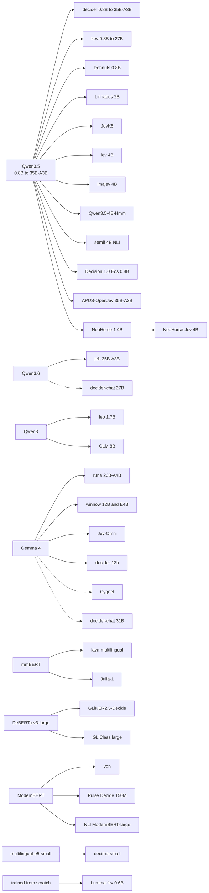

# 4. Dedicated, fine-tuned and vanilla models

A model's size tells you less about how it will decide than the place its answer is read from. This book sorts every model into one of three families by that place. A **dedicated** model was trained to answer System One questions and has its own readout: a letter at a trained answer slot, a pointer head, or a decision head on an encoder. A **fine-tuned** model is a chat model that someone tuned for a task, sometimes this task, sometimes a neighbouring one. A **vanilla** model is a stock chat model as its publisher released it.


*Most decision models grow from a few base models: Qwen, Gemma and a handful of encoders.*

The family decides which engines can run the model. It also decides how much prompt work you have to do before its answers are worth reading.

| family | where the answer comes from | engines in `ornotto` | engines and runtimes in the benchmark |
|---|---|---|---|
| dedicated | the model's own trained readout | dohnuts (decider, kev, Dohnuts), ollaya (its registry's models), pcdServer (as chat models) | jev, dohnuts, slot, pcdServer, ollaya, the authors' System One servers, llama.cpp embeddings, MLX, Core ML, Core AI, ONNX Runtime, PyTorch, ExecuTorch |
| fine-tuned | the first token of each allowed value, under a chat template | pcdServer | pcdServer, slot (Hmm readout) |
| vanilla | the first token of each allowed value, under a chat template | pcdServer | pcdServer |

The best row of every model in the benchmark, grouped by family:

--8<-- "tables/families.html"

## A family tree

Almost every decision model in this book is a small change to a model someone else released. The diagram below traces each model we ran, and a few we did not, back to the base weights its card names. A solid arrow means the weights were trained further: a full fine-tune, a LoRA, or a new head over a trained backbone. A dotted arrow means the base weights were left alone and only read in a new way.



Three things stand out.

**Qwen3.5 is the common ancestor.** Most decoder models in the benchmark start from it, at every size from 0.8B to the 35B-A3B mixture of experts. That is why pcdServer, dohnuts and slot can run so many of them with the same llama.cpp code: the architecture is one they already know. NeoHorse-Jev-4B is a two-step descendant. Its base, NeoHorse-1-4B, is a general agentic and coding model, not a decision model, and its GGUF header reports the Qwen3.5 architecture. Only the NeoHorse-Jev build answers System One questions.[^neohorse]

**Gemma 4 arrived late and went far.** rune, winnow, Jev-Omni and decider-12b are all Gemma 4 fine-tunes, and all of them appeared in the second half of September. Two of the dotted edges are Gemma 4 models used with no training at all. The September pcdServer build could not render the Gemma 4 template, so that round ran rune through slot and winnow through ollaya. The October fork serves the mradermacher Rune conversions on pcdServer ([chapter 3](03-engines.md#ollaya)).

**The encoders come from three families.** laya and Julia-1 are mmBERT, the base and the small size. GLiNER2.5-Decide and GLiClass are DeBERTa-v3-large. von, Pulse and the NLI model are ModernBERT. decima-small starts from multilingual-e5-small. Lumma-fev is the only model here trained from scratch.

The dotted edges matter for the rest of this chapter. They are the evidence that a stock model, read well, is already a decision model. The [vanilla models](#vanilla-models) section returns to them.

## Dedicated models

### decider

[Mapika/decider](https://github.com/Mapika/decider) is a family of full fine-tunes of Qwen3.5 trained to answer System One questions. The prompt is fixed by training: `Context:` and the state, then the question, the options lettered `(A)`, `(B)`, …, and `Answer: (`. The model is read at that last token, and only the logits of the option letters count. They are divided by a temperature from the checkpoint's `decider.json` (1.03 for the 0.8B model) before the softmax, so the probabilities are calibrated by the recipe.

The benchmark ran four sizes, from several converters:

| model | GGUF source | licence | best result (translated / direct) |
|---|---|---|---|
| decider-0.8b | [DreamBlooms/decider-0.8b-GGUF](https://huggingface.co/DreamBlooms/decider-0.8b-GGUF), [mradermacher/decider-0.8b-GGUF](https://huggingface.co/mradermacher/decider-0.8b-GGUF) | Apache-2.0 | 62/67 and 62/67 on dohnuts (Metal), mradermacher `Q6_K`, 54 ms; the DreamBlooms `Q8_0` file `ornotto` registers: 62/67 and 61/67, 52 ms |
| decider-2b | [DreamBlooms/decider-2b-GGUF](https://huggingface.co/DreamBlooms/decider-2b-GGUF), [cosetoenor/decider-2b-GGUF](https://huggingface.co/cosetoenor/decider-2b-GGUF) | Apache-2.0 | 59/67 and 62/67 on dohnuts (Metal); 60/60 on pcdServer |
| decider-4b | [Mapika/decider-4b](https://huggingface.co/Mapika/decider-4b), in Mapika's PyTorch package | Apache-2.0 | 63/67 and 65/67, 348 ms |
| decider-35b-a3b | [mradermacher/decider-35b-a3b-GGUF](https://huggingface.co/mradermacher/decider-35b-a3b-GGUF) | Apache-2.0 | 64/67 and 64/67 on dohnuts (Metal), 266 ms, 21 GB |

The DreamBlooms 2B build is a newer checkpoint with calibration-aware reinforcement learning and a temperature of 1.3. On this set it scores the same as the older 2B builds: calibration work shows up in the confidences, which the accuracy column does not see.

ollaya's `decider:0.8b` runs the 0.8B weights as a float32 ONNX graph on the CPU: 61/67 and 60/67, at 285 ms per query.

decider runs on dohnuts with its own readout, and on pcdServer as an ordinary chat model. The two are not the same measurement. [Chapter 6](06-results.md#one-set-of-weights-three-scores) shows the 0.8B model scoring 62 through its readout and 55 through pcdServer.

In `ornotto`, `decider-0.8b` and `decider-2b` are registered and default to dohnuts:

```python
import ornotto

fast = ornotto.Decider("decider-0.8b")                        # dohnuts, the trained readout
same_weights = ornotto.Decider("decider-0.8b", engine="pcd")  # pcdServer, as a chat model
```

decider changed more than any other model while this book was being written. Its Python package, `decider-ai`, shipped 18 releases between 1.0.0 on 2026-09-22 and 1.8.0 on 2026-09-29.[^decider-pypi] The ones that matter for local use:

| version | date | change |
|---|---|---|
| 1.4.0 | 2026-09-24 | temperatures per question type; decider-4b v2.1 and decider-2b v11 |
| 1.5.0 | 2026-09-25 | a vLLM server |
| 1.6.0 | 2026-09-27 | reads GGUF checkpoints, and GGUF files for decider-4b v2.1 and decider-2b v11 |
| 1.7.0 | 2026-09-29 | decider-12b, on Gemma-4-12B-it |
| 1.8.0 | 2026-09-29 | `temperature_by_options`, and two `decider-chat` repositories |

The temperature is where the recipe moved furthest. In our run, one number per checkpoint divided every logit. From 1.4.0 the temperature can depend on the question type, and from 1.8.0 on the number of options as well, following T(n) = max(min, a + b ln n), where n is the number of options and the temperature never falls below a fitted minimum.[^decider] A five-way router and a yes/no question on the same checkpoint no longer share one temperature. If you load a newer decider checkpoint in dohnuts, read its `decider.json` first to see which kind of temperature it carries.

The GGUF reader in 1.6.0 closes a gap. The reference PyTorch package and dohnuts can now load the same file, so a difference between them is a difference in code, not in weights ([chapter 12](12-choosing.md#contributing-upstream)).

The two `decider-chat` repositories are the stranger addition. They hold stock instruct weights, Gemma-4-31B-it and Qwen3.6-27B, read through decider's prompt and letter readout with a fitted temperature. Nothing in them is trained. They are the dotted edges in the family tree.

decider's README states: "Nothing was distilled from Jev." The teacher for its training data is a local Qwen3.5-27B.[^decider] `Mapika/decider-2b` had 244,279 downloads by 2026-09-30, the most of any decision-model repository created in September.[^decider2b]

### kev

[jaredpalmer/kev](https://github.com/jaredpalmer/kev) is a LoRA over Qwen3.5 plus a bilinear pointer head. The prompt marks the decision point and the end of every option with special tokens, and the head scores each option by the dot product of two projected hidden states. The benchmark ran the [mys/kev-0.8b-GGUF](https://huggingface.co/mys/kev-0.8b-GGUF) and kev-4b conversions through laya.cpp's `laya serve`. kev-4b reached 62/67 translated but 55/67 direct, and took 1,103 ms per query. kev-0.8b dropped to 45/67 on untranslated text.

ollaya's `kev:0.8b` reads the same LoRA and pointer head over Qwen3.5-0.8B-Base as a float32 ONNX graph and scored 60/67 translated and 62/67 direct, at 268 ms.

`ornotto` registers `kev-0.8b` from [DreamBlooms/kev-0.8b-GGUF](https://huggingface.co/DreamBlooms/kev-0.8b-GGUF) (Apache-2.0) on dohnuts, which reads the same pointer head. That build was not part of the benchmark run.

kev started with a single 0.5B model on 2026-09-17 and grew into a family three days later: Kev-27B, Kev-9B, Kev-4B and Kev-0.8B, released together on 2026-09-20.[^kev] Each size has its own temperature, fitted after training:

| model | fitted temperature |
|---|---|
| Kev-27B | 1.38 |
| Kev-9B | 2.30 |
| Kev-4B | 2.41 |
| Kev-0.8B | 2.35 |

The spread is worth noticing. decider's 0.8B checkpoint divides by 1.03, and Kev-0.8B by 2.35. A temperature says how sharp the raw scores of one particular head were before calibration. It says nothing about which model is more accurate, and two readouts' temperatures are not comparable with each other. They matter when you compare the probabilities of two models: see [chapter 9](09-confidence.md#what-calibration-means).

Like decider, kev states its provenance: "No Jev outputs were used for training."[^kev]

!!! quote "How it looked from the outside"
    kev trains in public. From 2026-09-26 its commits are numbered training rounds, each with a pass rule written down before the round runs. Not every round passes. Round 25 ended with "no candidate (0 of 8)", and round 26, on 2026-09-29, with "no candidate (0 of 4)".[^kev] Most model repositories publish only the checkpoints that worked. This one also publishes the ones that did not, which tells you how often a plausible change fails to beat the last model.

### Dohnuts

[PsiACE/Dohnuts](https://huggingface.co/PsiACE/Dohnuts-0.1.0-0.8B) is the model dohnuts.cpp was first written for: Qwen3.5-0.8B with language LoRA adapters and one scalar head read at each candidate marker. It also takes images through an `mmproj` projector. `ornotto` registers it as `dohnuts-0.8b`.

!!! warning "Non-commercial weights"
    The Dohnuts weights are licensed CC-BY-NC-SA-4.0. The engine is Apache-2.0, the weights are not. Dohnuts was not benchmarked here and is not the `ornotto` default.

On 2026-09-29 the dohnuts.cpp authors added a second model to the family: [Linnaeus-0.1.0-2B](https://huggingface.co/DreamBlooms/Linnaeus-0.1.0-2B-GGUF), Qwen3.5-2B with a rank-8 LoRA, published as F16, Q8_0 and Q4_K_M GGUF files with an `mmproj` projector and its own profile, `linnaeus.json`.[^linnaeus] It arrived after our benchmark runs, so it is not in the tables and not registered in `ornotto`. Upstream dohnuts.cpp gained its Linnaeus support in the same week. The October bundled dohnuts includes the upstream Linnaeus profile; this model remains unmeasured and unregistered ([chapter 12](12-choosing.md#contributing-upstream)).

### laya-multilingual

[convaiinnovations/laya-multilingual](https://huggingface.co/convaiinnovations/laya-multilingual) (Apache-2.0) is an encoder with a decision head, not a chat model; [chapter 3](03-engines.md#laya) describes its readout and its token budget.

The same checkpoint ran on eight engines and runtimes. Every method at 8-bit precision or better with the full prompt scored 52/67 translated and 49/67 direct, except an MXFP8 conversion on MLX at 53/67, so the engine or runtime changed only the speed: 6.9 ms per query on MLX, 12.3 ms in ollaya, 57.6 ms on laya.cpp. The compact prompt of the Neural Engine exports cost four to five answers. The 4-bit conversions spread widely: one lost an answer, one lost 16, the MXFP4 conversion lost 8, and the Q4_0 encoder from laya-neutron, read with its head converted to GGUF, gained two, to 54/67. `ornotto` runs laya only through ollaya (`ollaya-laya-multilingual`, `ollaya-laya-en`).

The weights live on Hugging Face under `convaiinnovations`, but that name does not exist on GitHub. laya's code is at [NandhaKishorM/laya](https://github.com/NandhaKishorM/laya), created on 2026-09-18. By 2026-09-30 it had 28,626 stars and 2,501 forks, the largest repository in the ecosystem that grew around jev, and 25 releases, the last of them v0.3.22 on 2026-09-29.[^laya] That release added checksum checks for each checkpoint and an abstention gate driven by confidence. Independent ports followed within two days: laya-mlx and laya-coreml for Apple silicon, and a C++ laya.cpp. Their speed claims are in [chapter 8](08-speed.md#the-later-engines-and-runtimes), next to our measurements and kept apart from them.

### jev

jev is TypeSafe's hosted System One model and the best result in the benchmark ([chapter 3](03-engines.md#jev)). Its internals are not public, so the benchmark treats it as the reference, not as a design to copy. dohnuts answers the same request shape, which is why pydantic-ai's TypeSafe model can drive a local engine ([chapter 11](11-typed.md)).

There was only one jev in September. TypeSafe's model list on 2026-09-30 shows `jev-1.13.0` as the only model, with both `jev-latest` and `jev-preview` pointing to it.[^tsmodels] Every public board that ranked jev during the month names the same version. Our harness called `jev-latest` and did not record the version it resolved to. Our jev rows almost certainly measure 1.13.0, but that is an inference from the boards and the docs, not a logged fact.

Several open models were built to be compared with jev, and some carry a version of its name. The name tells you what the authors were aiming at. It does not tell you whether jev's outputs were used to train them: that is a separate question, answered in [licences and provenance](#licences-and-provenance) below.

### Later dedicated models

A second benchmark round added decision models that the first round did not cover. Several were published as open alternatives to jev, and some say so in their names. They use the readouts described in [chapter 3](03-engines.md#a-linear-head-on-a-hidden-state-jev-omni), from letter logits to contrastive heads, and each ran on the runtime its authors provide. The licences are taken from the model cards.

| model | what it is | source | licence | best result (translated / direct, ms/query) |
|---|---|---|---|---|
| rune-26b-a4b | Gemma 4 26B-A4B mixture of experts, option-letter readout | [surogate/rune-26b-a4b-GGUF](https://huggingface.co/surogate/rune-26b-a4b-GGUF), version 1 (gated) | Apache-2.0 | 65/67 and 57/67, Q3_K_M on slot, 367 ms |
| winnow-12b | Gemma 4 12B, option-label logits | EldanRing, through ollaya's `winnow:12b` | Apache-2.0 | 64/67 and 65/67, Q8_0 in ollaya, 891 ms |
| neohorse-4b | NeoHorse-1-4B, packed prefill with a pointer head | [TokenRhythm/NeoHorse-Jev-4B-GGUF](https://huggingface.co/TokenRhythm/NeoHorse-Jev-4B-GGUF) | Apache-2.0 | 64/67 and 64/67, Q8_0, 273 ms |
| jev-omni | Gemma 4 12B-class, 256-way head on the last hidden state | [akhilaaa3/Jev-Omni](https://huggingface.co/akhilaaa3/Jev-Omni), as [GGUF](https://huggingface.co/ngquocvinh/Jev-Omni-GGUF) and [MLX](https://huggingface.co/Ruiruiz30/Jev-Omni-MLX-4bit) | Apache-2.0 | 64/67 and 64/67, Q3_K_M, 1,222 ms |
| openjev-35b-a3b | Qwen3.5-35B-A3B, option-letter readout, uncalibrated | [apus-ailab/APUS-OpenJev-v1-35B-A3B-GGUF](https://huggingface.co/apus-ailab/APUS-OpenJev-v1-35B-A3B-GGUF), and an MLX 4-bit build | Apache-2.0 | 63/67 and 64/67 on pcdServer, 297 ms |
| jeb-35b-a3b | Qwen3.6-35B-A3B, softmax restricted to the answer tokens | [szybkie-ai/jeb-35b-a3b](https://huggingface.co/szybkie-ai/jeb-35b-a3b), GGUF by mradermacher | Apache-2.0 weights, MIT code | 63/67 and 63/67, Q3_K_M, 333 ms |
| lev-4b | LoRA on Qwen3.5-4B, one-token option codes | [interfaze-ai/lev](https://huggingface.co/interfaze-ai/lev) | Apache-2.0 | 63/67 and 64/67, 2,204 ms |
| jevk5-4b | Qwen3.5-4B, option-letter readout | [alibiserikbay/JevK5-GGUF](https://huggingface.co/alibiserikbay/JevK5-GGUF) | Apache-2.0 | 62/67 and 63/67, Q4_K_M on slot, 351 ms |
| imajev-4b | LoRA on Qwen3.5-4B, 256-code readout | [mohit67890/imajev-4b](https://huggingface.co/mohit67890/imajev-4b) | Apache-2.0 | 62/67 and 64/67, 363 ms |
| gliner25-decide | DeBERTa-v3-large with a label head, English only | [fastino/GLiNER2.5-Decide](https://huggingface.co/fastino/GLiNER2.5-Decide), as Core AI, ONNX and Core ML builds | Apache-2.0 (DeBERTa-v3: MIT) | 61/67, Core AI, 27 ms |
| leo-1.7b | LoRA on Qwen3-1.7B-Base, listwise pointer head | [Suparva/leo-1.7b](https://huggingface.co/Suparva/leo-1.7b) | Apache-2.0 | 57/67 and 62/67, 136 ms |
| von | ModernBERT-large, order-invariant option markers, English only | [wfzyx/von](https://huggingface.co/wfzyx/von): 1.2 as ONNX, 1.1 in ollaya | Apache-2.0 | 57/67, ONNX, 53 ms |
| decision-eos | Qwen3.5-0.8B with an endpoint head | vLLM Semantic Router, through ollaya's `decision:eos` | Apache-2.0 | 57/67 and 56/67, 323 ms |
| semif-4b-nli | Qwen3.5-4B entailment cross-encoder | [jacksodj/semif-4b-nli-v5-mlx](https://huggingface.co/jacksodj/semif-4b-nli-v5-mlx) | MIT | 51/67 and 49/67, 121 ms |
| clm-8b | Qwen3-8B encoder with contrastive heads | [czl/CLM-v0.1-8B-GGUF](https://huggingface.co/czl/CLM-v0.1-8B-GGUF), MLX builds, ollaya's `clm:8b` | Apache-2.0 | 39/67 and 28/67, Q8_0, 108 ms |
| decima-small | multilingual late-interaction encoder | [amyrmahdy/decima-small](https://huggingface.co/amyrmahdy/decima-small) | Apache-2.0 | 37/67 and 38/67, int8, 12 ms |
| pulse-decide-150m | ModernBERT-base pair cross-encoder, English only | [RouterML/pulse-decide-150m](https://huggingface.co/RouterML/pulse-decide-150m) | Pulse Research Preview Licence | 34/67, 18 ms |
| lumma-fev-0.6b | 0.6B decoder trained from scratch, pointer head | [FrontiersMind/Lumma-fev-0.6b](https://huggingface.co/FrontiersMind/Lumma-fev-0.6b) | Apache-2.0 | 33/67 and 28/67, 70 ms |
| julia-1 | mmBERT-small with a laya-style head | [SupersonicLabs/Julia-1](https://huggingface.co/SupersonicLabs/Julia-1) | Apache-2.0 | 31/67 and 31/67, MLX, 6.8 ms |
| gliclass-large | DeBERTa-v3-large zero-shot classifier, Knowledgator | through ollaya's `gliclass:large` | Apache-2.0 | 26/67, 60 ms |
| nli-modernbert-large | ModernBERT-large zero-shot NLI, Moritz Laurer | through ollaya's `nli:modernbert-large` | Apache-2.0 | 20/67, 23 ms |

An empty direct score means the model was trained on English only, so only the translated text was sent to it.

Three licence notes travel with the rows. Pulse Decide 150M is a research preview whose training data carries non-commercial and terms-of-service restrictions; it is in the tables with that note and is not cleared for use in a product. The MXFP8 and MXFP4 conversions of laya declare no licence, and the MLX library that runs them, mlx-embeddings, is GPL-3.0. And two models were left out on purpose: Launchables' Myles encoders are gated, and their evaluation licence does not allow benchmark results to be published without the publisher's review.

Some of these models are in `ornotto` without any extra runtime: JevK5 and APUS-OpenJev as pcdServer models, and winnow, von, decision-eos, CLM, GLiClass and the ModernBERT NLI model as ollaya models ([chapter 10](10-package.md#registered-models)). The rest need the runtimes their authors publish.

Some notes on the rows, from the models' own cards:

- **NeoHorse.** Two different things share the name. NeoHorse-1, published on 2026-09-09, is a general agentic and coding model, and its many community builds on Hugging Face are chat models. Only TokenRhythm's NeoHorse-Jev-4B, published on 2026-09-23, is a decision model with a pointer head.[^neohorse] If you search Hugging Face for NeoHorse, most results are the wrong one.
- **winnow** comes in two sizes on Gemma 4: 12B, published on 2026-09-20, and E4B, on 2026-09-24. We ran the 12B through ollaya. ollaya's own documentation recommends `winnow:e4b` for general use.[^ollaya]
- **JevK5** has 2B, 4B and 9B builds, published between 2026-09-22 and 2026-09-25. We ran the 4B.
- **decision-eos** is the smallest decoder of the Decision 1.0 family from the vLLM Semantic Router project: Eos-0.8B, Sol-2B, Nox-4B and Lux-9B, plus two 0.6B encoders, Kai and Lex. The card gives a maximum input of 16,384 tokens.[^decision1]
- **CLM** comes from a Stanford and Nvidia group and was built for agent, game and tool-calling states. Its low score here is a question of fit as much as of quality ([chapter 3](03-engines.md#contrastive-similarity-clm)).

Where these models also appear on public leaderboards, their positions are in [chapter 5](05-method.md#other-public-boards). Those boards use other questions and other scales, and their numbers are not comparable with the 67-query scores in this table.

## Licences and provenance

A decision model has three things you might need to clear before shipping it: the licence of its weights, the licence of its base model, and where its training labels came from. The table above takes the first from each model card. The other two need a closer look.

!!! warning "Non-commercial and research licences"
    Most models in this chapter are Apache-2.0 or MIT. The exceptions:

    - **Dohnuts** weights are CC-BY-NC-SA-4.0 ([above](#dohnuts)).
    - **openjev/openjev**, an open jev alternative published on 2026-09-20, is CC-BY-NC-4.0.[^openjev] It is not the same model as APUS-OpenJev from `apus-ailab`, which is Apache-2.0 and is in our tables. The names are close enough to confuse.
    - **Pulse Decide 150M** uses a research-preview licence.
    - **Qwen2.5-3B, Qwen2.5-Coder-3B and Qwen1.5** carry Qwen research licences ([below](#vanilla-models)).

!!! warning "Models trained on jev's answers"
    TypeSafe's Master Customer Agreement, in the version marked "Last updated Sep 23, 2026", says in §2.3(b) that a customer may not use the service or its output "to perform model distillation, train a model to imitate the output of the Services", or build a competing product.[^mca] We do not know whether that clause was new on 2026-09-23 or already in the earlier text.

    Two days before that date, on 2026-09-21, the dataset `SargeDev/jev-distill-corpus-v3` was published under Apache-2.0. It has 740,957 rows, and its 498,010-row `yuri_v3` part carries the note "Labels distilled from Jev 1.13 (TypeSafe) via OpenRouter".[^corpus] The models `autotrust/JEV-9B` and `JEV-27B` describe themselves as "student of TypeSafe Jev 1.13" and train on that corpus.[^jev9b]

    The dataset's Apache-2.0 licence covers what its publisher can license. It does not settle whether the labels could be produced under TypeSafe's terms in the first place. None of these models is in our benchmark or in `ornotto`.

The models we did run say where their labels came from when their READMEs address it. decider's teacher is a local Qwen3.5-27B, and its README says "Nothing was distilled from Jev". kev's README says "No Jev outputs were used for training". For the others, the model card is the only source, and a card that says nothing about training data leaves the question open.

!!! quote "How it looked from the outside"
    The copies came fast. On the Hacker News thread for ollaya on 2026-09-25, a commenter asked how long open source had taken to copy the idea: "what, like 2 weeks?"[^hn-ollaya] The question was fair. Every model in our benchmark that was trained to answer System One questions first appeared on Hugging Face between 2026-09-16 and 2026-09-29, in the fortnight after jev's launch on 2026-09-15.

## Fine-tuned models

These are chat models tuned by third parties. None of them has a trained answer slot, so every one ran on pcdServer, which scores the first token of each allowed value under the model's chat template.

[n4ze3m/Qwen3.5-4B-Hmm](https://huggingface.co/n4ze3m/Qwen3.5-4B-Hmm) (Apache-2.0) is the exception worth knowing: it was tuned for this kind of pick-one decision. On pcdServer it scored 64/67 translated and 65/67 direct at every quantization from Q4 to BF16, the best local result near 90 ms. October Rune Q5 matches jev at 65/67 in both modes, but takes 962 ms with CPU weights. Read through its own letter readout on llama-server (the `slot` rows), the same weights scored 62/67 and 63/67 and took three times as long.

The rest spread from close to the top to the bottom of the table:

- The empero-ai Qwen3.8 distills reached 62/67 at 4B and 9B, and 49/67 at 2B.
- The coding models ([Qwen2.5-Coder](https://huggingface.co/Qwen/Qwen2.5-Coder-7B-Instruct-GGUF) 3B and 7B, jica98's Qwen3.5-4B super-coder) scored 60 to 61.
- Small models tuned for routing, deciding or retrieval scored worse than a vanilla model of the same size: pulse-0.6b 54, lq-decide-1.7b 50, lq-decide-0.6b 11, lyco-router-0.6b 35, Qwen3-Reranker-0.6B 40.
- DavidAU's Qwen3 Zero-Coder 0.8B scored 18 to 42 across seven quantizations, with no order by bit count, well below vanilla Qwen3.5-0.8B's best of 57.
- Qwen2.5-0.5B-PCb reached 27 at best, one answer below vanilla Qwen2.5-0.5B's 28, and EUAIAct-Qwen2.5-0.5B reached 20.

A tune for a nearby task does not carry over to this one. If you pick a fine-tuned model, check it on your own questions first.

`ornotto` registers `qwen3.5-4b-hmm` (the Q4_K_M file, 2.7 GB) on pcdServer:

```python
careful = ornotto.Decider("qwen3.5-4b-hmm")
```

## Vanilla models

Vanilla chat models need nothing but a chat template that llama.cpp understands, so any GGUF works on pcdServer. The benchmark ran Qwen3.5 (0.8B, 2B, 4B, 9B), Qwen3 (0.6B, 1.7B, 4B, 8B), Qwen2.5 (0.5B, 3B), Qwen1.5 (0.5B, 1.8B, 4B) and PrismML's Bonsai (1.7B, 27B), most of them at several quantizations.

- Qwen3.5-4B reached 62/67 and 63/67 at Q4; unsloth's Q8 build reached 63/67 and 64/67, one answer below the Hmm tune.
- Qwen3.5-2B at Q3_K_M reached 61/67 translated and 62/67 direct at 43 ms per query from a 1.2 GB file.
- Qwen3.5-0.8B reached 57/67 at Q5 and 55/67 at Q8, at about 30 ms.
- Qwen2.5-3B reached 62/67 on translated text but only 57 to 60 on direct text: it handles English well and other languages less well.
- Qwen1.5 scored 42/67 at best, at 4B. An older generation is no substitute for a smaller new one.
- Bonsai-27B at 1 bit (3.8 GB) reached 62/67 and 63/67, but took 514 ms per query.

Licences vary within the Qwen family. Qwen3 and Qwen3.5 are Apache-2.0. Qwen2.5-3B and Qwen2.5-Coder-3B use the Qwen Research licence, and Qwen1.5 the Tongyi Qianwen research licence. Read the model card before you ship one.

`ornotto` registers `qwen3.5-0.8b`, `qwen3.5-2b` and `qwen3.5-4b` on pcdServer. Any other GGUF works by path or by Hugging Face file:

```python
mine = ornotto.Decider("~/models/Qwen_Qwen3.5-2B-Q3_K_M.gguf")                            # a local file
hub = ornotto.Decider("hf:bartowski/Qwen_Qwen3.5-2B-GGUF/Qwen_Qwen3.5-2B-Q3_K_M.gguf")    # downloaded on first use
```

An unregistered GGUF runs on pcdServer only. To run one on dohnuts, pass the profile JSON as `metadata=` (and the scorer head as `head=` for kev or Dohnuts): dohnuts needs to know which readout the weights were trained for.

### Stock models on the public boards

Our result, that a vanilla Qwen3.5-4B comes within one or two answers of the best dedicated models, is not only ours. Two public leaderboards reached the same point in the last week of September, with larger models and other questions.

On JevBench v1.5.2, the first place went to Cygnet, a frozen, stock Gemma-4-12B-it read at one letter token, served on vLLM.[^cygnet] Nothing in Cygnet is trained for decisions. The recipe is the prompt and the readout. On the Decision Index v0.2.1, the second place went to decider-chat-gemma4-31b, the stock Gemma-4-31B-it read through decider's prompt with a fitted temperature.

These are other people's numbers, on scales unlike ours and unlike each other's. The table is here to show order within each board, not to compare boards:

| board, version, date read | system | what it is | score |
|---|---|---|---|
| JevBench v1.5.2, read 2026-09-29 | Cygnet | stock Gemma-4-12B-it, letter readout | 73.7 (#1) |
| | Winnow-12B Q8 | Gemma 4 fine-tune | 73.2 (#2) |
| | Jev 1.13.0 | hosted | 72.1 (#3) |
| | decider-4b v2 | Qwen3.5 fine-tune | 71.3 (#7) |
| Decision Index v0.2.1, 2026-09-28 | Jev 1.13.0 | hosted, listed separately | 57.91 |
| | rune 26B-A4B v3 | Gemma 4 fine-tune | 57.44 (#1) |
| | decider-chat-gemma4-31b | stock Gemma-4-31B-it, decider readout | 57.33 (#2) |
| | AutoJev-27B | open 27B model by Denis Yarats | 56.40 (#3) |
| | decider-chat-qwen3.6-27b | stock Qwen3.6-27B, decider readout | 51.35 (#8) |
| | decider-35b-a3b, NVFP4 | Qwen3.5 fine-tune | 47.11 (#12) |
| | decider-4b | Qwen3.5 fine-tune | 40.70 (#19) |
| | decider-2b | Qwen3.5 fine-tune | 28.97 (#37) |

Both sets of figures are as the decider README reports them. Its authors did not run either board themselves, and neither did we.[^decider] [Chapter 5](05-method.md#other-public-boards) describes how each board scores.

The decider authors drew the conclusion themselves: "On the index the base model sets most of the score: our trained 35B, 4B and 2B are below these two stock models read the same way."[^decider] An evidence audit of 28 early papers on typed decision models, posted on 2026-09-26, put it more generally: "the typed readout itself has not shown an independent accuracy advantage over comparable label-probability readouts."[^audit]

None of this makes training useless. It moves the question. A trained readout gives you a fixed prompt, a fitted temperature and a small model that answers fast. A larger stock model, read at the right token, may give you the accuracy. Which of the two you need depends on the latency and memory you can spend, which is what [chapter 8](08-speed.md) and [chapter 12](12-choosing.md) are about.

## The October Tev1 and Kev exports

Tev1 is Together AI's experimental Qwen3.5-0.8B decision fine-tune. The native interface supplies a state, question and labelled options; inference reads only the option-letter logits after the decision prompt. We measured its Q8 conversion on dohnuts and its MLX 4-bit conversion. The upstream licence remains unresolved. Kev now also has a FluidInference Core ML fp16 export with its native pointer head; we measured its single-question L512/K16 row on CPU and GPU. [Chapter 6](06-results.md#issue-102-october-additions) records the results and the remaining issue 102 variants.

## What changed in September 2026

This chapter was first written from the benchmark runs of 2026-09-22 and 2026-09-23. By the end of the month:

- decider gained temperatures per question type and per number of options, a GGUF reader, a Gemma 4 model and two readouts over stock chat models.
- kev had released four sizes with fitted temperatures and was publishing numbered training rounds.
- The dohnuts.cpp authors added Linnaeus-0.1.0-2B.
- laya became the most starred project around jev and gained ports to MLX, Core ML and C++.
- TypeSafe's customer agreement gained, or restated, a ban on distillation, while an Apache-2.0 corpus of jev labels and two models trained on it were already public.
- A stock Gemma 4 model read at one letter token took the first place on one public leaderboard.

jev itself did not change: 1.13.0 was the only version all month.

## Which family for which job

- If you want calibrated probabilities you can threshold, use a dedicated model on dohnuts. Only the dedicated readouts divide by a fitted temperature.
- If you want the most accurate local answer and can spend about 90 ms and 2.7 GB, use Qwen3.5-4B-Hmm on pcdServer.
- If you want the best local score and have the memory and latency budget, the mradermacher Rune Q5_K_M (19.13 GB) on pcdServer matches jev at 65/67 in both modes, at 962 ms with CPU weights. Its registered Q3 scores 64/64 at 146 ms.
- If you have a model already, or need one that no one has tuned, a vanilla Qwen3.5 on pcdServer works with no training at all. Qwen3.5-2B at Q3 is the smallest vanilla model that stays within one answer of the dedicated 0.8B model.

[Chapter 7](07-quantization.md) shows how far each family can be quantized, and [chapter 12](12-choosing.md) turns these results into a choice.

[^neohorse]: TokenRhythm, "NeoHorse-Jev-4B" model card, 2026-09-23; ngquocvinh, "NeoHorse-1-4B-GGUF" model card, 2026-09-13. Read 2026-09-30. <https://huggingface.co/TokenRhythm/NeoHorse-Jev-4B>, <https://huggingface.co/ngquocvinh/NeoHorse-1-4B-GGUF>
[^decider-pypi]: PyPI, "decider-ai" release history, 2026-09-22 to 2026-09-29. Read 2026-09-30. <https://pypi.org/project/decider-ai/>
[^decider]: Mapika, "decider" README, What's new and Standing sections. Read 2026-09-30. <https://github.com/Mapika/decider>
[^decider2b]: Hugging Face, "Mapika/decider-2b" model page, download count. Read 2026-09-30. <https://huggingface.co/Mapika/decider-2b>
[^kev]: Jared Palmer, "kev" README, releases and commit history, 2026-09-17 to 2026-09-29. Read 2026-09-30. <https://github.com/jaredpalmer/kev>
[^linnaeus]: DreamBlooms, "Linnaeus-0.1.0-2B-GGUF" model card and dohnuts.cpp commit history, 2026-09-29. <https://huggingface.co/DreamBlooms/Linnaeus-0.1.0-2B-GGUF>, <https://github.com/DreamBlooms/dohnuts.cpp>
[^laya]: NandhaKishorM, "laya" repository and releases, 2026-09-18 to 2026-09-29. Read 2026-09-30. <https://github.com/NandhaKishorM/laya>
[^tsmodels]: TypeSafe, "Models", documentation page. Read 2026-09-30. <https://docs.typesafe.ai/models>
[^ollaya]: ollaya, release notes v0.1.0 to v0.7.5, 2026-09-23 to 2026-09-28. <https://github.com/ollaya-dev/ollaya/releases>
[^decision1]: vLLM Semantic Router, "Decision-1.0-Eos-0.8B" model card, 2026-09-21. Read 2026-09-30. <https://huggingface.co/llm-semantic-router/Decision-1.0-Eos-0.8B>
[^openjev]: openjev, "openjev" model card, 2026-09-20. Read 2026-09-30. <https://huggingface.co/openjev/openjev>
[^mca]: TypeSafe, "Master Customer Agreement", last updated 2026-09-23. Read 2026-09-30. <https://typesafe.ai/legal/mca>
[^corpus]: SargeDev, "jev-distill-corpus-v3" dataset card, 2026-09-21. Read 2026-09-30. <https://huggingface.co/datasets/SargeDev/jev-distill-corpus-v3>
[^jev9b]: autotrust, "JEV-9B" model card. Read 2026-09-30. <https://huggingface.co/autotrust/JEV-9B>
[^hn-ollaya]: Hacker News, discussion of the ollaya launch, comment by pradn, 2026-09-25. <https://news.ycombinator.com/item?id=49848269>
[^cygnet]: blockbrain-ai, "cygnet-recipe" repository, 2026-09-24. <https://github.com/blockbrain-ai/cygnet-recipe>
[^audit]: Lijuan Tang and Yuemeng Zheng, "Typed Decision Models: An Early Evidence Audit and Evaluation Checklist", arXiv 2609.32160, 2026-09-26. <https://arxiv.org/abs/2609.32160>
