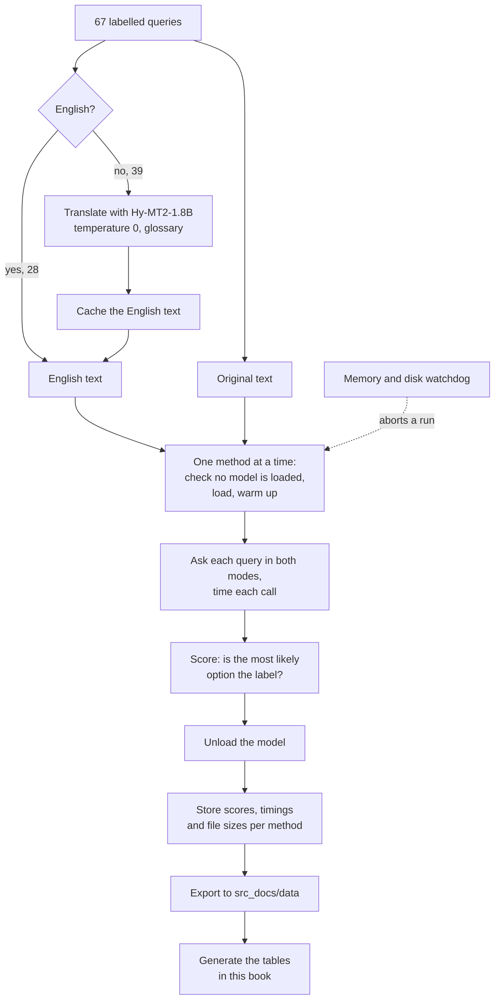

# 5. How we measured

The benchmark asks one question 67 times: which of five things does this FontLab user want the built-in assistant to do? It is the router in front of the FontLab assistant, and it is the decision this book was written to get right. Every method got the same 67 queries, and every answer was scored against a label we assigned before the run.

## The router question

The assistant can do five kinds of work, and each query belongs to exactly one:

| task | what the user wants |
|---|---|
| `docs` | an explanation of how a FontLab feature, tool, panel or setting works, from the documentation, not code |
| `python` | a Python script that automates FontLab: batch operations, renaming glyphs, generating files |
| `fea` | OpenType feature code in FEA syntax: `liga`, `kern`, `calt`, `ss01`, lookups, classes |
| `vfj` | a glyph definition in VFJ, FontLab's JSON glyph format: contours, nodes, components, anchors |
| `sample` | a sample text to type in the Glyph window: a pangram, test strings, glyph sequences |

The labels split 17 `docs`, 14 `fea`, 14 `sample`, 13 `python` and 9 `vfj`.

System One methods received the question as the instruction *"This message was sent to the assistant built into FontLab, the font editor. What is the user asking the assistant to do? Pick the single best match."* and each task as an option with a description of one to three sentences. Other methods needed shorter prompts, which the section on [prompts](#what-each-method-was-asked) lists.

## The 67 queries

28 queries are in English and 39 are in 29 other languages, 30 languages in all: Polish (3); German, French, Spanish, Italian, Russian, Japanese, Chinese and Korean (2 each); and Czech, Portuguese, Dutch, Turkish, Hungarian, Finnish, Swedish, Ukrainian, Bulgarian, Greek, Armenian, Georgian, Arabic, Persian, Hebrew, Urdu, Hindi, Bengali, Thai and Vietnamese (1 each). They cover Latin with diacritics, Cyrillic, Greek, Arabic, Hebrew, Devanagari, Bengali, Thai, Georgian, Armenian, Han, Hangul and Kana.

Ten of the queries were written to be hard. They sit on the border between two tasks, and a reasonable person could hesitate over each:

- "How do I write a liga feature?" asks for an explanation (`docs`) but names FEA.
- "Give me the code that makes ff become a ligature" is `fea`, and "Script the kerning for A V" is `fea` phrased like `python`.
- "What would the JSON for a glyph look like?" is `vfj`, while "Show me how a glyph is stored in a VFJ file" is `docs`.
- "Text with lots of kerning pairs" and "Something to type in the Glyph window that shows off my ligatures" are `sample`, and so is one Polish variant.
- "Can FontLab batch rename glyphs?" is `docs`, while "Rename all glyphs in every open font, I don't want to click" is `python`.

These ten carry most of the differences between the stronger models. On "How do I write a liga feature?", 9% of all methods answered `docs`, and jev answered `fea`. [Chapter 9](09-confidence.md) lists every query with the share of methods that got it right.

## Translated and direct

Every model was scored twice.

- **Direct**: the original query goes to the classifier, in whatever language it was written.
- **Translated**: the 39 non-English queries are first translated into English, and the 28 English ones pass through unchanged.

The translated mode models a pipeline in which a small translator runs before the decision. It costs one more model and about 88 ms per non-English query. It helps weaker multilingual models most and helps the strongest ones not at all: jev scored 65/67 either way.

### Language detection

The pipeline has to know whether a query is English before it can decide to translate it. Two detectors were measured over 100 passes of the 67 queries, single-threaded, after a warm-up:

--8<-- "tables/detectors.html"

[lingua](https://github.com/pemistahl/lingua-rs) was right on 63 of 67 queries and handles about 1,940 calls per second. papagan is about 40 times faster and was right on 43. The majority vote, which breaks ties in lingua's favour, adds nothing to lingua alone. Its four misses: a Spanish and an English query read as Latin, a Bulgarian one as Russian, and a Hindi query full of English terms as Sotho.

### Translation

The translator is Hy-MT2-1.8B at Q4_K_M on llama-server, at temperature 0, with a prompt that names the source language and carries a short glossary. The glossary pins font-editing terms that the model otherwise paraphrased in early tests: without it, the Polish *kursywy* came back as "curve", and the German *kern-Feature* as "core feature". Terms such as `glyph`, `kerning`, `feature`, `italic`, `VFJ`, `FEA` and `Glyph window` map to themselves.

The 39 translations, with the time each took:

--8<-- "tables/translator.html"

Each query was translated once and the English text was cached, so every classifier in translated mode saw the same English.

## From query to table

The whole run, from a labelled query to a row in this book, has five stages. Translation happens once per query. Classification happens once per query, per mode, per method.

- **Detect and translate.** The 39 non-English queries go through the translator once. The English text is stored, and every later method reads the stored text, so a change in the translator cannot make two methods see different English.
- **Classify.** Each method runs alone, on the original text and on the English text, with the prompt from the [next section](#what-each-method-was-asked). Models trained on English only get the English text alone. The harness keeps the probabilities, not only the winner, which is what the confidence gates in [chapter 9](09-confidence.md) need.
- **Guard.** The watchdog described [below](#one-model-at-a-time) can stop a run at any point. A stopped run leaves no row, not a score of zero. The jeb-35b-a3b Q5_K_M file in [chapter 3](03-engines.md#servers-that-model-authors-publish) is an example.
- **Store.** Results are kept per method name, so the published data holds one row per method.
- **Report.** The public data in `src_docs/data/` is exported from the stored results, and every table in the book is generated from that data when the book is built. No number in the tables is typed by hand.

## What each method was asked

Engines and runtimes take different request shapes, so the same decision was phrased in the shape each readout was built for:

| engine or readout | prompt |
|---|---|
| jev, dohnuts, laya.cpp (kev), PyTorch, ExecuTorch | a System One request: the query as `state`, one `choice` question with the long instruction and the five long task descriptions as `criteria` |
| slot, decider readout | decider's trained layout, tokenized as upstream does it: `Context:` and the query, then the question, the options lettered `(A)` to `(E)` with their long descriptions, then `Answer: (` |
| slot, Hmm readout | the Qwen chat template with thinking off, options as `A: name — description` lines, and "Return only the option letter." |
| pcdServer | one enum field `task` with the choices `docs`, `python`, `fea`, `vfj`, `sample`, and a field description made of a short instruction and one short description per task |
| laya runtimes | a System One request with the short instruction and short descriptions, because the encoder shares a 1,024-token budget; the Neural Engine exports hold 96 tokens and got a compact prompt |
| ollaya, the authors' System One servers | a System One request, as for jev; ollaya's encoder tags (laya, nli, gliclass, von) got the short instruction and descriptions |
| slot, rune, JevK5 and APUS-OpenJev readouts | each model's published prompt, with the options lettered and their long descriptions |
| the later encoders (GLiNER2.5-Decide, Julia-1, von, decima-small, Pulse Decide, the new laya builds) | the short instruction and descriptions, laid out as each model's own code lays them out |
| Jev-Omni, semif, Lumma | the prompt that each model's published code builds from the question, the options and the query |

pcdServer cannot attach a description to each allowed value, which is why its task descriptions live in the field description. [Chapter 3](03-engines.md) explains what each readout does with its prompt.

## One model at a time

Every model was loaded alone, measured, and unloaded before the next one started. The rule comes from an accident. An early driver loaded several GGUF files per batch (up to 9 GB of weights at once) next to the resident translation model, while other experiments ran beside it. The machine, an Apple M4 Max with 48 GB of memory, swapped until its boot disk was full and macOS stopped responding.

Since then the harness checks that no model process is running before it loads one. A watchdog polls every two seconds and aborts a model's run if swap grows by more than 4 GB, free space on the boot disk falls below 30 GB, available memory falls below 4 GB, or the run passes 30 minutes. With those guards in place, swap stayed flat at about 2.7 GB for every model, the 21 GB decider-35b-a3b included. [Chapter 8](08-speed.md#memory-one-model-at-a-time) turns this into rules for your own code.

One model at a time also makes the timings fair: no model competes with another for the GPU or for memory bandwidth.

## What the numbers mean

- **Translated** and **direct** count correct answers out of 67. A correct answer is one whose most likely option is the labelled task.
- The **English** column counts the 28 English queries in translated mode. **Other, translated** and **other, direct** count the 39 non-English queries in each mode.
- **ms/query** is the mean wall-clock time from the moment the harness sends a query to the moment it has the probabilities. For server engines it includes the HTTP round trip and JSON parsing on loopback. For jev it includes the network trip to OpenRouter. It excludes model loading and a warm-up call made before timing starts.
- **Load ms** is the time to load the model and answer the warm-up call, for runtimes that load in-process or that the harness started itself. It is blank where a server was started outside the timed step.
- **GB** is the size of the GGUF file as published on Hugging Face. For other formats it is the size of the weight files the method loads; for the adapters lev, imajev and leo it includes the base model they load; for an ollaya model it is the tag's download. Tokenizers and configuration files are left out.

In-process runtimes (MLX, Core ML, ONNX Runtime) have no HTTP in their times, so compare their milliseconds with a server's only loosely.

## Reproducibility

- **Engines.** dohnuts.cpp at upstream commit `9a894b0`, with llama.cpp pinned by its submodule at `b29c606`. The benchmark predates our prefix cache ([chapter 8](08-speed.md#prefix-caching-in-dohnuts)), which leaves single-question requests unchanged. pcdServer at commit `1ce9e55`, which fetches llama.cpp tag `v0.4.1` when it is configured. slot used a stock llama-server.
- **Translator.** Hy-MT2-1.8B at Q4_K_M, temperature 0, with the glossary above.
- **Dates.** The first 208 methods, the jev calls included, ran on 2026-09-22 and 2026-09-23; the 50 later methods on 2026-09-29 and 2026-09-30. ollaya was version 0.7.5.
- **jev version.** The harness called the alias `jev-latest` and did not record which version answered. TypeSafe's documentation on 2026-09-30 lists `jev-1.13.0` as the only model behind both `jev-latest` and `jev-preview`, and every public board that ranked jev in September names 1.13.0.[^tsmodels] Our jev rows almost certainly measure 1.13.0, but the version is inferred, not logged. A run against a pinned version name would remove the doubt.
- **Data.** The harness itself is private. Every method's scores, timings and file sizes are published in `src_docs/data/` in the [ornotto repository](https://github.com/fontlaborg/ornotto), and the tables in this book are generated from them.

## Limits

- **67 queries is a small set.** One query is 1.5 percentage points of accuracy. Differences of one or two queries between models are within what a different set of 67 would change.
- **The labels are ours.** For the ten ambiguous queries another person could label a few differently. jev's two errors are both on ambiguous queries.
- **Thresholds are in-sample.** The confidence gates in [chapter 9](09-confidence.md) were tuned on the same 67 queries they are scored on. Expect them to do somewhat worse on new traffic.
- **One machine.** All timings come from one Apple M4 Max, on Metal where the engine or runtime supports it. CPU-only machines are several times slower: dohnuts on the CPU with eight threads took 275 ms per query against 52 ms on Metal.
- **One task.** A five-way router is one decision. Yes/no questions, rubrics and long option lists behave differently, and [chapter 2](02-decisions.md) shows examples of each.
- **Only the winner is scored.** Accuracy looks at the most likely option. It ignores how confident the model was, which matters as soon as you gate on confidence ([chapter 9](09-confidence.md)).

## Other public boards

Our set answers one question: which of five handlers should get a FontLab message. It says little about yes/no questions, rubrics or long option lists. In the second half of September 2026, other people published boards that cover more ground. They are worth reading, and they are easy to misread. This section describes what each one measures, so that a number quoted from it can be put in context. None of them is comparable with our 67-query scores, and most are not comparable with each other.

| board | publisher | first published | what it holds | headline metric |
|---|---|---|---|---|
| typed-decisions | `LocalLLaMA` on Hugging Face | 2026-09-16 | 400 cases, 2,000 decisions, four business workflows | accuracy, with KL from gold, Brier, ECE, p50 latency and price |
| JevBench | Benchmark Heaven | v1.2 frozen 2026-09-19 | a public set plus sealed items; the count changed between versions | the JevBench Score, a mean of four axes |
| jev-bench | `Praveenrajus` on Hugging Face | 2026-09-20 | several configurations, including MASSIVE with 60 intents and soft-label sets | accuracy and ECE |
| Decision Index | multimodalart | v0.2.1 on 2026-09-28 | 70 entries across 43 benchmarks | a chance-corrected score, where 0 is random |
| Decision 1.0 benchmark | vLLM Semantic Router | 2026-09-21 | 54 tasks, 3,766 questions | overall score |

### typed-decisions

The typed-decisions set has four workflows: agent trace observability, customer service, invoice processing and security incidents. Its test split holds 400 cases with 2,000 decisions among them, across all three question types.[^typed] It reports six columns: accuracy, KL divergence from the gold distribution, Brier score, expected calibration error, median latency and price per million input tokens.

That column list is the board's most useful idea. Accuracy alone, which is what our tables report, cannot tell a model that is right and unsure from one that is right and certain. The card makes the point about jev itself: "Its accuracy is near the 0.735 ceiling, but it puts nearly all its probability on one answer, which is where the KL gap comes from."[^typed] Our [limits](#limits) say the same thing from the other side: we score only the winner. [Chapter 9](09-confidence.md#what-calibration-means) is where the probabilities come back in, and [chapter 6](06-results.md) has the board's top rows next to ours.

The board also shows how fragile a single figure is. The same model, jev 1.13.0, on the same set, is given as 0.727 on the card (measured 2026-09-18), as 0.738 by ollaya, which cites Winnow's report, and as 72.70% by the Julia-1 model card.[^typed][^julia] The spread comes from which run and which date each source used. If you quote a jev figure for this set, quote the card's 0.727 with its date.

### JevBench

JevBench, from Benchmark Heaven, combines four axes into one score: **Intelligence**, which is chance-corrected accuracy; **Calibration**, which combines the ECE on the hard tier with a fidelity measure; **Speed**; and **Cost**.[^jevbench] Version 1.2 combined them with a geometric mean. From version 1.4 the JevBench Score is an equal-weight harmonic mean, which punishes a weak axis harder.

Because speed and cost are part of the score, a JevBench number describes a model on a provider at a price, not only the model. A local model scores well on cost, and a hosted one on whatever latency its provider delivered that day.

The board changed more often than any model it ranked. Within two weeks it went through v1.2, v1.2.1 to v1.2.3, v1.3.0, v1.4, v1.4.1, v1.4.2.1, v1.4.2.2 and, on the site only, v1.5.2. The GitHub releases of the harness stop at v1.4.2 on 2026-09-24, so the v1.5.2 numbers cannot be reproduced from the published code today.[^jevbench][^decider]

!!! quote "How it looked from the outside"
    jev 1.13.0 was one fixed model all month. Its JevBench score was not:

    | JevBench version | date | jev 1.13.0 | its place |
    |---|---|---|---|
    | v1.2 | frozen 2026-09-19 | 74.4 | #1 |
    | v1.4.2.2 | not dated in our sources | 63.29 | #4 |
    | v1.5.2 | read 2026-09-29 | 72.1 | #3 |

    Nothing about jev changed between these rows. The questions, the formula and the scale did. A JevBench number without its version is not a measurement of anything in particular.

The top of v1.4.2.2, which ranked 95 systems, was Imajev-4B at 67.37, Plumb-4B at 65.84, decider-4b v2 at 64.13, jev 1.13.0 at 63.29 and JevK5 v0.2.0 at 62.04.[^jevbench] The top of v1.5.2 is in [chapter 4](04-models.md#stock-models-on-the-public-boards), on a scale that is not comparable with v1.4.x.

### jev-bench

jev-bench, with a hyphen and a lower-case name, is a different board: a Hugging Face dataset from `Praveenrajus`, published on 2026-09-20.[^jevbench-hf] Its card gives jev 1.13.0 "0.733 accuracy, ECE 0.113", and its best open entry, a fine-tuned Qwen3.5-9B, "0.763 accuracy, ECE 0.056, TVD to human labels 0.301 (Jev 0.432)". The last figure compares the model's distribution with how human labellers split, which only a set with soft labels can do. It also carries a `massive` configuration with 60 intents.

Two boards with nearly the same name is a small trap. When a card cites "JevBench", check which one it means.

### Decision Index

The Decision Index, published by multimodalart with a kit by apolinario, aggregates 43 existing benchmarks into one chance-corrected score, where 0 is random.[^index] Version 0.2.1, from 2026-09-28, has 70 entries. It lists jev separately from the ranked models, at 57.91. Its value is breadth: a model that does well on one kind of question and badly on another shows up as average. Its per-area scores are more telling than the total. The decider README reports, for decider-35b-a3b against jev, knowledge at 0.51 against 0.69 and tools at 0.72 against 0.73.[^decider]

### Decision 1.0 benchmark

The vLLM Semantic Router project published its Decision 1.0 models with a benchmark of its own: 54 tasks and 3,766 questions.[^decision1] Its card reports:

| model | overall, Decision 1.0 benchmark |
|---|---|
| Decision 1.0 Eos-0.8B | 61.89 |
| Kev 0.8B | 58.28 |
| Qwen3.5-2B, letter readout | 57.24 |
| Laya English | 51.03 |

A benchmark published by the authors of the first row is useful for comparing their models with each other. It is weaker evidence for comparing them with anyone else's. The same holds for our own set, which was written for the FontLab router and makes no claim beyond it.

### MASSIVE, scenario and intent

Several model cards report results on MASSIVE, a multilingual set of voice-assistant utterances. It has two label sets that are easy to confuse: **scenario**, with 18 labels, and **intent**, with 60. They are different tasks with different difficulty, and the cards do not always say which one they mean.

| model | MASSIVE task | reported score | source |
|---|---|---|---|
| Julia-1 | scenario, all 52 locales | 71.50% macro | model card[^julia] |
| Julia-1 | scenario, en-US | 86.75% | model card[^julia] |
| laya | intent, English | 0.783 | README[^laya] |
| laya | intent, 13 other languages | 0.451 | README[^laya] |
| decider-2b on Apple MPS | scenario, 1,500 held-out examples | 0.7553 accuracy, ECE 0.0438 | README[^decider] |

A scenario score and an intent score are not two measurements of the same thing. Put them side by side only if the card says which task it used.

### Reading any board

- **Cite the version and the date.** JevBench changed its scale at least three times in two weeks, and jev's figure on one fixed set differs by source.
- **Check who ran it.** A board run by a model's authors, or a figure a README copies from a board, is second-hand evidence. The decider README says of both boards it cites that its authors "did not run them".
- **Check what the score includes.** A JevBench score includes speed and price. A typed-decisions accuracy does not. A Decision Index score is chance-corrected, and ours is not.
- **Check the task.** A five-way router, a 60-intent classifier and a yes/no gate are different decisions. A model can lead on one and trail on another, so read a board's task before its ranking.

An evidence audit posted on 2026-09-26, which reviewed 28 early papers on typed decision models, ends with a 14-item checklist for exactly this kind of reading.[^audit]

## What changed in September 2026

Every board in this section was created in the second half of September, after jev's launch on 2026-09-15: typed-decisions on 2026-09-16, JevBench v1.2 on 2026-09-19, jev-bench on 2026-09-20, the Decision 1.0 benchmark on 2026-09-21 and the Decision Index kit on 2026-09-22. Our own runs took place on 2026-09-22 and 2026-09-23, and on 2026-09-29 and 2026-09-30. When this chapter was written, none of the public boards had been running for more than two weeks, and JevBench had already changed its method several times. Treat their rankings, and ours, as snapshots with dates.

[^tsmodels]: TypeSafe, "Models", documentation page. Read 2026-09-30. <https://docs.typesafe.ai/models>
[^typed]: LocalLLaMA, "typed-decisions" dataset card, created 2026-09-16. Read 2026-09-30. <https://huggingface.co/datasets/LocalLLaMA/typed-decisions>
[^julia]: SupersonicLabs, "Julia-1" model card, measured 2026-09-24. Read 2026-09-30. <https://huggingface.co/SupersonicLabs/Julia-1>
[^jevbench]: Benchmark Heaven, "JevBench", leaderboard and harness releases, 2026-09-19 to 2026-09-24. Read 2026-09-30. <https://benchmarkheaven.com/jev-models>, <https://github.com/fstandhartinger/jevbench>
[^decider]: Mapika, "decider" README, Standing section. Read 2026-09-30. <https://github.com/Mapika/decider>
[^jevbench-hf]: Praveenrajus, "jev-bench" dataset card, 2026-09-20. Read 2026-09-30. <https://huggingface.co/datasets/Praveenrajus/jev-bench>
[^index]: multimodalart and apolinario, "Decision Index" v0.2.1, 2026-09-28. <https://multimodalart-jev-decision-index.static.hf.space>, <https://github.com/apolinario/decision-index>
[^decision1]: vLLM Semantic Router, "Decision-1.0-Eos-0.8B" model card, 2026-09-21. Read 2026-09-30. <https://huggingface.co/llm-semantic-router/Decision-1.0-Eos-0.8B>
[^laya]: NandhaKishorM, "laya" README. Read 2026-09-30. <https://github.com/NandhaKishorM/laya>
[^audit]: Lijuan Tang and Yuemeng Zheng, "Typed Decision Models: An Early Evidence Audit and Evaluation Checklist", arXiv 2609.32160, 2026-09-26. <https://arxiv.org/abs/2609.32160>
