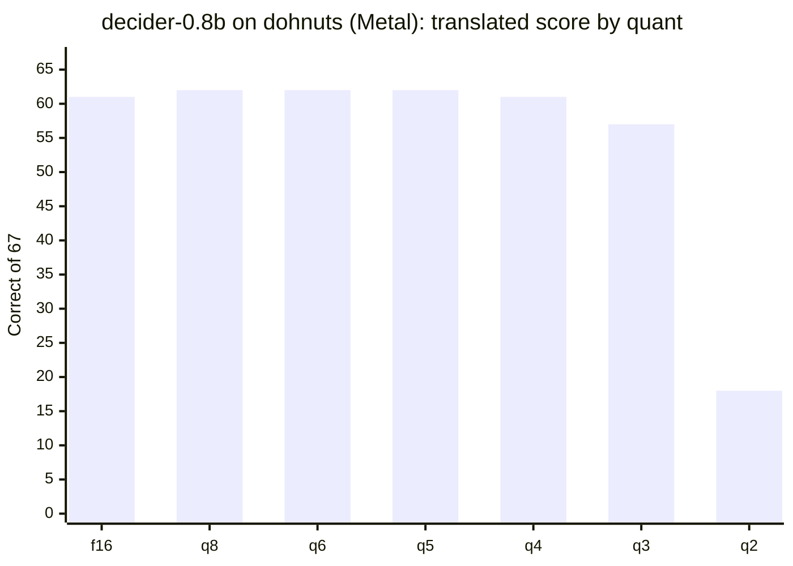

# 7. Quantization and size

A GGUF file stores a model's weights at reduced precision, and the precision you pick decides the file size, the memory the engine needs, and how many answers survive. On the router set, precision matters much less than you might expect, until it suddenly matters a lot.

This chapter reads the router benchmark by file rather than by model. It covers what the quantization labels mean, where the plateau ends, how the engine shifts the curve, and which file to download. The numbers are ours, from the same 67 queries as [chapter 6](06-results.md). Where a model's publisher rates its own quantizations, the rating is quoted and kept apart from our scores.

## What the labels mean

The suffix of a GGUF file names its quantization: how many bits each weight keeps, and how llama.cpp groups them.

| Label | llama.cpp's reference: Llama-3-8B size, perplexity cost | What it is |
|---|---|---|
| `F16`, `BF16` | about 16 GB, none | Half precision. `BF16` keeps the float32 exponent range; for inference both are the unquantized model. |
| `Q8_0` | 7.96 GB, +0.0026 | Eight bits per weight in small blocks, each with its own scale. The usual reference quant. |
| `Q6_K`, `Q5_K_M`, `Q4_K_M` | 6.14, 5.33, 4.58 GB; +0.022, +0.057, +0.175 | K-quants: nested blocks with their own scales, mixing precisions across tensors (`_M` is the medium mix). |
| `Q3_K_M`, `Q2_K` | 3.74, 2.96 GB; +0.66, +3.52 | The same scheme with fewer bits. |
| `IQ3_XXS`, `IQ2_XXS`, `IQ1_S` | 3.06, 2.06, 1.56 bits per weight | "i-quants": codebooks fitted with an importance matrix, built to hold up at very low bit rates. |
| `UD-…` | mixed | Unsloth's "dynamic" quants, which pick a precision per layer. |

The perplexity cost is the increase llama.cpp's `llama-quantize` lists for Llama-3-8B; it grows slowly to `Q4_K_M` and fast below it, which is the shape the router benchmark shows too.

In the tables below and in [chapter 6](06-results.md), the quant is shortened to its number: `q4` is `Q4_K_M` (or `Q4_0` for the ggml-org file), `iq2` is an `IQ2` variant, `f16` and `bf16` are the unquantized files. Files outside llama.cpp keep their own labels: `mlx4` and `mlx8` (or `4bit`) are MLX affine quantizations, `mxfp4` and `mxfp8` MLX's microscaling floats, `q4_0` and `q8_0` the exact GGUF type where a row names it, and `int8`, `fp16` and `fp32` the precision of an ONNX, Core ML or Core AI build.

## Q4 to Q8 is a plateau

Across every model that was measured at four or more quantizations, the score between `q4` and `q8` barely moves. Each cell below is the translated score out of 67, then the mean time per query.

--8<-- "tables/quant-sweeps.html"

Some rows that make the point:

- **decider-0.8b on dohnuts (Metal)**: 61 at `q4`, 62 at `q5`, `q6` and `q8`, 61 at `f16`. The 1.52 GB `f16` file scores no better than the 0.53 GB `q4`.
- **Qwen2.5-3B on pcdServer**: 62 at `q4`, `q6`, `q8` and `f16`, 61 at `q5`.
- **Qwen3-4B (Unsloth) on pcdServer**: 60 or 61 at every quant from `q3` to `bf16`.
- **Qwen3.5-4B (Unsloth) on pcdServer**: 60 to 63 from `q2` to `q8`.

One query is 1.5 percentage points of accuracy on a 67-query set, so a difference of one or two answers between neighbouring quants is noise. If you read the grid expecting a smooth curve, you will find bumps that do not repeat: Qwen3.5-2B scores 61 at `q3` and 57 at `q8`, which says more about three borderline queries than about 3-bit weights.

The time column is flat too. On a GPU the engines are limited by memory bandwidth and by the per-request overhead, not by the size of the weights, so a smaller file does not make a single short decision faster: decider-0.8b takes 51 to 55 ms per query on dohnuts (Metal) at every quant.

### One model at every quant

decider-0.8b on dohnuts (Metal) is the model with the fullest sweep: seven files of the same weights, read through the same trained readout on the same engine. Its translated scores, from the table above:

| quant | `f16` | `q8` | `q6` | `q5` | `q4` | `q3` | `q2` |
|---|---:|---:|---:|---:|---:|---:|---:|
| translated, of 67 | 61 | 62 | 62 | 62 | 61 | 57 | 18 |

Five files from `f16` down to `q4` score 61 or 62. The `q3` file scores 57, and the `q2` file 18. The chart is the whole chapter in one picture: a flat top, a step, and a cliff.

## Below Q3 it collapses

The plateau ends at three bits, and the drop below it is steep and uneven:

| Model and engine | `q4` or best | `q3` | `q2` | lowest i-quant |
|---|---|---|---|---|
| decider-0.8b, dohnuts (Metal) | 61 | 57 | **18** | |
| decider-0.8b, pcdServer | 57 | 52 | **17** | |
| Qwen3.5-0.8B, pcdServer | 57 (`q5`) | 46 | 40 | |
| Qwen3.5-0.8B (Unsloth), pcdServer | 56 (`q5`) | 48 | 43 | 26 (`iq2`) |
| Qwen3.5-2B (Unsloth), pcdServer | 57 | 57 | 53 | 44 (`iq2`) |
| Qwen2.5-3B, pcdServer | 62 | 57 | 53 | 49 (`iq2`) |
| Qwen3-4B (Unsloth), pcdServer | 61 | 60 | | **13** (`iq1`) |
| Qwen3.5-4B (Unsloth), pcdServer | 63 (`q8`) | 60 | 61 | 52 (`iq2`) |

Two patterns stand out. The smaller the model, the earlier it breaks: at 0.8B parameters `q3` already costs 4 to 11 answers, while the Qwen3.5-4B files hold their score down to `q2`. And the break is abrupt rather than gradual: decider-0.8b at `q2` falls from 62 to 18 correct, one more than you would get by always answering the most common task (the benchmark has 17 docs queries). The `IQ1_S` file of Qwen3-4B, at 1.08 GB, scores 13.

The 1-bit Bonsai models are the exception that shows why: Bonsai-27B at `q1` (3.8 GB) scores 62, because it is built as a 1-bit model ([prism-ml/Bonsai-27B-gguf](https://huggingface.co/prism-ml/Bonsai-27B-gguf)) rather than squeezed into 1-bit weights after training. A post-training quant of an ordinary model has no such margin.

## Q5 for the small models

For the 0.8B and 1.7B models, `q5` keeps the full score everywhere, and on pcdServer it is often the best row of its model:

- decider-0.8b on pcdServer scores 57 at `q5` against 55 at `q8` and `f16`.
- Qwen3.5-0.8B on pcdServer scores 57 at `q5` against 55 at `q8` and `bf16`.
- Qwen3-1.7B scores 57 at `q5`, `q6`, `q8` and `bf16`, and drops to 54 at `q4`.

The gain of `q5` over `q8` is two answers, inside the noise, so the practical reading is that `q5` loses nothing. The `q4` files of the same models lose anything from nothing (decider-0.8b on pcdServer, 57 at both `q4` and `q5`) to five answers (Qwen3.5-0.8B, 52 against 57), and `q3` loses more.

## The same file on different engines

A quant is not a property of the model alone: the engine that reads the answer out decides how much of the model's accuracy you keep. The three rows for decider-0.8b show this most clearly, because they use the same GGUF files:

- dohnuts (Metal) and slot read decider's trained answer slot, the letter logits after `Answer: (`, and score identically at every quant: 62 at `q8`, `q6` and `q5`, 61 at `f16` and `q4`, 57 at `q3`, 18 at `q2`.
- pcdServer runs the same weights as a chat model and scores the first tokens of the task names, a readout decider was never trained for. It loses five to seven answers at every quant: 55 at `q8`, 57 at `q5`, 17 at `q2`.

The quant curve has the same shape on every engine; the engine shifts it up or down. [Chapter 3](03-engines.md) explains the readouts, and [chapter 6](06-results.md) has the full cross-engine comparison.

Laya shows a different failure: the laya-multilingual encoder run as a llama.cpp embedding model scores 52 at `q8` and `f16`, 51 at `q6`, 47 at `q5`, 36 at `q4` and 49 at `q3`. An encoder's hidden states feed a decision head that expects float precision, and the loss does not follow bit count in order. If you run laya through llama.cpp, keep `q8` or `f16`.

The same engine can also hide a quant's cost. slot reads the same trained answer slot as dohnuts, and the two scored decider-0.8b identically at every quant. On the file compared text by text, their probabilities differed by at most 0.0004 ([chapter 6](06-results.md#one-set-of-weights-three-scores)). Two engines that read the same position of the same file give the same answer, whatever the file's precision. A difference between engines is a difference between readouts, and a difference between files on one engine is a difference between quants. Keeping the two apart is what lets the sweeps above be read at all.

## The later decision models

The decision models added in the second round were mostly measured at two or three quantizations. They show the same plateau, and for the large ones the smallest file measured was as good as the largest:

| Model and engine | Scores (translated / direct) by quant | Best file |
|---|---|---|
| Jev-Omni, llama.cpp embeddings + head | `q3` 64/64, `q5` 63/63, `q8` 63/63 | `q3`, 6.1 GB |
| rune-26b-a4b, slot | `q3` 65/57, `q4` 64/55 | `q3`, 13.5 GB |
| NeoHorse-Jev-4B, its own server | `q3` 63/63, `q8` 64/64 | `q8`, 5.2 GB |
| JevK5 4B, slot | `q4` 62/63, `q8` 61/63 | `q4`, 2.7 GB |
| JevK5 4B, pcdServer | `q4` 61/62, `q8` 61/62 | `q4`, 2.7 GB |
| APUS-OpenJev 35B-A3B | `q4` 63/64 on pcdServer, `4bit` 63/62 on MLX | `q4`, 21.2 GB |
| CLM-v0.1-8B, its own server | `q4` 36, `q5` 38, `q8` 39, `mlx4` 33, `mlx8` 38 | none good |
| laya-multilingual, MLX | `mxfp8` 53/49, `mxfp4` 44/44 | `mxfp8`, 0.32 GB |

Jev-Omni and rune are Gemma 4 models of 12B and 26B parameters, and at `q3` they lose nothing against `q5`, `q8` or `q4`; the one-answer differences favour the smaller file, which is what noise looks like. NeoHorse at 4B shows the small-model pattern in miniature: `q3` costs one answer in each mode. The CLM rows spread by six answers across five builds, but every one of them is far below the models above, so the choice of quant does not rescue the readout. jeb-35b-a3b was measured at `q3` only (63/63); its `q5` file needed more memory than the benchmark machine could spare. That file is 23.6 GB. The benchmark stops a load when free memory falls below a fixed safety margin, because loading several large GGUFs at once had earlier filled the swap on the 48 GB test Mac and hung it. The `q5` load crossed that margin and was stopped before it could run a query ([chapter 8](08-speed.md#memory-one-model-at-a-time)).

Jev-Omni shows how much memory the plateau saves. Its three files are 6.09 GB at `q3`, 8.55 GB at `q5` and 12.67 GB at `q8`, and they scored 64, 63 and 63 in both modes. The smallest file is the best one here.

For laya, the MXFP4 conversion lost eight answers, and the Q4_0 encoder from laya-neutron, read through llama.cpp with its head converted to GGUF, scored 54/67 and 51/67, the best laya result. Two 4-bit conversions of the same encoder scored 44 and 54, which says more about the conversion than about the bit count.

### Smaller files are not faster

The second-round models repeat the timing result of the first round. A smaller file of the same model did not answer faster, and several answered slower:

| Model and engine | Smaller file | Larger file |
|---|---|---|
| NeoHorse-Jev-4B, its own server | `q3`: 296.1 ms, 2.95 GB | `q8`: 273.1 ms, 5.17 GB |
| rune-26b-a4b, slot | `q3`: 366.6 ms, 13.52 GB | `q4`: 335.3 ms, 17.03 GB |
| Jev-Omni, llama.cpp embeddings + head | `q3`: 1,222.3 ms, 6.09 GB | `q8`: 1,124.1 ms, 12.67 GB |
| JevK5 4B, pcdServer | `q4`: 89.9 ms, 2.71 GB | `q8`: 84.2 ms, 4.48 GB |

As with the first-round models, the size of the file does not set the time of one short decision. Pick a quant for memory and for accuracy. Do not pick one for speed; [chapter 8](08-speed.md#where-the-time-goes) shows where the time goes instead.

### GGUF against MLX

Four models ran both as GGUF files and as MLX builds. The runtimes differ as well as the formats, so these pairs compare two whole setups, not two quantizations of one file:

| Model | GGUF | MLX |
|---|---|---|
| APUS-OpenJev 35B-A3B | `q4` on pcdServer: 63/64, 296.8 ms | `4bit`: 63/62, 250.0 ms |
| Jev-Omni | `q3` with its head: 64/64, 1,222.3 ms | `4bit`: 61/61, 780.1 ms |
| CLM-v0.1-8B | `q8`: 39/28, 107.6 ms | `mlx8`: 38/31, 100.4 ms |
| laya-multilingual | `q8` as embeddings: 52/49 | `mxfp8`: 53/49, 57.8 ms |

At eight bits the two formats gave the same score within an answer or two. At four bits the results differ by model: Jev-Omni's MLX build scored 61/61 where its 3-bit GGUF scored 64/64, while APUS-OpenJev scored 63 on translated text in both formats. laya's 4-bit files spread from 36 to 54 across formats and converters, as shown above. We did not measure enough pairs to say whether that is the format, the converter or the model. If you run MLX, prefer the 8-bit build unless you have checked the 4-bit one on your own question.

### What CLM's publishers say about its quants

CLM is the one model in the benchmark whose publishers rate their own quantizations. The model card of the GGUF conversion marks `Q4_K_M` as "not recommended" and `Q5_K_M` as "usable", and only the `Q8_0` file passes the card's own quality gate. The card of the 4-bit MLX build carries the same "not recommended" rating.[^clm-gguf][^clm-mlx4]

Our scores follow the same order at the edges and are flat in between:

| CLM-v0.1-8B build | Publisher's rating | Translated / direct, of 67 | ms/query | GB |
|---|---|---|---:|---:|
| `Q8_0` GGUF | passes the card's gate | 39 / 28 | 107.6 | 8.25 |
| `Q5_K_M` GGUF | "usable" | 38 / 27 | 119.2 | 5.78 |
| `Q4_K_M` GGUF | "not recommended" | 36 / 28 | 113.8 | 5.03 |
| MLX 8-bit | | 38 / 31 | 100.4 | 9.29 |
| MLX 4-bit | "not recommended" | 33 / 28 | 89.6 | 5.20 |
| ollaya `clm:8b`, float32 ONNX | | 39 / 30 | 1,677.9 | 16.50 |

The publisher's warning is right about the direction: the two 4-bit builds are the two lowest translated scores. It does not change the conclusion: the best CLM file scored 39 on translated text, where Qwen3.5-4B-Hmm scored 64. ollaya's own run of CLM on typed-decisions reached 0.357, which its release notes describe as "close to chance there".[^ollaya-074] A readout that is not suited to a question cannot be fixed by keeping more bits.

!!! quote "How it looked from the outside"
    A published score is a score for one file. Winnow's card names it: it compares the `Q8_0` build with jev on a 231-item public subset of JevBench, where both score 85.71%.[^winnow] ollaya builds `winnow:e4b` from the author's own `Q8_0` GGUF.[^ollaya-070] CLM's cards go further and rate two of their own files "not recommended". A board row with no quant named is a claim about some file, and it may not be the one you download.

## Size against accuracy

Across families, parameters buy more than bits do. The best translated score of each size class on the router set:

| Size class | Best row | GB | Translated | ms/query |
|---|---|---|---|---|
| 0.5 to 0.6B | Qwen3-0.6B `q8`, pcdServer | 0.64 | 53/67 | 25.5 |
| 0.8B | decider-0.8b `q8` (DreamBlooms), dohnuts (Metal) | 0.81 | 62/67 | 52.2 |
| 1.7 to 2B | Qwen3.5-2B `q3`, pcdServer | 1.22 | 61/67 | 42.7 |
| 3B | Qwen2.5-3B `q8`, pcdServer | 3.29 | 62/67 | 53.3 |
| 4B | Qwen3.5-4B-Hmm `q8`, pcdServer | 4.48 | 64/67 | 87.6 |
| 12B | Jev-Omni `q3`, llama.cpp embeddings + head | 6.09 | 64/67 | 1,222.3 |
| 26B (4B active) | rune-26b-a4b `q3`, slot (llama-server) | 13.52 | 65/67 | 366.6 |
| 35B (3B active) | decider-35b-a3b `q4`, dohnuts (Metal) | 21.17 | 64/67 | 266.3 |

The hosted jev scores 65 at 466 ms per query. A dedicated 0.8B model gets within three answers of it, and a fine-tuned 4B model within one, at a fifth of the latency. The 35B mixture-of-experts decider does no better than the 4B fine-tune and is three times slower. rune, a 26B mixture of experts at `q3`, is the only local row to match jev on translated text, and it drops to 57/67 on the original text. Generations matter as much as size: the Qwen1.5 models score 39 to 42 at 4B, which the newer 0.8B models beat.

## What changed in September 2026

Many files in the first round of this benchmark came from third-party quantizers such as bartowski, unsloth and mradermacher. In the second half of September 2026 the publishers of decision models began to ship their own GGUF files, sometimes with ratings, and the tools around them caught up.

- **Publishers now ship quants.** NeoHorse-Jev-4B, JevK5, APUS-OpenJev, Jev-Omni and CLM all had GGUF files within days of release, from their authors or from converters. The decider GGUFs `ornotto` registers come from DreamBlooms, the organisation behind dohnuts.cpp.
- **The reference runtime reads GGUF.** Mapika's `decider-ai` package added GGUF checkpoints in version 1.6.0 on 27 September 2026.[^decider-ai] The PyTorch reference and dohnuts can now read the same quantized file, so a quant can be checked against the reference without a second conversion ([chapter 12](12-choosing.md)).
- **Not every model has a GGUF.** The rune file in this benchmark is version 1, from an earlier revision of the repository. The later v3 was published as full-precision weights only when we ran the benchmark.
- **llama.cpp moved, the engines did not.** Both dohnuts.cpp and pcdServer pin llama.cpp v0.4.1 of 14 September 2026. The quant formats in this chapter are the ones that version reads ([chapter 3](03-engines.md)).

## What this chapter did not measure

Every score in this chapter is an accuracy: the number of the 67 queries answered correctly. None of them says how a quant changes the probabilities that come with each answer. A dedicated model's temperature is fitted once, for the checkpoint, and every quantized file of that checkpoint reuses it. A quantized file may be more or less confident than the weights the temperature was fitted on. We did not measure calibration per quant. If your application thresholds the probability, as the gate in [chapter 9](09-confidence.md#a-fallback-gate) does, check the threshold again on the file you ship.

The benchmark also ran one quant of each file on one machine. The noise between neighbouring quants, one or two answers, is the same size as the differences it hides. A quant that scores one answer higher here is not better; it is the same.

## Which quant to download

- **0.5B to 1B models**: `q5`, or `q8` if the file size does not matter. Never below `q4`; at `q2` they fail.
- **1.7B to 2B models**: `q5` or `q4`. `q3` is usable on the Qwen3.5-2B files, `q2` and the i-quants are not.
- **3B to 4B models**: `q4`. It costs nothing to two answers against `q8` (Qwen3.5-4B-Hmm 64 at both, unsloth's Qwen3.5-4B 61 against 63) and cuts the download from 4.48 GB to 2.71 GB for Qwen3.5-4B-Hmm. The Qwen3.5-4B files keep their score even at `q2`; Qwen3-4B at `IQ1_S` does not.
- **Encoders run as embedding models** (laya through llama.cpp): `q8` or `f16`.
- **Dedicated models of 12B and more** (Jev-Omni, rune): `q3` scored as well as the larger files here. Jev-Omni's `q3` file is half the size of its `q8`.
- **Anything larger**: `q4`, and check the memory arithmetic in [chapter 8](08-speed.md#memory-one-model-at-a-time) before you load it.

The registered models in the `ornotto` package follow this: `decider-0.8b`, `decider-2b`, `kev-0.8b`, `dohnuts-0.8b` and `qwen3.5-0.8b` are `q8`, the 2B and 4B chat models are `q4` ([chapter 10](10-package.md)).

[^clm-gguf]: czl, "CLM-v0.1-8B-GGUF" model card, created 2026-09-26, read 2026-09-30. <https://huggingface.co/czl/CLM-v0.1-8B-GGUF>
[^clm-mlx4]: czl, "CLM-v0.1-8B-MLX-4bit" model card, read 2026-09-30. <https://huggingface.co/czl/CLM-v0.1-8B-MLX-4bit>
[^ollaya-074]: ollaya-dev, "ollaya v0.7.4" release notes, 2026-09-28. <https://github.com/ollaya-dev/ollaya/releases>
[^ollaya-070]: ollaya-dev, "ollaya v0.7.0" release notes, 2026-09-26. <https://github.com/ollaya-dev/ollaya/releases>
[^winnow]: EldanRing, "Winnow-12B" model card, created 2026-09-20, read 2026-09-30. <https://huggingface.co/EldanRing/Winnow-12B>
[^decider-ai]: Mapika, "decider" README and `decider-ai` release notes, version 1.6.0, 2026-09-27. <https://github.com/Mapika/decider>
