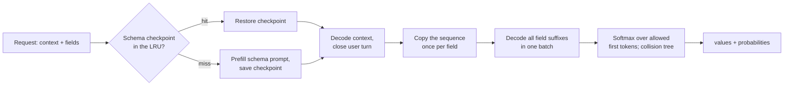

# 8. Speed, memory and caching

A decision costs one forward pass over the prompt and nothing more: no readout in this book lets the model write its answer (slot asks llama-server for a single token only to read the candidates' log-probabilities). So the latency of a decision is the time to prefill the prompt, plus whatever the engine can avoid prefilling again, plus the HTTP round trip. That is why the same GGUF file answers in 28 ms on one engine and in 275 ms on another.

## Same weights, four setups

The DreamBlooms conversion of decider-0.8b (`decider-0.8b-q8_0.gguf`) ran in four setups. Times are the mean client wall-clock per query over the 67 translated queries, HTTP included, on an Apple M4 Max:

| Engine | ms/query | Translated | Load ms |
|---|---|---|---|
| pcdServer | 28.3 | 55/67 | 78 |
| dohnuts (Metal) | 52.2 | 62/67 | |
| slot (llama-server) | 65.1 | 62/67 | 689 |
| dohnuts (CPU, 8 threads) | 275.2 | 62/67 | |

A separate run of the same four setups earlier that day measured 28.5, 51.9, 65.4 and 272.9 ms, so the ordering and the gaps are stable. The load column is empty for dohnuts because those servers were started before the timed run; model load is excluded from every ms/query figure.

The accuracy column matters as much as the time: pcdServer is the fastest engine here and also the least accurate, because it reads decider's weights as a chat model rather than at the answer slot decider was trained for ([chapter 3](03-engines.md)). dohnuts and slot read the same slot and give the same answers ([chapter 6](06-results.md#one-set-of-weights-three-scores)); they differ only in how they get there.

## Where the time goes

The four setups do different amounts of work per question.

**slot** sends the whole prompt to a stock `llama-server` with `cache_prompt: false`, asks for one token with the top 100 log-probabilities, and reads the option letters out of that list on the client. Every query prefills everything, and the response carries 100 candidates it mostly throws away.

**dohnuts** builds the same prompt inside the server and reads the letter logits directly. It skips the tokenizer round trip and the candidate list, which is the 13 ms it gains over slot. It still prefills every row from scratch: the prompt starts with `Context:` and the state, then the question, then the lettered options with their descriptions. The router prompt carries a description for each of the five tasks, so one routing row takes about 52 ms on its own.

**pcdServer** puts the fixed part of the prompt first. The system prompt lists every field, its description and its allowed values; the user's text comes after it. The fixed part is the same for every request with the same schema, so pcdServer computes it once, saves the model's state after it, and restores that state for later requests. Only the user text and a short suffix per field are decoded per request.

The per-phase timings come back in every pcdServer response under `metrics.phasesMs`: `tokenize`, `restoreOrPrefill`, `dynamicContext`, `broadcast`, `suffix` and `tree`. If you want to know why one request was slow, that object tells you which phase paid.

**dohnuts (CPU)** does what dohnuts (Metal) does on eight CPU threads. Qwen3.5 is a hybrid of 18 gated delta-net layers and 6 attention layers, and the delta-net layers are the slow part on a CPU. That is the fivefold gap between the two dohnuts rows.

## The schema cache in pcdServer

Qwen3.5 keeps recurrent state in its delta-net layers, and recurrent state cannot be rewound to an earlier position. The usual llama.cpp trick for reusing a prompt prefix (keep the KV cache, drop the tokens after the prefix with `llama_memory_seq_rm`) returns `false` on these models and leaves the sequence unchanged. pcdServer therefore saves a **complete** checkpoint of the sequence state after the schema prefix (`llama_state_seq_get_data_ext`) and restores the whole thing on a hit.

Complete checkpoints are large, and their size decides how many schemas stay warm:

- A three-field Qwen3.5-0.8B checkpoint is about 22 MB (22,332,068 bytes in pcdServer's example) and restores in about 6 ms, against about 36 ms to prefill the same prefix (pcdServer's own figures on Apple silicon).
- A Qwen3.5-4B checkpoint measured 56 to 63 MB in our runs.
- The cache is an LRU bounded by `--cache-entries` (default 32) and `--cache-bytes` (default 512 MiB). `metrics.schemaCacheStatus` reports `hit`, `miss` or `fallback` for every request.

Our benchmark servers ran with `--cache-bytes 67108864` (64 MiB), which holds one 4B checkpoint. With the router schema warm, a four-field request evicted it, and the next router call was a miss: 244 ms against 79 ms on a hit. First calls to a new schema took 200 to 360 ms with the 4B model; repeats took 79 to 154 ms. If your application rotates between several schemas, set `--cache-bytes` above the checkpoint size times the number of schemas. The `ornotto` package starts pcdServer with 512 MiB.

Extra fields are cheap once the prefix is cached: with the 4B model, three more fields added 35 ms to the router's 79 ms. On dohnuts before the change below, three short extra questions added 50 ms to a 51 ms routing row (decider-0.8b `q5`), because every question paid for the state again.

## Prefix caching in dohnuts

dohnuts' decider and kev profiles lay out every row as the state followed by the question, and every row of a request starts with the same state. The runner nevertheless cleared the model's memory and prefilled each row from token zero. A request with three questions, one of them a five-level `score` (which dohnuts expands into one yes/no row per level), prefilled the same state seven times.

We contributed prefix reuse upstream as [DreamBlooms/dohnuts.cpp#1](https://github.com/DreamBlooms/dohnuts.cpp/pull/1). The change follows pcdServer's approach, because the model is the same hybrid:

- Each planned row records where its state prefix ends: after `Context:\n<state>` for decider, after the prefix token and the (possibly truncated) state for kev.
- For a request with more than one row, the runner decodes that prefix as its own batch, saves a full sequence-state checkpoint, and restores it for the remaining rows, which then decode only their own suffix.
- Checkpoints live in an LRU keyed by the exact prefix tokens and capped at 256 MiB. A later multi-row request over the same state restores instead of prefilling. One checkpoint is about 22 MB for a state of about 190 tokens on the 0.8B models.
- Prefixes shorter than 16 tokens are decoded normally, and single-row requests take exactly the old path.

Measured on an Apple M4 Max with the DreamBlooms decider-0.8b and kev-0.8b Q8_0 files, a state of about 190 tokens, medians of three or four requests:

| Profile | Device | Request | Before (ms) | After (ms) | Speedup |
|---|---|---|---:|---:|---:|
| decider | Metal | 1 question | 34 | 34 | 1.0x |
| decider | Metal | 3 questions (7 rows) | 230 | 121 | 1.9x |
| decider | Metal | 2 questions, state seen before | 65 | 28 | 2.3x |
| decider | CPU | 1 question | 184 | 186 | 1.0x |
| decider | CPU | 3 questions (7 rows) | 1197 | 379 | 3.2x |
| decider | CPU | 2 questions, state seen before | 345 | 73 | 4.7x |
| kev | Metal | 1 question | 45 | 45 | 1.0x |
| kev | Metal | 3 questions (7 rows) | 127 | 80 | 1.6x |
| kev | Metal | 2 questions, state seen before | 85 | 32 | 2.7x |
| kev | CPU | 1 question | 242 | 233 | 1.0x |
| kev | CPU | 3 questions (7 rows) | 647 | 298 | 2.2x |
| kev | CPU | 2 questions, state seen before | 431 | 74 | 5.8x |

The gain grows with the number of rows and the length of the state, and it is largest on the CPU, where prefill is most expensive.

Accuracy was checked three ways:

- **Single-row requests** are bit-identical to the unpatched server: 8 of 8 per profile and device.
- **Multi-row requests** now send the state and the suffix to llama.cpp as two batches instead of one. On Metal, decider's output is identical and kev's probabilities move by at most 0.0005. On the CPU they move by up to 0.03, from the order in which the chunked delta-net accumulates. Against the float32 PyTorch reference of decider-0.8b on the same requests, the maximum probability deviation on the CPU is 0.0245 with the change and 0.0319 without it, 0.0116 on Metal either way, and every choice agrees.
- **Cache hits** give exactly the result of the first prefill, so a request scores the same whether or not its state was cached.

An earlier draft also cached single-question requests the second time their state appeared. It was dropped: the same request then scored differently depending on what the server had seen before (by up to 0.014 on the CPU), and always splitting the prompt cost single-question requests 7 to 10 percent. The version in the pull request changes nothing for a request with one row.

The `ornotto` wheels build dohnuts from the branch of that pull request, so you get the faster multi-question path without waiting for the upstream merge.

## Load time and the latency floor

Load time is paid once per process, but it decides whether an engine suits a command-line tool that starts cold. From the benchmark's load column:

| Engine and model | Load ms | ms/query | Translated |
|---|---|---|---|
| pcdServer, decider-0.8b (DreamBlooms q8) | 78 | 28.3 | 55/67 |
| pcdServer, Qwen3.5-4B-Hmm q4 | 296 | 92.6 | 64/67 |
| slot, decider-0.8b (DreamBlooms q8) | 689 | 65.1 | 62/67 |
| laya, MLX | 1,797 | 6.9 | 52/67 |
| laya, Core ML on the Neural Engine (compact prompt) | 20,130 | 4.2 | 47/67 |
| decider-4b, PyTorch | 16,802 | 348.2 | 63/67 |

The laya rows are the latency floor of this benchmark. laya-multilingual reads its input in one encoder pass and never decodes ([chapter 3](03-engines.md#laya)). On MLX it answers in 6.9 ms; exported to Core ML for the Neural Engine it answers in 4.2 ms, with a 96-token budget that forced a compact prompt and cost five answers. Both land at 47 to 52 of 67, 10 to 15 answers below decider-0.8b's 62. If you need a decision per keystroke, that is the trade; for anything slower than that, the decoder models are better value. The hosted jev takes 466 ms per query, the round trip to its API included.

## Memory: one model at a time

Every engine in this book loads its whole model into memory, and on a Mac the GPU shares that memory with everything else. Loading several models at once on the 48 GB benchmark machine filled its boot disk with swap and hung macOS ([chapter 5](05-method.md#one-model-at-a-time)).

The fix was procedural, and it is worth copying if you benchmark models yourself:

- Load one model process at a time, and check that none is resident before you load the next.
- Stop a server by its process and then confirm that its port is free; a server that ignores the stop signal still holds its memory.
- Watch swap growth, free disk space and available RAM while a model runs, and stop the run when any of them crosses a limit.

The `ornotto` package applies the same discipline to itself. Each `Decider` shares one engine process per model, engine and device; the processes stop when Python exits, and `ornotto.shutdown()` stops them earlier ([chapter 10](10-package.md)). If your code opens several models at once, add up their GGUF sizes plus the pcdServer checkpoint budget before you do.
