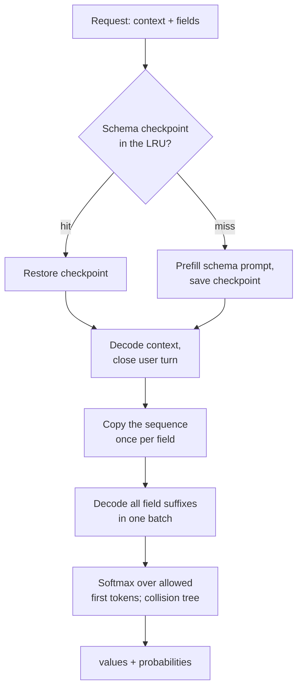
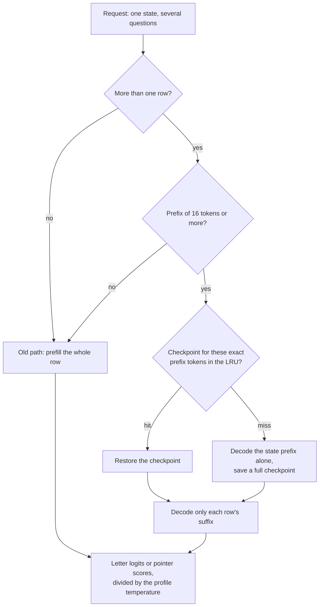

# 8. Speed, memory and caching

A decision costs one forward pass over the prompt and nothing more: no readout in this book lets the model write its answer (slot asks llama-server for a single token only to read the candidates' log-probabilities). So the latency of a decision is the time to prefill the prompt, plus whatever the engine can avoid prefilling again, plus the HTTP round trip. That is why the same GGUF file answers in 28 ms on one engine and in 275 ms on another.

*On a Mac, speed and memory share one budget.*

## Same weights, four setups

The DreamBlooms conversion of decider-0.8b (`decider-0.8b-q8_0.gguf`) ran in four setups. Times are the mean client wall-clock per query over the 67 translated queries, HTTP included, on an Apple M4 Max:

| Engine | ms/query | Translated | Load ms |
|---|---|---|---|
| pcdServer | 28.3 | 55/67 | 78 |
| dohnuts (Metal) | 52.2 | 62/67 | |
| slot (llama-server) | 65.1 | 62/67 | 689 |
| dohnuts (CPU, 8 threads) | 275.2 | 62/67 | |

A separate run of the same four setups earlier that day measured 28.5, 51.9, 65.4 and 272.9 ms, so the ordering and the gaps are stable. The load column is empty for dohnuts because those servers were started before the timed run; model load is excluded from every ms/query figure.

The accuracy column matters as much as the time: pcdServer is the fastest engine here and also the least accurate, because it reads decider's weights as a chat model rather than at the answer slot decider was trained for ([chapter 3](03-engines.md)). dohnuts and slot read the same slot and give the same answers ([chapter 6](06-results.md#one-set-of-weights-three-scores)); they differ only in how they get there.

## Where the time goes

The four setups do different amounts of work per question.

**slot** sends the whole prompt to a stock `llama-server` with `cache_prompt: false`, asks for one token with the top 100 log-probabilities, and reads the option letters out of that list on the client. Every query prefills everything, and the response carries 100 candidates it mostly throws away.

**dohnuts** builds the same prompt inside the server and reads the letter logits directly. It skips the tokenizer round trip and the candidate list, which is the 13 ms it gains over slot. It still prefills every row from scratch: the prompt starts with `Context:` and the state, then the question, then the lettered options with their descriptions. The router prompt carries a description for each of the five tasks, so one routing row takes about 52 ms on its own.

**pcdServer** puts the fixed part of the prompt first. The system prompt lists every field, its description and its allowed values; the user's text comes after it. The fixed part is the same for every request with the same schema, so pcdServer computes it once, saves the model's state after it, and restores that state for later requests. Only the user text and a short suffix per field are decoded per request.

```mermaid
%%{init: {"flowchart": {"useMaxWidth": false}}}%%
flowchart TD
    A[Request: context + fields] --> B{Schema checkpoint<br>in the LRU?}
    B -- hit --> C[Restore checkpoint]
    B -- miss --> D[Prefill schema prompt,<br>save checkpoint]
    C --> E[Decode context,<br>close user turn]
    D --> E
    E --> F[Copy the sequence<br>once per field]
    F --> G[Decode all field suffixes<br>in one batch]
    G --> H[Softmax over allowed<br>first tokens; collision tree]
    H --> I[values + probabilities]
```

The per-phase timings come back in every pcdServer response under `metrics.phasesMs`: `tokenize`, `restoreOrPrefill`, `dynamicContext`, `broadcast`, `suffix` and `tree`. If you want to know why one request was slow, that object tells you which phase paid.

**dohnuts (CPU)** does what dohnuts (Metal) does on eight CPU threads. Qwen3.5 is a hybrid of 18 gated delta-net layers and 6 attention layers, and the delta-net layers are the slow part on a CPU. That is the fivefold gap between the two dohnuts rows.

## The schema cache in pcdServer

Qwen3.5 keeps recurrent state in its delta-net layers, and recurrent state cannot be rewound to an earlier position. The usual llama.cpp trick for reusing a prompt prefix (keep the KV cache, drop the tokens after the prefix with `llama_memory_seq_rm`) returns `false` on these models and leaves the sequence unchanged. pcdServer therefore saves a **complete** checkpoint of the sequence state after the schema prefix (`llama_state_seq_get_data_ext`) and restores the whole thing on a hit.

Complete checkpoints are large, and their size decides how many schemas stay warm:

- A three-field Qwen3.5-0.8B checkpoint is about 22 MB (22,332,068 bytes in pcdServer's example) and restores in about 6 ms, against about 36 ms to prefill the same prefix (pcdServer's own figures on Apple silicon).
- A Qwen3.5-4B checkpoint measured 56 to 63 MB in our runs.
- The cache is an LRU bounded by `--cache-entries` (default 32) and `--cache-bytes` (default 512 MiB). `metrics.schemaCacheStatus` reports `hit`, `miss` or `fallback` for every request.

Our benchmark servers ran with `--cache-bytes 67108864` (64 MiB), which holds one 4B checkpoint. With the router schema warm, a four-field request evicted it, and the next router call was a miss: 244 ms against 79 ms on a hit. First calls to a new schema took 200 to 360 ms with the 4B model; repeats took 79 to 154 ms. If your application rotates between several schemas, set `--cache-bytes` above the checkpoint size times the number of schemas. The `ornotto` package starts pcdServer with 512 MiB.

Extra fields are cheap once the prefix is cached: with the 4B model, three more fields added 35 ms to the router's 79 ms. On dohnuts before the change below, three short extra questions added 50 ms to a 51 ms routing row (decider-0.8b `q5`), because every question paid for the state again.

## Prefix caching in dohnuts

dohnuts' decider and kev profiles lay out every row as the state followed by the question, and every row of a request starts with the same state. The runner nevertheless cleared the model's memory and prefilled each row from token zero. A request with three questions, one of them a five-level `score` (which dohnuts expands into one yes/no row per level), prefilled the same state seven times.

We contributed prefix reuse upstream as [DreamBlooms/dohnuts.cpp#1](https://github.com/DreamBlooms/dohnuts.cpp/pull/1). The change follows pcdServer's approach, because the model is the same hybrid:

- Each planned row records where its state prefix ends: after `Context:\n<state>` for decider, after the prefix token and the (possibly truncated) state for kev.
- For a request with more than one row, the runner decodes that prefix as its own batch, saves a full sequence-state checkpoint, and restores it for the remaining rows, which then decode only their own suffix.
- Checkpoints live in an LRU keyed by the exact prefix tokens and capped at 256 MiB. A later multi-row request over the same state restores instead of prefilling. One checkpoint is about 22 MB for a state of about 190 tokens on the 0.8B models.
- Prefixes shorter than 16 tokens are decoded normally, and single-row requests take exactly the old path.

Measured on an Apple M4 Max with the DreamBlooms decider-0.8b and kev-0.8b Q8_0 files, a state of about 190 tokens, medians of three or four requests:

| Profile | Device | Request | Before (ms) | After (ms) | Speedup |
|---|---|---|---:|---:|---:|
| decider | Metal | 1 question | 34 | 34 | 1.0x |
| decider | Metal | 3 questions (7 rows) | 230 | 121 | 1.9x |
| decider | Metal | 2 questions, state seen before | 65 | 28 | 2.3x |
| decider | CPU | 1 question | 184 | 186 | 1.0x |
| decider | CPU | 3 questions (7 rows) | 1197 | 379 | 3.2x |
| decider | CPU | 2 questions, state seen before | 345 | 73 | 4.7x |
| kev | Metal | 1 question | 45 | 45 | 1.0x |
| kev | Metal | 3 questions (7 rows) | 127 | 80 | 1.6x |
| kev | Metal | 2 questions, state seen before | 85 | 32 | 2.7x |
| kev | CPU | 1 question | 242 | 233 | 1.0x |
| kev | CPU | 3 questions (7 rows) | 647 | 298 | 2.2x |
| kev | CPU | 2 questions, state seen before | 431 | 74 | 5.8x |

The gain grows with the number of rows and the length of the state, and it is largest on the CPU, where prefill is most expensive.

Accuracy was checked three ways:

- **Single-row requests** are bit-identical to the unpatched server: 8 of 8 per profile and device.
- **Multi-row requests** now send the state and the suffix to llama.cpp as two batches instead of one. On Metal, decider's output is identical and kev's probabilities move by at most 0.0005. On the CPU they move by up to 0.03, from the order in which the chunked delta-net accumulates. Against the float32 PyTorch reference of decider-0.8b on the same requests, the maximum probability deviation on the CPU is 0.0245 with the change and 0.0319 without it, 0.0116 on Metal either way, and every choice agrees.
- **Cache hits** give exactly the result of the first prefill, so a request scores the same whether or not its state was cached.

An earlier draft also cached single-question requests the second time their state appeared. It was dropped: the same request then scored differently depending on what the server had seen before (by up to 0.014 on the CPU), and always splitting the prompt cost single-question requests 7 to 10 percent. The version in the pull request changes nothing for a request with one row.

The `ornotto` wheels build dohnuts from the branch of that pull request, so you get the faster multi-question path without waiting for the upstream merge.

The path a request takes through the patched runner:

```mermaid
%%{init: {"flowchart": {"useMaxWidth": false}}}%%
flowchart TD
    R["Request: one state, several questions"] --> N{"More than one row?"}
    N -- "no" --> S["Old path: prefill the whole row"]
    N -- "yes" --> L{"Prefix of 16 tokens or more?"}
    L -- "no" --> S
    L -- "yes" --> C{"Checkpoint for these exact<br>prefix tokens in the LRU?"}
    C -- "hit" --> H["Restore the checkpoint"]
    C -- "miss" --> P["Decode the state prefix alone,<br>save a full checkpoint"]
    H --> X["Decode only each row's suffix"]
    P --> X
    X --> O["Letter logits or pointer scores,<br>divided by the profile temperature"]
    S --> O
```

### Upstream after the merge

The maintainer, mili-tan, merged the pull request on 2026-09-24, about six hours after it was opened, with the only comment on it: "lgtm, thank you very much."[^pr1] Eight minutes later the upstream repository gained a commit of its own, "Cache decoded state prefixes across calls" (`60d247e5`).[^upstream-cache] It does two things:

- It moves the checkpoint LRU out of the decider and kev runner into a shared cache, still bounded at 256 MiB and still keyed by the exact prefix tokens.
- It uses that cache in the Dohnuts model's own decode path as well. That path already decoded the shared `State:` prefix once per call and copied it to every candidate sequence; it now also keeps the decoded prefix across calls, so a state the server has seen before skips its prefill there too. The upstream README says the side models share the same cache.

So there are now two layers of reuse in upstream dohnuts. Within one request, rows that share a state decode it once. Across requests, a state seen before is restored from the LRU, on every model family dohnuts runs. pcdServer's schema cache sits on the other side of the prompt: it keeps the fixed schema prefix warm, not the user's state, because pcdServer puts the schema first and the user text after it.

Two further upstream changes affect speed. On 2026-09-29 dohnuts gained a `--flash-attn` switch that takes `true`, `false` or `auto`, with `auto` as the default; `auto` leaves the choice to llama.cpp, which enables flash attention when the active device supports it.[^flash] The same day it added a new Dohnuts-family model, Linnaeus-0.1.0-2B ([chapter 4](04-models.md#dohnuts)).

!!! note "Measured before the upstream changes"
    Every dohnuts number in this book was measured on the pull request branch, before the cross-call cache and the flash-attention switch existed upstream. The `ornotto` submodule still follows that branch. After the submodule moves to upstream, the dohnuts rows need to be measured again: the new cache overlaps the one in the pull request, and the `auto` default lets the backend turn flash attention on when the device supports it.

## Load time and the latency floor

Load time is paid once per process, but it decides whether an engine suits a command-line tool that starts cold. From the benchmark's load column:

| Engine and model | Load ms | ms/query | Translated |
|---|---|---|---|
| pcdServer, decider-0.8b (DreamBlooms q8) | 78 | 28.3 | 55/67 |
| pcdServer, Qwen3.5-4B-Hmm q4 | 296 | 92.6 | 64/67 |
| slot, decider-0.8b (DreamBlooms q8) | 689 | 65.1 | 62/67 |
| laya, MLX | 1,797 | 6.9 | 52/67 |
| laya, Core ML on the Neural Engine (compact prompt) | 20,130 | 4.2 | 47/67 |
| decider-4b, PyTorch | 16,802 | 348.2 | 63/67 |
| GLiNER2.5-Decide, Core AI | 3,378 | 26.9 | 61/67 |
| GLiNER2.5-Decide, Core ML (fixed 256 tokens) | 82,062 | 349.1 | 61/67 |
| Julia-1, MLX | 1,866 | 6.8 | 31/67 |

The laya rows are the latency floor of this benchmark. laya-multilingual reads its input in one encoder pass and never decodes ([chapter 3](03-engines.md#laya)). On MLX it answers in 6.9 ms; exported to Core ML for the Neural Engine it answers in 4.2 ms, with a 96-token budget that forced a compact prompt and cost five answers. Both land at 47 to 52 of 67, 10 to 15 answers below decider-0.8b's 62. If you need a decision per keystroke, that is the trade; for anything slower than that, the decoder models are better value. Julia-1, a smaller multilingual encoder, is as fast as laya on MLX and scores 31. GLiNER2.5-Decide on Core AI is the exception in the middle: 61/67 on translated text in 26.9 ms, but it reads English only. The hosted jev takes 466 ms per query, the round trip to its API included.

## The later engines and runtimes

The second benchmark round brought runtimes that the first did not have, and the same weights again cost very different amounts of time depending on where they run. Times are ms per translated query, load excluded; the load column is the separate load or preload time.

| Engine or runtime | Method | ms/query | Load ms | Translated |
|---|---|---:|---:|---|
| Core AI | GLiNER2.5-Decide, fp16 | 26.9 | 3,378 | 61/67 |
| ONNX Runtime, CPU | GLiNER2.5-Decide, fp32 | 67.3 | 4,607 | 61/67 |
| Core ML | GLiNER2.5-Decide, fp16, 256 tokens | 349.1 | 82,062 | 61/67 |
| ONNX Runtime, CPU | laya-multilingual, fp32 | 24.7 | 1,578 | 52/67 |
| ONNX Runtime, CPU | laya-multilingual, fp16 | 57.6 | 1,067 | 52/67 |
| ollaya (MLX) | `laya:multilingual` | 12.3 | 1,217 | 52/67 |
| ollaya (ONNX Runtime, CPU) | `decider:0.8b` | 284.8 | 7,924 | 61/67 |
| ollaya (ONNX Runtime, CPU) | `kev:0.8b` | 268.2 | 4,848 | 60/67 |
| ollaya (llama.cpp, Metal) | `winnow:12b` | 891.1 | 36,488 | 64/67 |
| ollaya (ONNX Runtime, CPU) | `clm:8b` | 1,677.9 | 49,184 | 39/67 |
| llama.cpp embeddings + head | Jev-Omni `q3` | 1,222.3 | 1,411 | 64/67 |
| MLX | Jev-Omni `4bit` | 780.1 | | 61/67 |
| MLX | APUS-OpenJev 35B-A3B `4bit` | 250.0 | 27,426 | 63/67 |
| pcdServer | APUS-OpenJev 35B-A3B `q4` | 296.8 | 338 | 63/67 |
| System One server | NeoHorse-Jev-4B `q8` | 273.1 | | 64/67 |
| System One server | CLM-v0.1-8B `q8` | 107.6 | | 39/67 |
| System One server | leo-1.7b | 136.2 | | 57/67 |
| System One server | lev (4B) | 2,203.8 | | 63/67 |

Three things stand out.

- **The runtime moves an encoder by an order of magnitude and leaves its score alone.** GLiNER2.5-Decide answers in 27 ms on Core AI, 67 ms on ONNX Runtime and 349 ms as a fixed-shape Core ML package, with 61/67 each time. On ONNX Runtime on the CPU, laya's fp16 graph is slower than its fp32 graph, 57.6 ms against 24.7.
- **ollaya's CPU path is slow for decoders.** ollaya runs most of its models as float32 ONNX graphs on the CPU. decider-0.8b takes 285 ms there, against 52 ms on dohnuts (Metal) with the same weights and the same score within one answer. CLM takes 1.7 seconds in ollaya and 108 ms when its encoder runs in llama.cpp. The encoders that ollaya runs on MLX are fast: laya in 12.3 ms.
- **Load time is a real cost for the large and the fixed-shape models.** The benchmark preloaded every ollaya model through `/api/decide` and kept it resident, so the preload stays out of ms/query. It took 36 seconds for winnow and 49 seconds for clm. The MLX build of APUS-OpenJev loaded in 27 seconds; the same model as a GGUF on pcdServer in a third of a second. The authors' System One servers were started before the timed run, so their load is not measured.

## Speed claims by others

Decision models were sold on speed from the first day, and September 2026 produced many latency figures. None of them was measured the way the tables above were. They come from other machines, other prompts, other numbers of options, and different ideas of where the clock starts and stops. They are collected here, apart from our measurements, so that each keeps its context.

| Source | Model or service | Claimed latency | Context as stated | Date |
|---|---|---|---|---|
| TypeSafe blog[^ts-launch] | jev, hosted | 70 to 500 ms | end to end, vendor claim | 2026-09-15 |
| typed-decisions dataset card[^typed] | jev 1.13.0, hosted | 710 ms p50 | the card's client, measured 2026-09-18 | read 2026-09-30 |
| typed-decisions dataset card[^typed] | meraGPT Decider 1, hosted | 526 ms p50 | the card's client | read 2026-09-30 |
| typed-decisions dataset card[^typed] | Liquid AI d1, hosted | 525 ms p50 | the card's client, measured 2026-09-30 | read 2026-09-30 |
| The New Stack on OpenAI DevDay[^openai] | OpenAI Decision API on Luna | 150 ms | vendor claim, "compared to GPT-6 Luna, which would take 1.6 seconds" | 2026-09-29 |
| laya-mlx README[^laya-ports] | laya on MLX | 7 to 14 ms | "short decisions on M3 Max" | 2026-09-19 onwards |
| laya-coreml README[^laya-ports] | laya on Core ML | about 5 ms | "short decisions on M3 Max", Neural Engine | 2026-09-19 onwards |
| Jeff README[^jeff] | Jeff 0.8B | 28 ms | Apple M4 Max, MLX | 2026-09-28 |
| Red Hat Developer[^redhat] | djev on vLLM | 35 to 60 ms | single step on vLLM, Red Hat's measurement | 2026-09-28 |

Read the table as a list of what each author saw, not as a ranking. The hosted rows include a network round trip of unknown length, and our own figure for jev, 466 ms per query ([chapter 6](06-results.md)), includes ours. The local rows differ in hardware (M3 Max, M4 Max, a server GPU), in the prompt, and in what "a decision" contains: the laya ports speak of short decisions, and the router question here carries five options with a description each. The closest comparison the tables above allow is our own laya run on the same kind of hardware: 6.9 ms on MLX and 4.2 ms on the Neural Engine with a compact prompt ([load time and the latency floor](#load-time-and-the-latency-floor)).

Hosted speed also depends on how busy the service is. On 2026-09-18, three days after launch, TechCrunch reported that jev's API briefly failed under demand.[^techcrunch] TypeSafe's documentation lists rate limits of 100K tokens per second and 40 requests per second.[^ts-models] A local engine has no queue but its own, and no limit but the machine.

!!! quote "How it looked from the outside"
    Our contribution to dohnuts, the prefix reuse described above, was a pull request opened late on 2026-09-23. It was merged the next morning with a one-line review, "lgtm, thank you very much." Eight minutes after the merge the maintainer pushed a commit that took the same checkpoint cache and applied it across calls to every model family the server runs. Most projects in this field were days old that month, and the code moved while it was being measured: the dohnuts rows in this chapter were measured before either commit.[^pr1][^upstream-cache]

## Memory: one model at a time

Every engine in this book loads its whole model into memory, and on a Mac the GPU shares that memory with everything else. Loading several models at once on the 48 GB benchmark machine filled its boot disk with swap and hung macOS ([chapter 5](05-method.md#one-model-at-a-time)).

The fix was procedural, and it is worth copying if you benchmark models yourself:

- Load one model process at a time, and check that none is resident before you load the next.
- Stop a server by its process and then confirm that its port is free; a server that ignores the stop signal still holds its memory.
- Watch swap growth, free disk space and available RAM while a model runs, and stop the run when any of them crosses a limit. That limit stopped one measurement in the second round: the Q5_K_M file of jeb-35b-a3b took available memory below 4 GB while it loaded, and it has no row.

### What went wrong, and what the guard does

The incident happened on 2026-09-23, during the first benchmark round. Three things were running at once. The quantization sweep loaded several GGUF files per batch to save time, and the translation model stayed loaded beside them. A set of exploratory Core AI probes of decider ran, without any guard, while an encoder step was still running. And the driver kept loading the next model after the previous one had failed. macOS reported "No space left on device" while the 16-bit GGUF of laya was running: swap had filled the boot disk, and the machine stopped responding. The root cause was never isolated to one process; all three contributed.

A second defect made it worse. The helper that stopped a server found it by its port on the command line, and matched the port followed by a space. A server whose port was the last argument never matched, so it was never stopped, and it kept its model in memory while the next one loaded.

The rerun used a guard that sampled the machine every two seconds and stopped the unit under test when any of these held:

- swap had grown by more than 4 GB since the unit started;
- the boot disk had less than 30 GB free;
- available RAM had dropped below 4 GB;
- the unit had run for 30 minutes.

When the guard tripped it logged the largest memory users, stopped every server, aborted the run and marked the method so that it would be skipped next time. Before each unit the driver asserted that no model process was resident, and after each unit it stopped the server and checked that the port was free. With that in place, swap stayed flat at about 2.7 GB for every unit of the rerun, the 35B models included.

The guard tripped twice in the rounds that followed, and both times it did what it was for:

- The jeb-35b-a3b Q5_K_M file is 23.6 GB. While it loaded, available memory fell below 4 GB, the guard stopped it, and the model was not benchmarked at that quantization. Its Q3_K_M row, 63/67 on both texts, stands ([chapter 4](04-models.md#later-dedicated-models)).
- A Core AI export of decider-0.8b built for GPU pipelining grew swap by more than 2 GB within seconds of loading, under a tighter probe-only limit, and logged a connection error from the Neural Engine compiler service. The probe was stopped, and that export has no row either.

Neither result says the model is broken. Each says the file needed more free memory at load time than the benchmark machine had left, which is better learned from a log line than from a frozen screen.

### Budgeting memory on a Mac

On Apple silicon the GPU has no memory of its own. A model loaded with Metal takes its weights from the same pool as the applications you have open, and macOS starts swapping when that pool runs out. The numbers to add up before you load are the ones this book already gives:

- the model file itself, which is roughly what the engine keeps resident ([chapter 7](07-quantization.md#size-against-accuracy) lists the file sizes);
- the checkpoint cache: pcdServer's LRU is bounded by `--cache-bytes`, 512 MiB as `ornotto` starts it, and dohnuts' prefix LRU by 256 MiB;
- for a fallback gate, both models at once ([chapter 9](09-confidence.md#a-fallback-gate));
- everything else on the machine, which on a working Mac is rarely small.

A model that fits with room to spare runs at the speeds in this chapter. A model that does not fit may still load and run from swap, at speeds this chapter does not report, or it may stop the machine as it did here. [Chapter 12](12-choosing.md#which-engine-and-model) turns these sizes into a choice by the memory you have.

The `ornotto` package applies the same discipline to itself. Each `Decider` shares one engine process per model, engine and device; the processes stop when Python exits, and `ornotto.shutdown()` stops them earlier ([chapter 10](10-package.md)). If your code opens several models at once, add up their GGUF sizes plus the pcdServer checkpoint budget before you do.

## What changed in September 2026

- **Upstream dohnuts** merged our prefix reuse on 2026-09-24, generalised it into a cross-call prefix cache the same morning, and added a `--flash-attn` switch defaulting to `auto` on 2026-09-29. The dohnuts rows here predate both; re-measurement on upstream is pending ([upstream after the merge](#upstream-after-the-merge)).
- **Hosted decision services** multiplied. OpenAI announced a Decision API with a 150 ms claim on 2026-09-29, and Liquid AI's d1 and meraGPT's Decider 1 joined jev on the typed-decisions board with p50 latencies near 525 ms ([speed claims by others](#speed-claims-by-others)).
- **The September timings** use engine builds pinned to llama.cpp v0.4.1 of 2026-09-14. The October dohnuts additions use `7fe450e` (0.5.0-dev), while pcdServer retains v0.4.1; those new rows do not revise the older timings ([chapter 3](03-engines.md)).

[^pr1]: DreamBlooms/dohnuts.cpp, pull request #1, "Reuse the state prefix across side-model rows", opened 2026-09-23, merged 2026-09-24. <https://github.com/DreamBlooms/dohnuts.cpp/pull/1>
[^upstream-cache]: DreamBlooms/dohnuts.cpp, commit `60d247e5`, "Cache decoded state prefixes across calls", 2026-09-24. <https://github.com/DreamBlooms/dohnuts.cpp/commit/60d247e5362e233fac94bdf19b74c9f7bf395704>
[^flash]: DreamBlooms/dohnuts.cpp, commit `4ba1cf5`, "Make Flash Attention a --flash-attn[=true|false|auto] switch", 2026-09-29. <https://github.com/DreamBlooms/dohnuts.cpp/commits/main>
[^ts-launch]: Diogo Almeida, TypeSafe, "Introducing System One Models & Jev", 2026-09-15. <https://typesafe.ai/blog/introducing-system-one-models-and-jev>
[^ts-models]: TypeSafe, "Models", documentation, read 2026-09-30. <https://docs.typesafe.ai/models>
[^typed]: LocalLLaMA, "typed-decisions" dataset card, Hugging Face, read 2026-09-30. <https://huggingface.co/datasets/LocalLLaMA/typed-decisions>
[^openai]: Frederic Lardinois, The New Stack, "OpenAI Decision API on Luna", 2026-09-29. <https://thenewstack.io/openai-decision-api-luna/>
[^laya-ports]: mizorewww, laya-mlx and laya-coreml READMEs, read 2026-09-30. <https://github.com/mizorewww/laya-mlx>, <https://github.com/mizorewww/laya-coreml>
[^jeff]: firelex, "jeff" README, read 2026-09-30. <https://github.com/firelex/jeff>
[^redhat]: Lucas Wilkinson and Rob Greenberg, Red Hat Developer, "Run decision models on vLLM and Red Hat AI using DiffusionGemma", 2026-09-28. <https://developers.redhat.com/articles/2026/09/28/run-decision-model-vllm-and-red-hat-ai>
[^techcrunch]: TechCrunch, "A new kind of AI model from a ChatGPT inventor is thrilling developers", 2026-09-18. <https://techcrunch.com/2026/09/18/a-new-kind-of-ai-model-from-a-chatgpt-inventor-is-thrilling-developers/>
