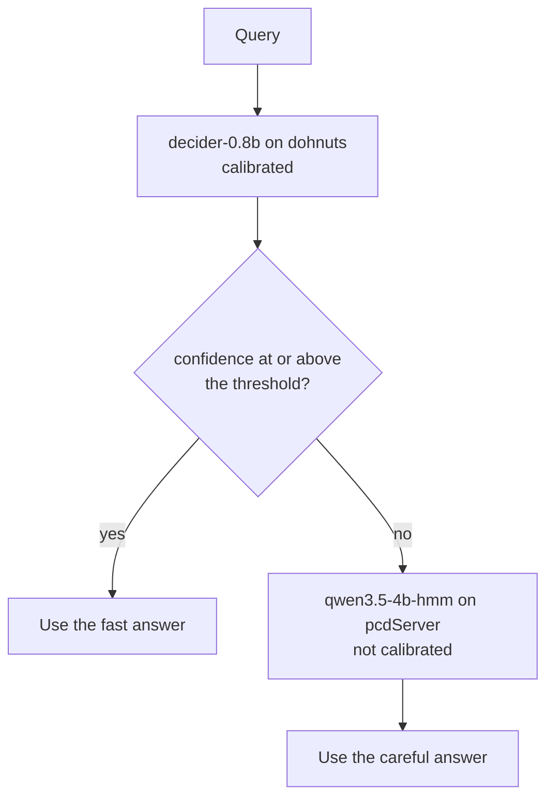

# 9. Confidence and fallback

Every engine in this book returns a probability for each option, not just a winner. If those probabilities mean what they say, you can act on the confident answers and send the doubtful ones somewhere slower and better. This chapter measures whether they do, on the router benchmark, and what a fallback buys.

## What calibration means

A model is calibrated when its stated probability matches its hit rate: of all the answers it gives with a top probability near 0.8, about 80 percent are right. Calibration is a property of the probabilities, separate from accuracy. A model can be accurate and badly calibrated (always 0.99, sometimes wrong), or calibrated and mediocre.

The dedicated models get calibrated during training. decider divides the letter logits by a fitted temperature before the softmax (T 1.03 for decider-0.8b, 1.3 for DreamBlooms' decider-2b), and laya picks a temperature per bucket of option count and question type. pcdServer applies no temperature: its probabilities are the model's raw softmax over the first tokens of the allowed values, which says how strongly the model prefers one value, not how often it is right. The `ornotto` package marks the difference on every answer with `Answer.calibrated`, `True` on dohnuts and `False` on pcdServer, so that you do not compare the two as if they were one scale.

To check calibration you need labelled examples: group the answers by their top probability, and count how many in each group were right.

### Too sure and not sure enough

A badly calibrated model can err in two directions. An **over-confident** model states probabilities higher than its hit rate: it says 0.99 and is right 80 percent of the time. An **under-confident** model does the opposite: it says 0.6 and is right 90 percent of the time. Both break a threshold. The first lets wrong answers through as sure ones, and the second sends right answers to a fallback they did not need.

The two best-documented cases of September 2026 sit at opposite ends.

**jev is sure.** The typed-decisions board on Hugging Face scores hosted models on 2,000 decisions from four workflows and reports, beside accuracy, the KL divergence of each model's distribution from the gold labels.[^typed] On that board jev 1.13.0, measured on 2026-09-18, has a KL from gold of 1.442. meraGPT's Decider 1, the board's top entry, has 0.096. The card explains the gap in one sentence: "Its accuracy is near the 0.735 ceiling, but it puts nearly all its probability on one answer, which is where the KL gap comes from." jev is usually right, and when it is not, its probabilities give little warning.

**laya is not sure enough.** An independent reproduction of laya on the same board (arXiv 2609.33843, 2026-09-27) matched its headline accuracy and found it under-confident, with an expected calibration error of 0.214.[^laya-repro] A single temperature, T = 0.469, fitted on part of the data, brought the held-out error from 0.204 to 0.037. A temperature below one sharpens a distribution, so laya's probabilities were too flat, not wrong in order.

Other people's figures, as reported on the board and in the paper. They are not comparable with the router-set numbers in this chapter.

| Source | Model | Accuracy | KL from gold | Brier | ECE |
|---|---|---|---|---|---|
| typed-decisions card, read 2026-09-30 | meraGPT Decider 1 (`sd-1`) | 0.768 | 0.096 | 0.052 | 0.180 |
| typed-decisions card, read 2026-09-30 | Liquid AI d1, measured 2026-09-30 | 0.742 | 0.475 | 0.155 | 0.124 |
| typed-decisions card, read 2026-09-30 | jev 1.13.0, measured 2026-09-18 | 0.727 | 1.442 | 0.148 | 0.144 |
| typed-decisions card, read 2026-09-30 | prior (label frequencies only) | 0.470 | 0.347 | 0.189 | 0.088 |
| arXiv 2609.33843, 2026-09-27 | laya | 0.767 | | | 0.214 |

The board's own ranking uses accuracy, and the calibration columns tell a different story. In this table Decider 1 has the lowest KL and Brier score but not the lowest ECE, and the prior, which knows nothing about any input, has the lowest ECE of all. One calibration number is not enough to choose a model by, and a low ECE on its own can mean the model has learned to hedge.

!!! quote "How it looked from the outside"
    On the Hacker News thread for ollaya on 2026-09-25, one commenter, george_max, compared the two: "Laya performs significantly worse. It's less confident and often makes wrong decisions with more complex queries."[^hn-ollaya] The paper two days later measured the first half of that sentence. On the router set here, laya-multilingual scores 52/67, ten answers below decider-0.8b ([chapter 6](06-results.md)).

### Temperature is one number

Temperature scaling is the usual repair, and it is what the dedicated models ship with. The model's logits are divided by a single fitted number T before the softmax. T above one flattens the distribution, T below one sharpens it, and the order of the options never changes, so accuracy is untouched. The number is fitted on labelled data the model was not trained on.

The dedicated models in this book carry their temperatures with them ([chapter 4](04-models.md#dedicated-models)):

- decider stores T in the checkpoint's `decider.json`: 1.03 for decider-0.8b, 1.3 for DreamBlooms' decider-2b. From version 1.8.0 on 2026-09-29, Mapika's reference package can also make T depend on the number of options, T(n) = max(min, a + b ln n).[^decider]
- kev publishes a fitted temperature per size: 1.38 for 27B, 2.30 for 9B, 2.41 for 4B and 2.35 for 0.8B.[^kev] All four are above one: each size's raw scores needed flattening.
- laya picks a temperature per bucket of option count and question type, and the reproduction above suggests that on typed-decisions the buckets were set too high.

dohnuts reads the temperature from the model's profile JSON and applies it before it returns anything ([chapter 3](03-engines.md#dohnuts)). pcdServer applies none. That is why `Answer.calibrated` is `True` for one and `False` for the other, and why a threshold tuned on one engine does not transfer to the other even for the same weights ([chapter 6](06-results.md#one-set-of-weights-three-scores)).

## decider-0.8b on the router set

These are the 67 router queries answered by decider-0.8b on dohnuts (Metal), grouped by top probability. The file is DreamBlooms' `Q8_0` conversion, the one `ornotto` registers. First with translation:

--8<-- "tables/calibration-translated.html"

And on the original text:

--8<-- "tables/calibration-direct.html"

Pooled over both runs, answers at 0.95 and above were right 97 percent of the time (61 of 63), answers from 0.8 to 0.95 were right 85 percent of the time (28 of 33), answers from 0.6 to 0.8 were right 95 percent of the time (19 of 20), and answers below 0.6 were right 83 percent of the time (15 of 18). The top band keeps its promise, but the order below it is loose: the 0.6 to 0.8 band is more reliable than its probability says, and more reliable than the band above it. With 67 queries per run the bands hold 8 to 32 answers each, so one answer moves a band by several percentage points. The signal separates the very confident answers from the rest, and says little about which of the others are wrong.

The bands use the top probability, which dohnuts reports as `native.confidence`; its plain `confidence` field is an entropy measure ([chapter 2](02-decisions.md#the-confidence-trap)).

## A fallback gate

The fastest accurate local model and the most accurate local model are different models:

- decider-0.8b (DreamBlooms `Q8_0`, the file `ornotto` registers) on dohnuts (Metal): 62 of 67 translated at 52.2 ms per query, 61 of 67 direct at 52.4 ms.
- Qwen3.5-4B-Hmm (`Q8_0`, 4.48 GB) on pcdServer: 64 of 67 translated at 87.6 ms, 65 of 67 direct at 88.0 ms. The `Q4_K_M` file that `ornotto` registers scores the same at 93 ms from 2.7 GB ([chapter 6](06-results.md)).

A gate asks the fast model first and sends the query to the slow one only when the fast model's top probability is below a threshold. The tables replay the benchmark's cached answers through such a gate at several thresholds. "Mean ms" is the cost per query averaged over all 67, where a query that falls back pays for both calls.

With translation:

--8<-- "tables/cascade-translated.html"

On the original text:

--8<-- "tables/cascade-direct.html"

The two runs lead to different decisions.

**With translation, the gate does not pay.** Thresholds from 0.5 to 0.85 score 62 of 67, the same as decider alone: at 0.5 the gate fixes one error (the sidebearings script, top probability 0.49) and makes one ("Which words should I look at to judge the spacing of round letters?", 0.49, where Qwen3.5-4B-Hmm says docs). The gate first gains an answer at 0.9, when the Urdu request for a Python script (0.86) falls back, and then scores 63 at 89.2 ms with 29 fallbacks. Qwen3.5-4B-Hmm alone scores 64 at 87.6 ms.

**Without translation, the gate helps.** Below 0.7, it scores 63 of 67 at 71.5 ms with 15 fallbacks: two answers better than decider alone and 16 ms faster than Qwen3.5-4B-Hmm alone. It catches decider's errors on the Persian, German and sidebearings queries, which had top probabilities from 0.37 to 0.68, and loses the round-letters query. Below 0.95 it reaches 64 of 67 at 97.2 ms with 35 fallbacks, which is slower than Qwen3.5-4B-Hmm alone, and Qwen3.5-4B-Hmm alone still scores higher, 65 of 67.

Some of decider's errors sit where a useful threshold cannot reach them, because decider is sure of them. "Show me how a glyph is stored in a VFJ file" (a docs question) got vfj at 0.99, above every threshold in the tables. "Can FontLab batch rename glyphs?" (also docs) got python at 0.94, and falls back only below 0.95, where the gate is already slower than Qwen3.5-4B-Hmm alone. Both are questions about FontLab, worded with the vocabulary of the task they are not, and Qwen3.5-4B-Hmm answers both correctly. "How do I write a liga feature?" (docs) got fea at 0.86, and falling back does not help: Qwen3.5-4B-Hmm answers fea too.

!!! warning "Read these gains with care"
    The thresholds were chosen on the same 67 queries they are scored on, and the direct run uses the same queries as the translated run, so neither is a held-out test. A gate also needs both models loaded at once (about 0.8 GB plus 4.5 GB here), and no benchmark run has measured the two servers running side by side.

### Confident errors do not fall back

A gate works on the answers a model doubts. It does nothing for the answers a model is sure of and gets wrong, and the September 2026 papers suggest these are not rare and not easy to catch another way.

- **Wording moves confident answers.** JevAdvBench (arXiv 2609.31142, 2026-09-25) appended one unverified opinion to the input and flipped 12.1 percent of jev-1.13.0's decisions. The same appended opinion pushed 38 percent of confident answers below 0.8, the confidence threshold that routes an answer to human review in the paper's setup.[^jevadv] A confidence gate moves with the input, not only with the question.
- **Option names and order move answers too.** Renaming the options `0` and `1` to `no` and `yes` moved AUC from .94 to .23 on open jev-like models in one September paper, while every answer stayed a valid option ([chapter 2](02-decisions.md#names-and-order-are-part-of-the-question)). The type check cannot notice, and neither can a gate that looks only at the top probability.
- **A bigger model may make the same mistake.** Rao and Callison-Burch compared jev with LLM judges on rubric grading (arXiv 2609.29769, 2026-09-24). The LLM judges cost 16 to 325 times as much, and "On Jev's most confident errors, about 96% of LLM verdicts repeat its wrong answer". In their study, no cascade from jev to an LLM judge beat the best single judge by more than 2.7 points, even with oracle thresholds.[^rao]

On the router set the picture is less bleak, and also smaller. Qwen3.5-4B-Hmm answers two of decider's confident errors correctly, but the gate barely reaches them: the batch-rename question at 0.94 falls back only at a threshold of 0.95, where the gate is already slower than Qwen3.5-4B-Hmm alone, and the VFJ storage question at 0.99 sits above every threshold in the tables. The third, the liga question at 0.86, is wrong in both models. Sixty-seven queries cannot say how general any of this is. They do say where the gate stops: it trades latency for accuracy on the doubtful answers, and the confident errors need better questions, not a second opinion.

## A gate in ornotto

The `ornotto` repository ships the gate as `examples/fallback.py`:

```python
import ornotto

THRESHOLD = 0.7
TASKS = ["docs", "python", "fea", "vfj", "sample"]
QUESTION = "Which kind of help does this FontLab user want?"

fast = ornotto.Decider("decider-0.8b")
careful = ornotto.Decider("qwen3.5-4b-hmm", engine="pcd")

for text in ("Build a kern feature for A V", "Jak zmienić kąt pochylenia kursywy w FontLab?",
             "Show me how a glyph is stored in a VFJ file"):
    answer = fast.choose(text, TASKS, QUESTION)
    source = "decider"
    if answer.confidence < THRESHOLD:
        answer, source = careful.choose(text, TASKS, QUESTION), "qwen3.5-4b-hmm"
    print(f"{answer.value:7} {answer.confidence:.2f} {source:15} {text}")
```

The gate is ordinary code around two `Decider` objects; `ornotto` has no built-in fallback. It relies on two properties of every `Answer`. `confidence` is the probability of the answer given: the top option for a choice, the top level for a score, and the larger of p(yes) and p(no) for a yes/no question. `calibrated` says whether that probability was temperature-scaled by the model's recipe. Here the first stage runs on dohnuts, where `calibrated` is `True`, and only its confidence is compared with the threshold; the second stage's confidence is printed but never tested. Keep it that way if you build your own: a threshold belongs to one model on one engine.



The script sends a shorter question than the benchmark's router prompt, so its confidences differ from the tables above even though the model file is the same. In our test run of this script the kern request stayed on decider (fea, 0.79), the Polish question stayed on decider (docs, 0.99), and the VFJ question fell below 0.7 and went to Qwen3.5-4B-Hmm, which answered vfj. The thresholds you pick belong to your own prompts and your own labelled examples, not to this benchmark.

If you run the two models as a pydantic-ai chain instead, [chapter 11](11-typed.md) shows the same pattern with an `Agent`.

## The hardest queries

Some queries defeat most of the 261 classifiers, and they are worth reading because they show where the task definition, not the model, is weak. The table lists every query with the share of classifiers that got it right, translated and direct, and jev's answer on the translated text. It opens with the hardest.

--8<-- "tables/queries.html"

The three hardest:

- **"How do I write a liga feature?"** is labelled docs: the user asks how, not for code. 9 percent of the classifiers agree, and jev answers fea. The words "write" and "feature" pull every model towards the feature-code task. Whether the label or the models are right is a question about what the assistant should do, which a router cannot settle.
- **"Which words should I look at to judge the spacing of round letters?"** is labelled sample: the user wants test text. 23 percent get it right, jev among them. The question is about spacing, and the request for text to look at is implied rather than stated.
- **"Show me how a glyph is stored in a VFJ file"** is labelled docs, and 28 percent agree. It is the same trap as the liga query: the format's name pulls the answer to vfj, the task of writing VFJ, and jev answers vfj too.

One query shows what translation costs. The Korean request for a VFJ glyph named hyphen with a width of 300 is right for 90 percent of the classifiers on the original text and for 34 percent after translation, because the translator turned it into "The FontLab file has a hyphen name and a glyph definition with a width of 300." Most classifiers read the Korean better than the English they were given.

## The abstain signal nobody used

laya returns one more number that the other engines do not: `action.act_probability`, the output of a separate act head that estimates whether the model should answer directly or escalate. It is the only built-in abstain signal among the engines benchmarked here. Our benchmark harness never read it; it compared only the probability maps. A gate on `act_probability` instead of on top probability is the obvious next experiment for laya, whose 4 to 7 ms answers ([chapter 8](08-speed.md#load-time-and-the-latency-floor)) would make a cheap first stage if it knew when to step aside.

Two things happened after our run that bear on this. On 2026-09-29 laya's release v0.3.22 added confidence-based abstention gating to laya itself, so the engine can now decline to answer instead of leaving the decision to the caller.[^laya-rel] We have not measured it. And the Sys1Cal-v1 paper posted the day before (arXiv 2609.35342) argues that jev appears to suppress an "I don't know" mass in its distributions; recovering it raised the median soft accuracy of choice answers from 0.771 to 0.978 in that paper's evaluation.[^sys1cal] Both point the same way: a decision engine that can say "none of these" or "ask someone else" gives a gate something better to read than a top probability.

## What changed in September 2026

- **Calibration became a published column.** The typed-decisions board reports KL from gold, Brier score and ECE beside accuracy, and JevBench folds a calibration axis into its score. Both boards appeared in September ([chapter 5](05-method.md)).
- **The two best-known models turned out to miss in opposite directions.** jev puts nearly all its probability on one answer; laya spreads it too thinly, and one temperature fixes most of that ([too sure and not sure enough](#too-sure-and-not-sure-enough)).
- **Temperatures got richer.** decider-ai 1.8.0 lets the temperature depend on the number of options, and kev published fitted temperatures for each size. dohnuts reads whatever the checkpoint's profile holds, so a newer checkpoint may shift a threshold you tuned on an older one ([chapter 4](04-models.md#decider)).
- **laya added abstention** in v0.3.22, after the benchmark run.

[^typed]: LocalLLaMA, "typed-decisions" dataset card, Hugging Face, read 2026-09-30. <https://huggingface.co/datasets/LocalLLaMA/typed-decisions>
[^laya-repro]: Gowthamkumar Nandakishore, "Laya as a Typed Probabilistic Assessor: An Independent Reproduction and a Preregistered Study of Calibration and Selective Escalation", arXiv 2609.33843, 2026-09-27. <https://arxiv.org/abs/2609.33843>
[^hn-ollaya]: Hacker News, "Ollaya – Ollama for open-source, Jev-style decision models", comment by george_max, 2026-09-25. <https://news.ycombinator.com/item?id=49848269>
[^decider]: Mapika, "decider" README, read 2026-09-30. <https://github.com/Mapika/decider>
[^kev]: Jared Palmer, "kev" README, read 2026-09-30. <https://github.com/jaredpalmer/kev>
[^jevadv]: Jianyi Hu et al., "JevAdvBench: A Benchmark and Black-Box Attacks for Reinforcement Learning for Calibrated Decisions Models", arXiv 2609.31142, 2026-09-25. <https://arxiv.org/abs/2609.31142>
[^rao]: Delip Rao and Chris Callison-Burch, "JEV vs. LLMs as Rubric Judges: Cheaper, Faster, and Wrong in the Same Places", arXiv 2609.29769, 2026-09-24. <https://arxiv.org/abs/2609.29769>
[^laya-rel]: NandhaKishorM/laya, release v0.3.22, 2026-09-29. <https://github.com/NandhaKishorM/laya/releases>
[^sys1cal]: Riccardo Porcedda, "Jev thinks \"I don't know'', but doesn't say it: Introducing Sys1Cal-v1 Dataset for Probability Calibration", arXiv 2609.35342, 2026-09-28. <https://arxiv.org/abs/2609.35342>
