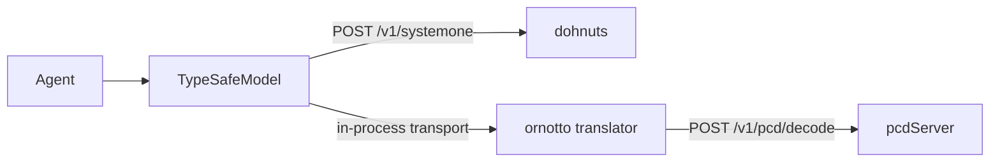

# 11. Typed decisions and pydantic-ai

A decision already has a type. A choice is a `Literal`, a yes/no is a `bool`, a set of decisions about one message is a pydantic model. ornotto lets you write that type and nothing else: the fields become the questions and the model's answers fill them in. You can do it three ways: with `extract` and a pydantic model, with a typed function under `@decision`, or through a pydantic-ai `Agent` whose `output_type` is the model.

## Fill a pydantic model: extract

`ornotto.extract(schema, state)` asks one question per field of `schema`, all in one request, and returns a validated instance.

```python
from typing import Literal
from pydantic import BaseModel, Field
import ornotto

class Triage(BaseModel):
    task: Literal["docs", "python", "fea"] = Field(description="What does the user want?")
    wants_code: bool = Field(description="Does the user want code they can run?")
    spam: float = Field(ge=0, le=1, description="Is this message spam?")

ornotto.extract(Triage, "Write a Python script that renames every .sc glyph")
# Triage(task='python', wants_code=True, spam=0.0056)
```

Each field type maps to one question kind:

| Field type | Question | Value in the instance |
|---|---|---|
| `Literal["a", "b", ...]` of strings | choice | the chosen option |
| `Enum` whose values are strings | choice over the values | the Enum member |
| `bool` | yes/no | `True` when p(yes) ≥ 0.5 |
| `float` with `ge=0` and `le=1` | yes/no | p(yes) itself |

The field's `description` is the question. A field without one is asked by its name, with underscores turned into spaces and a question mark added: `wants_code` becomes "Wants code?". A short name makes a weak question, so describe every field.

Any other field type raises `TypeError` before a request is sent, and the message names the field. That includes `int`, `str`, optional fields and nested models. For rubrics, use `rate` ([chapter 10](10-package.md#decider)) or the pydantic-ai route below, which accepts both.

`extract` takes `decider=` to pick the model and engine; without it, the shared default from `ornotto.use()` answers. `ornotto.aextract` is the same for asyncio. If you want the probabilities as well as the instance, ask the same questions yourself: `ornotto.questions_for(Triage)` returns the question dict that `extract` sends, and `decide` returns the full `Decision` for it.

```python
d = ornotto.decide(text, ornotto.questions_for(Triage))
d.task.probabilities, d.wants_code.probability
```

## Turn a function into a decision: @decision

`@ornotto.decision` turns a typed function with a docstring and no body into a decision.

```python
from typing import Literal
import ornotto

@ornotto.decision
def route(request: str) -> Literal["docs", "python", "fea"]:
    """Which kind of help does this FontLab user want?"""

route("How do I open the Glyph window?")   # 'docs'
```

The docstring is the question, as written. It is not a template: the arguments do not get formatted into it. They become the state instead. One argument is the state as it is. Several arguments become a JSON state keyed by argument name, with defaults filled in, and dohnuts reads a JSON state natively ([chapter 2](02-decisions.md)).

```python
@ornotto.decision
def wants_code(request: str, app: str = "FontLab 8") -> bool:
    """Does the user want code they can run?"""

wants_code("Write a Python script that renames every .sc glyph to .smcp")   # True
wants_code("How do I open the Glyph window?")                               # False
# state sent: {"request": "...", "app": "FontLab 8"}
```

The return annotation picks the question:

| Return type | Question | Returns |
|---|---|---|
| `Literal[...]` or `Enum` of strings | choice | the option, or the Enum member |
| `bool` | yes/no | `True` or `False` |
| `float` | yes/no | p(yes) |
| a pydantic model | one question per field, as `extract` | the instance |

Without a docstring, the function name stands in for the question. An unsupported return type raises `TypeError` when you call the function, not when you decorate it. `@ornotto.decision(decider=...)` binds the function to one `Decider`; without it, each call uses the shared default.

### What the decorator borrows

The shape comes from libraries that turn a typed stub into an LLM call. [promptic](https://github.com/knowsuchagency/promptic) uses the docstring as the prompt. [magentic](https://github.com/jackmpcollins/magentic)'s `@prompt` reads the return annotation to decide what the call must produce, and [Mirascope](https://github.com/Mirascope/Mirascope) builds calls from decorated functions too. ornotto takes the idea, not the code: it has no integration with any of them, and the function never reaches a language model that writes text. Where those libraries ask a model to generate output and then parse it into the return type, ornotto asks the engine to score the allowed values of the return type, so the result is always one of them.

## Pick a label: classify

`ornotto.classify(data, labels, instructions=None)` follows [marvin](https://github.com/PrefectHQ/marvin)'s `classify`: pick the label that fits `data`.

```python
import enum

class Tone(enum.Enum):
    CALM = "calm"
    ANGRY = "angry"

ornotto.classify("I was charged twice and nobody answers my emails!", Tone)   # Tone.ANGRY
ornotto.classify("Build a kern feature", ["docs", "python", "fea"])            # 'fea'
```

`labels` is a list of strings or an Enum class; an Enum class returns a member. `instructions` is the question. Without it, the model sees only the labels, which is enough for a dedicated model on dohnuts and too little for a chat model on pcdServer (see [chapter 3](03-engines.md)).

marvin 3 is built on pydantic-ai, so in principle a pydantic-ai model from ornotto could run its functions directly. It cannot today: as of September 2026, marvin 3 fails to import against pydantic-ai 2 (`ImportError: cannot import name 'Usage' from 'pydantic_ai.usage'`). `classify` and `@decision` are idioms that look like marvin's and promptic's, not integrations with them.

## pydantic-ai

[pydantic-ai](https://github.com/pydantic/pydantic-ai) has a model class for System One: `TypeSafeModel`, written for TypeSafe's hosted jev. It turns an agent's `output_type` into System One questions, sends the latest user prompt as the state, and builds the output from the answers. No text is generated. dohnuts speaks the same `/v1/systemone` protocol, so the same model class can run an agent on a local engine. `ornotto.pydantic_ai.model()` sets that up.

```sh
uv add "ornotto[pydantic-ai]"
```

```python
from typing import Literal
from pydantic import BaseModel, Field
from pydantic_ai import Agent
from ornotto.pydantic_ai import model

class Triage(BaseModel):
    """A FontLab user's request."""
    task: Literal["docs", "python", "fea"] = Field(description="What does the user want?")
    wants_code: bool = Field(description="Does the user want code they can run?")

agent = Agent(model("decider-0.8b"), output_type=Triage, instructions="Classify a FontLab user's request.")
agent.run_sync("Build a kern feature for A V W T").output
# Triage(task='fea', wants_code=True)
```

`model(model="decider-0.8b", *, engine=None, **kwargs)` takes a model name with the same options as `Decider`, or a `Decider` you already have. It returns a `TypeSafeModel` whose provider points at that Decider's engine. pydantic-ai 2.48 prints an observability banner on the first run; set `PYDANTIC_AI_NO_BANNER=1` to turn it off.

### How requests reach the engine



- **dohnuts**: the provider is a `TypeSafeProvider` with the engine's loopback URL as `base_url`. The TypeSafe client sends its request straight to dohnuts, which answers it natively. The API key is a fixed placeholder, because the client requires one and the local engine checks none.
- **pcdServer**: pcdServer does not speak System One. The provider's HTTP client has an in-process transport that catches each `/v1/systemone` request, translates the questions into pcdServer fields ([chapter 3](03-engines.md)), calls the engine through the `Decider`, and returns a System One response. The transport also answers `GET /v1/models` with the one local model. Nothing leaves the process except the call to the loopback engine.

### What an output type may contain

pydantic-ai's `TypeSafeModel` decides which field types it can express, and refuses the rest with a `UserError` before any request. Its documentation lists:

| Field type | Question | Output |
|---|---|---|
| `bool` | yes/no | `True` when p(yes) reaches the threshold, 0.5 by default |
| `Literal[...]` or `Enum` of two or more strings | choice | the chosen option |
| `float` with `ge=0` and `le=1` | yes/no | p(yes) |
| whole numbers 0, 1, 2, … (up to 10 levels) with a description per level in the schema | score | the nearest level |
| `list` of a `Literal` or `Enum` | one yes/no per option | the options answered yes |
| a nested model of these | its fields, named `outer.inner` | the model |
| `Literal[...]` or `Enum`, or `None` | choice, or none of these | the option, or `None` |

This is wider than `extract`: rubrics, multi-select lists and nested models all work. A rubric needs its level descriptions in the JSON schema, as `anyOf` entries with a `const` and a `description` each:

```python
urgency: int = Field(description="How urgent is it?", json_schema_extra={"anyOf": [
    {"const": 0, "description": "can wait"},
    {"const": 1, "description": "this week"},
    {"const": 2, "description": "today"}]})
```

On dohnuts with a decider model, a rubric field runs as an isolated score: one row per level, each asking whether that level fits ([chapter 3](03-engines.md)).

The model's docstring and the agent's `instructions` go along as context. With an earlier conversation in `message_history`, the state becomes a JSON object with the latest text and a `history` list, which dohnuts takes as it is and pcdServer receives serialized as JSON text.

### Reading the confidence

The run returns the output. The numbers behind it are on the last `ModelResponse`, in `provider_details`:

```python
from pydantic_ai.messages import ModelResponse

result = agent.run_sync("Write a Python script that renames every .sc glyph")
details = [m for m in result.all_messages() if isinstance(m, ModelResponse)][-1].provider_details
details["confidence"]["task"], details["probabilities"]["task"]
```

`confidence` is per field, from 0 for undecided to 1; `probabilities` holds the full distribution of each choice and rubric field; `scores` holds each rubric field's expected level before rounding. On dohnuts these numbers are temperature-scaled. On pcdServer they are the raw softmax over allowed tokens ([chapter 9](09-confidence.md)).

Two model settings from pydantic-ai tune the thresholds: `typesafe_boolean_threshold` (default 0.5) sets how likely a yes must be before a `bool` field is `True`, and `typesafe_tool_call_threshold` (default 0.6) sets how likely a tool call must be before the model proposes it.

### Tools and fallback

With tools on the agent, `TypeSafeModel` asks one more question: which tool, or the output, the text calls for. A tool without arguments, or one whose arguments use the types above, is called. If a picked tool has arguments it cannot fill, it raises `ToolCallProposed`, which is a `ModelAPIError`. pydantic-ai documents that a `FallbackModel` with a language model behind the TypeSafe model hands such a step to the language model, tools and all. That is the pattern for an agent that decides locally and calls a larger model only when a tool needs free-form arguments:

```python
from pydantic_ai.models.fallback import FallbackModel

agent = Agent(FallbackModel(model("decider-0.8b"), "anthropic:claude-sonnet-5"), output_type=Triage)
```

`TypeSafeModel` refuses plain text output, native tools, and files in the prompt or history. A local engine cannot produce any of them either.

### Which model to put behind an agent

On the FontLab router question, decider-0.8b on dohnuts is right 62 times in 67 at 52 ms per query, and Qwen3.5-4B-Hmm (Q8_0) on pcdServer 64 times at 88 ms ([chapter 6](06-results.md)). Through pydantic-ai the prompt differs from the benchmark's, so treat those as a ranking, not a promise. In our own integration tests, decider-0.8b on pcdServer, which reads it without its trained answer slot, got the task of a short Python request wrong where the same model on dohnuts got it right. If you run a dedicated model, run it on dohnuts.
