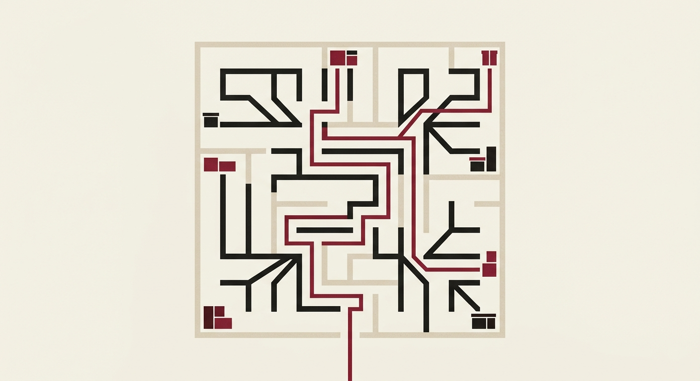
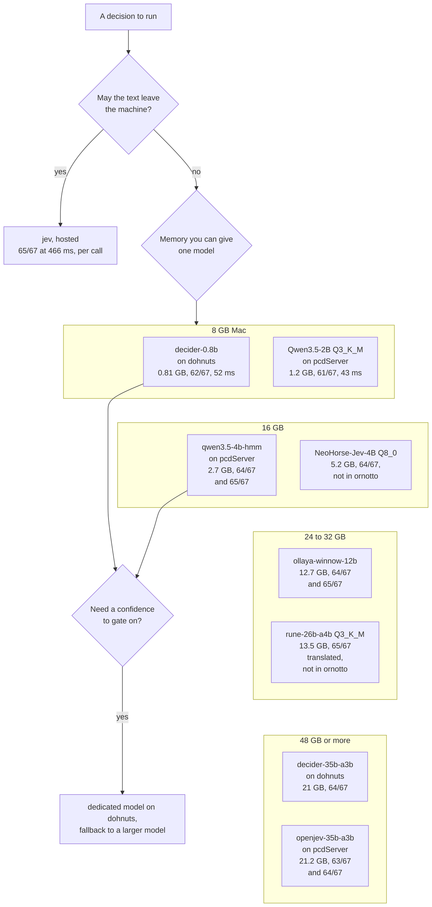
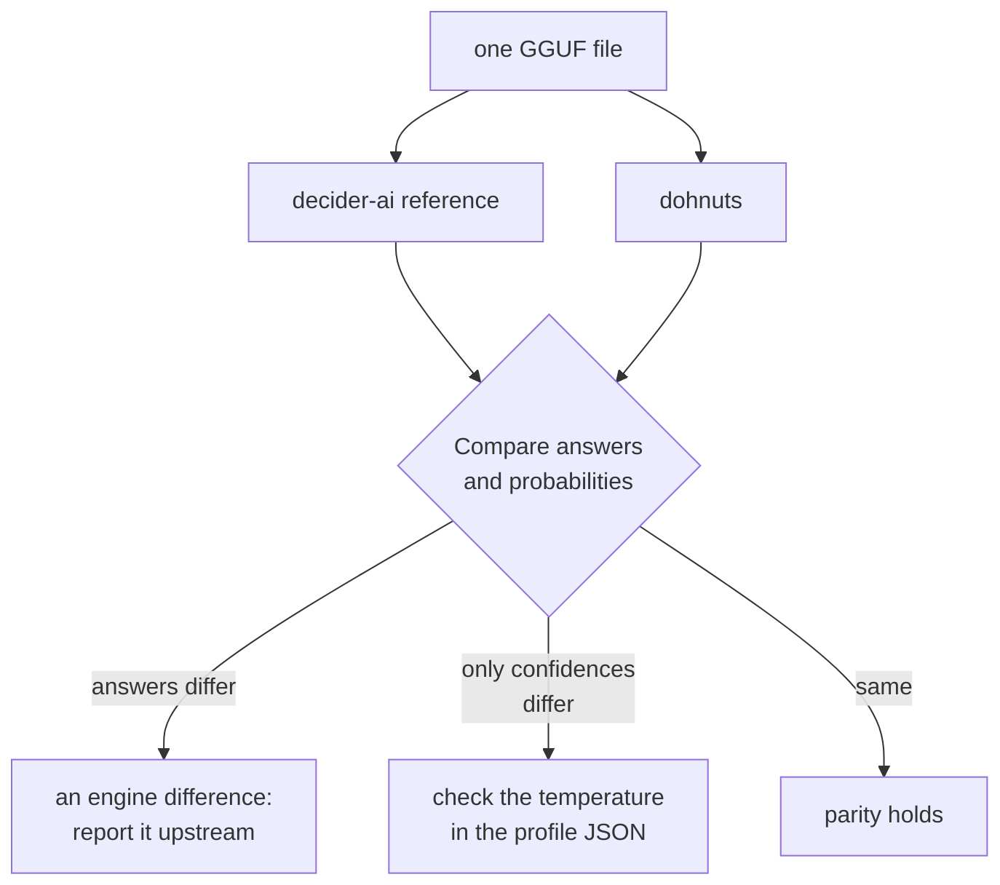

# 12. Choosing, building and contributing

The first eleven chapters describe how the engines read an answer, how the models compare, and what the package does. This one turns them into choices you make on day one: which engine and model for which job, how to build the engines if no wheel fits, how a release is made, and how to send a change upstream.


*Choosing an engine and a model is a path through a few constraints: memory, languages, speed and licence.*

## Which engine and model

Start from what your decision needs, not from the model list. The numbers in the right-hand column are from the FontLab router benchmark ([chapter 6](06-results.md)), translated set, on an Apple M4 Max; your task will score differently, but the order tends to hold.

| If you need | Use | Why, and what it costs |
|---|---|---|
| A good default | `decider-0.8b` on dohnuts | 62/67 at 52 ms per query on Metal, 0.81 GB, calibrated probabilities. On CPU the same model takes 275 ms. |
| The most accurate answer near 90 ms in `ornotto`, in both modes | `qwen3.5-4b-hmm` on pcdServer | 64/67 translated and 65/67 direct, at 88 to 93 ms, 2.7 GB at Q4_K_M. |
| Match jev in both modes, with more memory and latency | `rune-26b-a4b` Q5_K_M on pcdServer | 65/67 translated and direct, 962 ms, 19.13 GB. CPU weights with Metal computation; this quantization needs an explicit GGUF path rather than the registry default Q3. |
| The most accurate local answer on translated text, on a 48 GB Mac | rune-26b-a4b version 1 at Q3_K_M on llama-server | 65/67 translated, the same as jev, at 367 ms from 13.5 GB. It drops to 57/67 on the original text, so keep the translator. That row measures the earlier surogate conversion through its native readout. The October package registers the separate mradermacher Q3 conversion on pcdServer: 64/67 in both modes, 146 ms, 13.29 GB. |
| The best small dedicated model | NeoHorse-Jev-4B at Q8_0, in its authors' runtime | 64/67 in both modes at 273 ms, from 5.2 GB. Its Q3_K_M file (3.0 GB) scored 63/67. Not in ornotto; the runtime is a patched llama.cpp whose build script targets CUDA, and the benchmark built it for Metal. |
| No setup beyond one install | an ollaya model | `ollaya-winnow-12b` scored 64/67 and 65/67 at 891 ms (12.7 GB); `ollaya-decider-0.8b` 61/67 at 285 ms. ornotto starts ollaya, pulls the tag and loads it; the answers are calibrated. |
| An English encoder, fast | GLiNER2.5-Decide on Core AI | 61/67 on translated text in 27 ms, from 0.87 GB, nine answers above laya. It reads English only, so non-English queries need the translator. Not in ornotto. |
| The lowest latency for one model | pcdServer | Same decider-0.8b GGUF: 28 ms on pcdServer against 52 ms on dohnuts (Metal). pcdServer reads it as a chat model, though, and scores 55/67 instead of 62. |
| Non-English text without a translator | `qwen3.5-4b-hmm` on pcdServer | 65/67 on the original text. decider-0.8b drops from 62 to 61 without translation ([chapter 5](05-method.md)). |
| Several questions about one message | either | pcdServer decodes the message once and adds a short suffix per field. dohnuts reuses the state across the questions of one request since our [prefix cache](08-speed.md#prefix-caching-in-dohnuts) (1.9× on Metal, 3.2× on CPU for three questions). |
| Options that need explaining | dohnuts | Each option carries a description (`choice(..., {"name": "description"})`). pcdServer only has the field description, so ornotto folds option descriptions into it, clipped to 1,024 bytes. |
| A graded answer, and whether any level fits | dohnuts with a decider model | `score` returns the expected level; `raw["native"]` has `level_fit` and `fit_mass` per level. pcdServer has no graded type; ornotto emulates one with the choices "0", "1", … and returns their expected value. |
| Application state as JSON | dohnuts | It prints the JSON into the prompt and indexes long arrays (`_index`), so the model can refer to items by position. pcdServer gets the JSON serialized as text. |
| Any chat GGUF | pcdServer | dohnuts needs a native profile: decider, kev, Dohnuts, Jet, JPT, Tev1 or ThisThat. pcdServer scores the allowed tokens of any model with a chat template. |
| A confidence to gate on | dohnuts | Temperature-scaled probabilities. [Chapter 9](09-confidence.md) shows how a gate at 0.7 to Qwen3.5-4B-Hmm moved 61/67 to 63/67 on untranslated text. |
| Many different question sets in rotation | dohnuts, or pcdServer with a larger cache | pcdServer caches one checkpoint per question set: about 22 MB on a 0.8B model and 56 to 63 MB on a 4B one. ornotto starts it with a 512 MiB cache. |
| Remote decisions | OpenRouter API | Nine measured endpoints through `ornotto`; compare [remote scores and network-inclusive timings](results/details.md#openrouter-nine-remote-models). Respan uses noul OVR. |

Two catches in the registry. `qwen3.5-2b` in ornotto is the Q4_K_M file, which scored 57/67; the Q3_K_M file of the same model scored 61/67 at 43 ms ([chapter 7](07-quantization.md)). If a small vanilla model is what you want, pass that file as `hf:bartowski/Qwen_Qwen3.5-2B-GGUF/Qwen_Qwen3.5-2B-Q3_K_M.gguf`. And the fastest methods in the benchmark, laya-multilingual on the Neural Engine (4.2 ms, 47/67) and on MLX (6.9 ms, 52/67), use runtimes the wheel does not bundle: the optional native `laya-mlx` engine now exposes the multilingual checkpoint through the package API ([chapter 3](03-engines.md)). Through ollaya, `ollaya-laya-multilingual` answers in 12.3 ms with the same 52/67.

## Choosing by memory on a Mac

On Apple silicon the GPU shares the machine's memory with everything else, so the first practical limit is not speed but whether the model fits. The tree below sorts the models this book measured by how much memory they need. The tiers are guidance, not measurements: every number in it comes from one 48 GB M4 Max ([chapter 5](05-method.md#one-model-at-a-time)). The rule behind the tiers is the file size plus headroom for macOS, your other applications and the engine's own cache. pcdServer, as ornotto starts it, may add up to 512 MiB of schema checkpoints ([chapter 8](08-speed.md#the-schema-cache-in-pcdserver)).



Read the tree from the bottom of your tier upwards. A 32 GB Mac can run everything in the 8 GB and 16 GB tiers, and on the router question the larger models are not always better: qwen3.5-4b-hmm at 2.7 GB scored 64/67 translated and 65/67 on the original text, rune at 13.5 GB 65/67 and 57/67 ([chapter 6](06-results.md#the-top-of-the-table)). The large models earn their memory only if your own questions show it.

The last branch is the pattern from [chapter 9](09-confidence.md#a-fallback-gate): run a small dedicated model on dohnuts, whose probabilities are temperature-scaled, and send only the low-confidence answers to a larger model. The two models must then fit side by side, because ornotto keeps each engine loaded ([chapter 10](10-package.md#engine-lifecycle)). decider-0.8b and qwen3.5-4b-hmm together come to the two file sizes in the tree plus both engines' headroom.

!!! warning "One large model at a time"
    `openjev-35b-a3b` needs about 23 GB of memory when loaded, and on the 48 GB benchmark machine the Q5_K_M file of jeb-35b-a3b took available memory below 4 GB while it loaded, so it has no row ([chapter 8](08-speed.md#memory-one-model-at-a-time)). On a machine of that size, run a 35B model with nothing else loaded.

### A file does not change under you

A GGUF on disk gives the same answers until you replace it. A hosted alias is a promise instead. TypeSafe's chief executive, Diogo Almeida, made that promise plainly on the Latent Space podcast on 2026-09-21: "We will not change our models when we deploy them. That is insane."[^latent-space] In the same conversation he said TypeSafe is "not promising long-term support for the models". Through September 2026, `jev-latest` pointed at jev 1.13.0 whenever the public boards or TypeSafe's documentation named a version ([chapter 1](01-deciding.md#jev-the-hosted-reference)). If you tune a threshold against jev, record the version behind the alias along with the threshold.

## Building from source

You build from source to change an engine, to get a platform the wheels do not cover, or to work on ornotto itself. You need Git, CMake 3.25 or later (pcdServer's minimum), a C++20 compiler, `uv`, and network access for the first configure, when pcdServer fetches its pinned dependencies.

```sh
git clone --recursive https://github.com/fontlaborg/ornotto
cd ornotto
./build.sh
```

`build.sh` initializes the submodules, runs `ruff` and the unit tests, and builds an sdist and a wheel for your platform into `dist/`. It builds the wheel from the source tree, not from the sdist, because the sdist does not carry the engine sources. It then copies the two executables into `src/ornotto/_bin/`, where an editable install (`uv sync`) finds them.

The engines come from two git submodules:

| Submodule | Repository | Brings its own llama.cpp |
|---|---|---|
| `engines/dohnuts.cpp` | [fontlaborg/dohnuts.cpp](https://github.com/fontlaborg/dohnuts.cpp), branch `issue102-models` | as a nested submodule |
| `engines/pcdServer` | [fontlaborg/pcdServer](https://github.com/fontlaborg/pcdServer), branch `issue102-jinja-fallback` | fetched by CMake at configure time |

So a build compiles llama.cpp twice, once per engine, each at the version its engine pins. The CMake build directories live in `build-engines/` and are reused, so a second build recompiles only what changed.

### What the build hook passes to CMake

`hatch_build.py` is a hatchling build hook. It builds both engines, adds them to the wheel as `ornotto/_bin/dohnuts-cli` and `ornotto/_bin/pcd_server`, and tags the wheel `py3-none-<platform>`. Every flag it adds answers one portability problem:

| Flag | Engine | Why |
|---|---|---|
| `-DBUILD_SHARED_LIBS=OFF`, `-DDOHNUTS_STATIC=ON` | both | One self-contained executable, no llama.cpp shared libraries to ship or find at run time. |
| `-DGGML_NATIVE=OFF` | both | No `-march=native`, so the binary runs on CPUs other than the one that built it. |
| `-DGGML_OPENMP=OFF` | both | No OpenMP runtime to bundle; ggml uses its own thread pool. |
| `-DLLAMA_CURL=OFF` | both | No libcurl; ornotto downloads models itself. |
| `-DHTTPLIB_USE_<LIB>_IF_AVAILABLE=OFF` for OpenSSL, zlib, Brotli, zstd, mbedTLS and wolfSSL | pcdServer | cpp-httplib links any of these it finds on the build machine. A macOS build linked Homebrew's OpenSSL, Brotli and zstd, and would not start on a Mac without them. |
| `-DHTTPLIB_USE_NON_BLOCKING_GETADDRINFO=OFF` | pcdServer | cpp-httplib's non-blocking name lookup calls `getaddrinfo_a`, which needs libanl on the glibc 2.28 of manylinux_2_28. The server only binds a loopback port and never resolves a name. |
| `-DDOHNUTS_METAL=ON` | dohnuts, macOS | The Metal backend. pcdServer turns Metal on by itself. |
| `-DCMAKE_OSX_DEPLOYMENT_TARGET=14.0` | both, macOS | The wheel tag says `macosx_14_0`, so the binary must load on macOS 14. |
| `-DCMAKE_OSX_ARCHITECTURES=<machine>` | both, macOS | Builds for the machine's own architecture (`arm64` on Apple silicon), so the executable is not a universal binary. |
| `-DCMAKE_CXX_FLAGS=-fexperimental-library` | dohnuts, macOS | dohnuts uses `std::jthread`, which Apple's libc++ before LLVM 20 keeps behind this flag. Without it, the macOS 14 CI runner fails with `no member named 'jthread' in namespace 'std'`. |
| `-DCMAKE_MSVC_RUNTIME_LIBRARY=MultiThreaded` | dohnuts, Windows | Static MSVC runtime, no redistributable DLLs to ship. |
| `-DCMAKE_CXX_FLAGS=/Zc:char8_t- /utf-8 /EHsc` | dohnuts, Windows | dohnuts builds llama.cpp as C++20, where `u8""` literals are `char8_t`, which llama.cpp's sources reject under MSVC. |

Four environment variables steer the hook:

| Variable | Effect |
|---|---|
| `ORNOTTO_ENGINES=skip` | build a pure wheel without engines |
| `ORNOTTO_PLATFORM_TAG` | wheel platform tag; CI sets `manylinux_2_28_x86_64` and `manylinux_2_28_aarch64` |
| `ORNOTTO_BUILD_DIR` | the CMake build directory, default `build-engines/` |
| `ORNOTTO_JOBS` | parallel compile jobs, default the CPU count |

If you build the engines some other way, skip the hook and point ornotto at them with `ORNOTTO_DOHNUTS_BIN` and `ORNOTTO_PCD_BIN` ([chapter 10](10-package.md#install)).

## Tests

```sh
./test.sh                 # ruff check and format check, then the unit tests
ENGINES=1 ./test.sh       # also the real-engine tests, then every script in examples/
```

The unit tests need no engine and no model: they cover the System One and pcdServer translation, the typed helpers against a fake `Decider`, and the engine command lines. The engine tests carry the pytest marker `engine`, which the default run deselects. They load decider-0.8b on dohnuts, then on pcdServer, one engine at a time, and check that no engine is left running afterwards. They download 0.81 GB on the first run; `examples/fallback.py` adds 2.7 GB for Qwen3.5-4B-Hmm.

!!! note
    The engine tests assert the answers, not just their shape, so a model that behaves differently fails them. Two checks are looser on pcdServer: `extract` and the pydantic-ai agent assert only the type there, because decider-0.8b read as a chat model gets the short Python request in those tests wrong ([chapter 11](11-typed.md#which-model-to-put-behind-an-agent)).

## Parity checks against the reference

A local engine is only as trustworthy as its agreement with the model's reference implementation. For decider the reference is Mapika's PyTorch package, `decider-ai`. Until late September that package read the original checkpoints and dohnuts read GGUF conversions, so a parity check compared two different files: when the answers differed, the cause could be the engine or the conversion.

`decider-ai` 1.6.0, released on 2026-09-27, added GGUF checkpoints to its `Decider`, together with GGUF files for decider-4b v2.1 and decider-2b v11.[^decider] The reference and dohnuts can now read the same file. A difference between them is then the engine's, not the conversion's.



We have not rerun our own checks this way yet. The prefix cache in [chapter 8](08-speed.md#prefix-caching-in-dohnuts) was checked against dohnuts' own comparison script and the f32 PyTorch model, as described under [contributing upstream](#contributing-upstream).

Two later `decider-ai` releases change what a comparison has to account for. 1.7.0 added decider-12b, built on Gemma-4-12B-it; the October pcdServer fork renders Gemma 4 templates, but decider-12b itself has not been measured on either engine. 1.8.0 added `temperature_by_options`, a temperature that depends on the number of options, T(n) = max(min, a + b ln n). A reference that scales by option count and an engine that reads one fixed temperature from the profile will agree on the answer and disagree on its confidence. Read the profile JSON of a new checkpoint before you blame the engine.

## Wheels and releases

The workflow in `.github/workflows/wheels.yml` builds one wheel per platform, plus the sdist:

| Job | Runner | Output |
|---|---|---|
| Linux x86_64 | `ubuntu-24.04` in the `manylinux_2_28_x86_64` container | `manylinux_2_28_x86_64` wheel |
| Linux aarch64 | `ubuntu-24.04-arm` in the `manylinux_2_28_aarch64` container | `manylinux_2_28_aarch64` wheel |
| macOS | `macos-15` | `macosx_14_0_arm64` wheel |
| Windows | `windows-2022`, allowed to fail | `win_amd64` wheel with dohnuts only |
| sdist | `ubuntu-24.04` | source distribution without engines |

Each wheel job installs its wheel into a fresh virtual environment and checks that its engines are found before it uploads the artifact. Building in the manylinux 2.28 containers makes the Linux wheels load on glibc 2.28 and later. On Windows the hook builds dohnuts only: pcdServer's sources do not compile with MSVC yet (`model_catalog.cpp` calls `std::wstring::rfind` with a `char`), so `Decider(..., engine="pcd")` there needs a `pcd_server` you build yourself. The Windows job is allowed to fail, so a release can ship without a Windows wheel.

A release runs from `./publish.sh`, which needs `UV_PUBLISH_TOKEN` (a PyPI token) and an authenticated `gh`:

1. `./build.sh` checks and builds locally.
2. `uvx gitnextver` commits any changes, tags the next version `vX.Y.Z`, and pushes the commit and the tag.
3. The tag starts the wheels workflow, whose last job attaches every wheel and the sdist to a GitHub release.
4. `publish.sh` waits for that run, downloads its artifacts and uploads them with `uv publish`.

The version comes from the tag, through hatch-vcs, so nothing in the source holds a version number. Every file in the working tree that git does not ignore goes into the release commit, because gitnextver adds them all.

## The book

This book is built from `src_docs/` with ProperDocs and the MaterialX theme, into `docs/`, which GitHub Pages serves at <https://fontlab.org/ornotto/>.

```sh
./docs.sh           # regenerate tables, build into docs/
./docs.sh serve     # live preview
```

The benchmark tables are not written by hand. The results live as JSON in `src_docs/data/`, exported from our benchmark harness: `classifiers.json` (one row per model and engine), `queries.json`, `translator.json`, `detectors.json` and `cascade.json`. `src_docs/gen_tables.py` renders them into the sortable HTML snippets in `src_docs/md/tables/`, and the chapters include those snippets. To correct a number, change the JSON and run `./docs.sh`; the build runs in strict mode and fails on a broken link or a missing snippet.

## Contributing upstream

The engines are other people's projects, and changes to them belong upstream. The dohnuts prefix cache is the worked example ([chapter 8](08-speed.md#prefix-caching-in-dohnuts)):

1. Read how the project takes changes. dohnuts.cpp had no contribution guide, template or CI when we started; its history was short imperative commit subjects, and it keeps its English and Chinese READMEs in sync.
2. Make the change in a fork, on a topic branch: [fontlaborg/dohnuts.cpp](https://github.com/fontlaborg/dohnuts.cpp), branch `side-prefix-cache`. Keep it to the code the change needs: six files, and no README edit, which would have needed a matching Chinese one.
3. Measure before and after, on both backends, and check accuracy against the project's own reference: here the upstream `scripts/compare/compare.sh` (8/8) and the f32 PyTorch decider on longer states.
4. Open the pull request with the numbers: [DreamBlooms/dohnuts.cpp#1](https://github.com/DreamBlooms/dohnuts.cpp/pull/1).

The October package carries fixes in both engine forks: native JPT/Jet prompts and label mappings in dohnuts, and Jinja chat-template rendering in pcdServer.

The pull request was opened on 2026-09-23 at 22:34 UTC and merged by mili-tan on 2026-09-24 at 04:44 UTC, with one comment, "lgtm, thank you very much.", and a heart.[^pr1] Eight minutes after the merge the maintainer pushed a commit of their own, "Cache decoded state prefixes across calls", which extends the idea from the rows of one request to later requests: a bounded cache of 256 MiB, keyed by the exact prefix tokens and shared with the side models.[^dohnuts-commits]

The October dohnuts gitlink is `dbf48c0` on `issue102-models`. It includes upstream `85a917a`, the merged prefix cache, cross-call cache, Linnaeus profile and automatic flash attention, plus the verified JPT/Jet prompt and answer-token fixes. Earlier benchmark rows keep their original engine measurements; the October rows measure this new build.

The pcdServer fork[^pcdserver] gitlink is `1046a00` on `issue102-jinja-fallback`. It retains the legacy renderer where that succeeds and falls back to llama.cpp's Jinja renderer otherwise. It avoids a duplicated automatic BOS token and accepts `--gpu-layers`; the larger Rune runs keep weights on CPU. Both forks retain their existing llama.cpp pins.

!!! quote "How it looked from the outside"
    The two engines ornotto bundles are younger than jev's public launch on 2026-09-15: pcdServer's repository was created on 2026-09-18 and dohnuts.cpp's on 2026-09-21. A pull request to a project that young is a conversation with one or two people, not a process. Ours got a one-line approval, and the maintainer answered it by building the next step themselves the same morning.

The licences travel with the wheel, in its `dist-info/licenses/`:

| Component | Licence |
|---|---|
| ornotto | Apache-2.0 |
| dohnuts.cpp | Apache-2.0, with a NOTICE file |
| laya.cpp HTTP transport, inside dohnuts.cpp | MIT |
| pcdServer | MIT |
| llama.cpp and ggml | MIT |
| cpp-httplib, nlohmann/json | MIT |

Model weights are not in the wheel and keep their own licences: Apache-2.0 for every registered model except Dohnuts, which is CC-BY-NC-SA-4.0.

Changes to ornotto itself go to [fontlaborg/ornotto](https://github.com/fontlaborg/ornotto) as issues or pull requests. `./test.sh` must pass; the code style is `ruff` with a line length of 110, and every source file names its own path in a `this_file` comment.

## What changed in September 2026

The advice in this chapter rests on measurements from the second benchmark round. Around it, the month moved these pieces:

- **dohnuts** merged our pull request and added a cross-call prefix cache, Linnaeus-0.1.0-2B and `--flash-attn`. ornotto still builds from the fork ([above](#contributing-upstream)).
- **decider-ai** can read GGUF, which makes [parity checks](#parity-checks-against-the-reference) cheaper, and fits temperatures per option count.
- **pcdServer upstream** had not changed by the September snapshot; the October bundled fork carries the rendering fixes.
- **ollaya** reached v0.7.5 with a GPU path on Apple silicon ([chapter 10](10-package.md#ornotto-and-ollaya)).
- **pydantic-ai** put `TypeSafeModel` under a new `DecisionModel` base; ornotto's lock stays on 2.48.0 ([chapter 11](11-typed.md#what-changed-in-september-2026)).

Each of these can change a row in the table at the top of this chapter. The book's numbers are dated to the runs that produced them; when you choose, check the release you are about to install against the one the book measured.

[^latent-space]: Latent Space, "Jev: System One models for Prod, not God, with Diogo Almeida, CEO, TypeSafe AI", 2026-09-21, at 00:48:11. <https://www.latent.space/p/jev>
[^decider]: Mapika, "decider" README, read 2026-09-30. <https://github.com/Mapika/decider>
[^pr1]: DreamBlooms/dohnuts.cpp, "Reuse the state prefix across side-model rows", pull request #1, 2026-09-24. <https://github.com/DreamBlooms/dohnuts.cpp/pull/1>
[^dohnuts-commits]: DreamBlooms, "dohnuts.cpp" commit history, read 2026-09-30. <https://github.com/DreamBlooms/dohnuts.cpp/commits/main>
[^pcdserver]: stephanj, "pcdServer", read 2026-09-30. <https://github.com/stephanj/pcdServer>

## Choose a measured GPU configuration

Rune Q5 full Metal scores 64/67 in both modes at 153.3 ms translated and 152.8 ms direct. The retained mixed run scores 65/67 at 962.3 ms: choose whether that extra answer on this small set merits the latency. Ornith Splash scores 62/63 at 322.4/328.5 ms and does not improve the fastest useful frontier. A failed or refused load provides no accuracy result. [The explorer keeps every completed configuration and explains exclusions](results/explorer.md#rune-q5-and-splash-two-completed-october-runs).

For English routing at a 60-answer floor, the new Core ML CPU/GPU GLiNER run leads at 61/67 and 21.9 ms. Jev-Omni last-token/MLX preserves 64/64 at about 908 ms; Neutron MPS is slower than its retained mixed run. These are benchmark-only provider/head adapters. [Compare the complete runs and exclusions](results/explorer.md#three-gpu-provider-and-head-comparisons).
