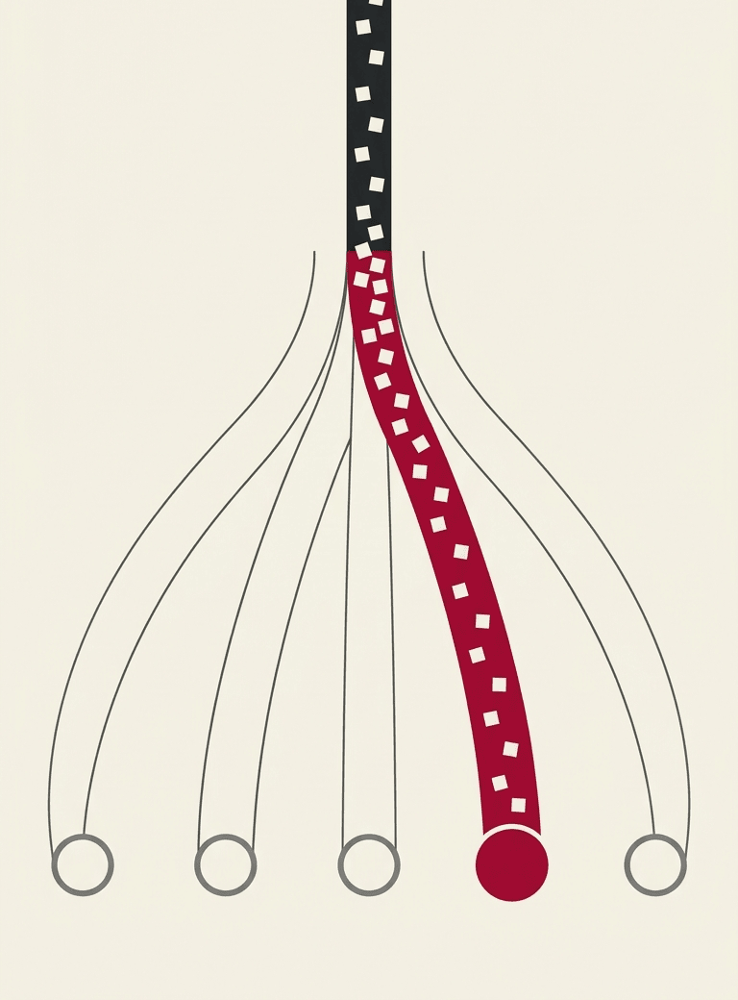
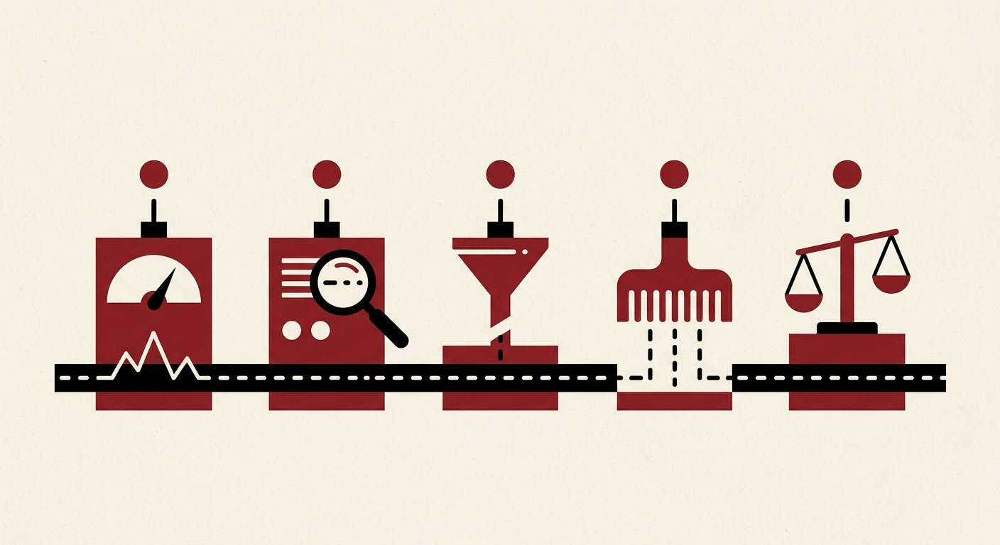
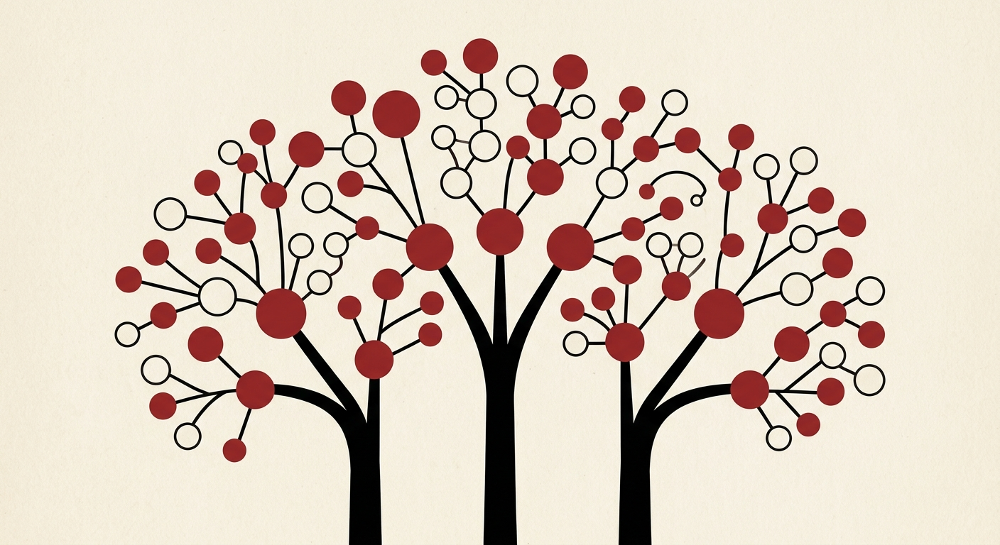

<div class="ornotto-hero" markdown="1">

<div class="ornotto-hero__text" markdown="1">

ornotto · a book and a Python package
{ .ornotto-eyebrow }

# Ask a local model to pick an answer, not to write one { data-toc-label="Overview" }

Send a message and a closed list of answers. The model returns one of them and a probability for every alternative, with no generated text to parse, repair or retry.
{ .ornotto-lead }

[See the results](results/tldr.md){ .md-button .md-button--primary }
[Read the book](01-deciding.md){ .md-button }

</div>

<figure class="ornotto-hero__art" markdown="1">
{ width="768" height="1040" }
</figure>

</div>

<div class="ornotto-numbers" role="list">
<div role="listitem"><span class="ornotto-numbers__value">305</span><span class="ornotto-numbers__label">methods measured</span><span class="ornotto-numbers__note">a model, read one way on one engine or remote API</span></div>
<div role="listitem"><span class="ornotto-numbers__value">67</span><span class="ornotto-numbers__label">queries in 30 languages</span><span class="ornotto-numbers__note">each asking for one of five tasks</span></div>
<div role="listitem"><span class="ornotto-numbers__value">65<small>/67</small></span><span class="ornotto-numbers__label">best local score</span><span class="ornotto-numbers__note">Rune q5 on pcdServer, level with jev in both modes</span></div>
<div role="listitem"><span class="ornotto-numbers__value">26.9<small> ms</small></span><span class="ornotto-numbers__label">fastest at 60/67 or better</span><span class="ornotto-numbers__note">gliner25-decide on Core AI, 61/67</span></div>
</div>

<div class="ornotto-band ornotto-band--tint" markdown="1">

## How a decision works { #how-it-works }

<ol class="ornotto-steps">
<li>
<svg viewBox="0 0 40 40" aria-hidden="true"><rect x="8" y="5" width="24" height="30" rx="2" fill="none" stroke="currentColor" stroke-width="2"/><path d="M13 13h14M13 19h14M13 25h9" stroke="currentColor" stroke-width="2"/></svg>
<h3>A state</h3>
<p>A message, a ticket or a slice of application data. The model reads it once.</p>
</li>
<li>
<svg viewBox="0 0 40 40" aria-hidden="true"><path d="M13 12a7 7 0 1 1 9 6.7c-1.3.5-2 1.4-2 2.8V23" fill="none" stroke="currentColor" stroke-width="2"/><circle cx="20" cy="28" r="1.4" fill="currentColor"/><rect x="5" y="33" width="8" height="4" rx="1" fill="currentColor" opacity=".35"/><rect x="16" y="33" width="8" height="4" rx="1" fill="var(--ornotto-red)"/><rect x="27" y="33" width="8" height="4" rx="1" fill="currentColor" opacity=".35"/></svg>
<h3>A question and its answers</h3>
<p>A named question with a closed set of answers, such as <code>docs</code>, <code>python</code> or <code>fea</code>.</p>
</li>
<li>
<svg viewBox="0 0 40 40" aria-hidden="true"><path d="M5 35h30" stroke="currentColor" stroke-width="2"/><rect x="8" y="27" width="6" height="7" fill="currentColor" opacity=".35"/><rect x="17" y="8" width="6" height="26" fill="var(--ornotto-red)"/><rect x="26" y="22" width="6" height="12" fill="currentColor" opacity=".35"/></svg>
<h3>A probability for each answer</h3>
<p>The highest one is the choice. The others show how close the alternatives came.</p>
</li>
</ol>

</div>

<div class="ornotto-band ornotto-band--ink" markdown="1">

<figure class="ornotto-quote">
<blockquote><p>Would you say a linear classifier hallucinates?</p></blockquote>
<figcaption><a href="https://news.ycombinator.com/item?id=49717558">Diogo Almeida, TypeSafe, September 2026</a></figcaption>
</figure>

<div class="ornotto-quote__note" markdown="1">

Almeida asked this on jev's launch thread, when the discussion turned to whether a model that writes no text can hallucinate. None of the readouts in this book can return an answer outside your list. Each of them can still put a high probability on the wrong one, which is what [chapter 9](09-confidence.md) measures.

</div>

</div>

<div class="ornotto-band ornotto-band--tint" markdown="1">

## What we measured

One router question, asked of every method: which of five tasks does a FontLab user want? The chart ranks the best eight by translated score, then direct score and speed. Local and remote runs retain their execution labels. [Explore the speed/accuracy frontier](results/explorer.md), or read [all 305 rows and every table](results/details.md).
{ .ornotto-section-lead }

For a fast first pass, laya on MLX scores **52/67 in 6.9 ms** on translated text. [Set your own accuracy floor and compare Pareto frontiers](results/explorer.md). Rune Q4 now measures **124.8 ms** on GPU, against **487.1 ms** with CPU weights. Rune Q5 full Metal adds **64/64 at 153.3 ms**, 6.3× faster with one fewer correct answer in each mode than its mixed run. Ornith Splash scores **62/63 at 322.4/328.5 ms**. **C** = CPU, **G** = GPU, **C+G** = mixed, **R** = remote; all other device codes are explained in the full report.

--8<-- "tables/landing-bars.html"

<details class="ornotto-more" markdown="1">
<summary><span class="ornotto-more__sign" aria-hidden="true">+</span>Show the full top 15</summary>

Each row is one method, ranked by translated score, then direct score, then speed. Click a column header to sort.

--8<-- "tables/top.html"

</details>

</div>

## Local engines and remote models, one API

The package runs two open-source C++ engines on llama.cpp behind one Python API, drives ollaya if you install it, supports optional native Laya MLX/xDecision encoders, and calls the nine measured OpenRouter endpoints remotely. [Chapter 3](03-engines.md) explains how each one reads an answer.
{ .ornotto-section-lead }

<div class="ornotto-features" markdown="1">

<div class="ornotto-feature" markdown="1">

<div class="ornotto-feature__text" markdown="1">

### dohnuts

Runs models trained for this job and reads their answer at the slot they were trained to fill. decider-0.8b scores 62/67 in about 51 ms.

[How dohnuts reads an answer](03-engines.md#dohnuts)

</div>

<div class="ornotto-crop" style="--w:440%;--tx:-3.9%;--ty:-26%" markdown="1">
{ loading="lazy" width="1408" height="768" }
</div>

</div>

<div class="ornotto-feature" markdown="1">

<div class="ornotto-feature__text" markdown="1">

### pcdServer

Runs any chat GGUF and scores only the tokens of the answers you allow. Qwen3.5-4B-Hmm scores 65/67 on the original text in 88 ms.

[How pcdServer constrains the answer](03-engines.md#pcdserver)

</div>

<div class="ornotto-crop" style="--w:503%;--tx:-41.5%;--ty:-29.9%" markdown="1">
{ loading="lazy" width="1408" height="768" }
</div>

</div>

<div class="ornotto-feature" markdown="1">

<div class="ornotto-feature__text" markdown="1">

### ollaya

A separate binary with its own model registry; ornotto drives it when it is installed. Ten of its models were measured, and winnow-12b scores 65/67 on the original text.

[Setting up ollaya](10-package.md#ollaya)

</div>

<div class="ornotto-crop" style="--w:271%;--tx:-31.5%;--ty:-7.8%" markdown="1">
{ loading="lazy" width="1408" height="768" }
</div>

</div>

</div>

<div class="ornotto-band ornotto-band--tint" markdown="1">

## The book in twelve chapters

<div class="ornotto-chapters" markdown="1">

<div markdown="1">

Concepts
{ .ornotto-chapters__group }

1. [Deciding, not generating](01-deciding.md) A model that points at one of the answers you gave it.
2. [The shape of a decision](02-decisions.md) The request and the answer in System One terms, and what changes on pcdServer.
3. [Ways to read an answer](03-engines.md) Each readout takes its answer from a different place in the model.
4. [Dedicated, fine-tuned and vanilla models](04-models.md) Three families, sorted by where the answer is read.

</div>

<div markdown="1">

Benchmarks
{ .ornotto-chapters__group }

5. [How we measured](05-method.md) One router question, 67 queries, labels fixed before the run.
6. [Results](06-results.md) All 305 methods against jev, the hosted reference.
7. [Quantization and size](07-quantization.md) What precision changes: file size, memory and the answers that survive.
8. [Speed, memory and caching](08-speed.md) One forward pass per decision, and what an engine avoids prefilling twice.
9. [Confidence and fallback](09-confidence.md) Whether the probabilities mean what they say, and what a fallback buys.

</div>

<div markdown="1">

The package
{ .ornotto-chapters__group }

10. [The ornotto package](10-package.md) What each object takes, and how the engines start and stop.
11. [Typed decisions and pydantic-ai](11-typed.md) A `Literal`, a `bool` or a pydantic model as the question.
12. [Choosing, building and contributing](12-choosing.md) Which engine and model for which job, and how to send a change upstream.

</div>

</div>

</div>

<div class="ornotto-install" markdown="1">

## Try it in two lines

```sh
uv add ornotto
python -c 'import ornotto; print(ornotto.choose("Build a kern feature for A V W T", ["docs", "python", "fea"]).value)'   # fea
```

The first call downloads decider-0.8b (0.81 GB) from Hugging Face and starts dohnuts on a loopback port. Later calls reuse both. For a yes/no question with its probability, use `check`:

```python
answer = ornotto.check("Write me a script that renames glyphs", "Does the user want code?")
answer.value, answer.probability   # (True, 0.6)
```

[Chapter 10](10-package.md) covers the rest of the API, and `uv add "ornotto[pydantic-ai]"` adds the pydantic-ai integration.

</div>
